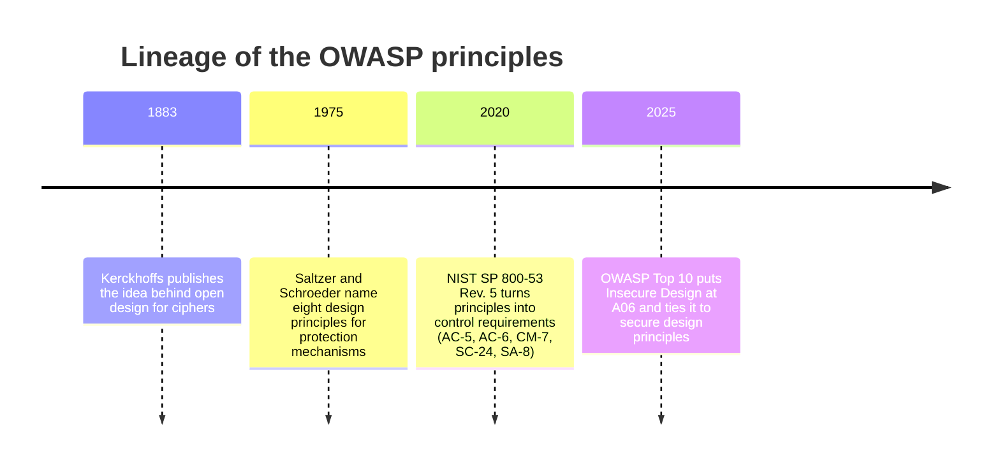
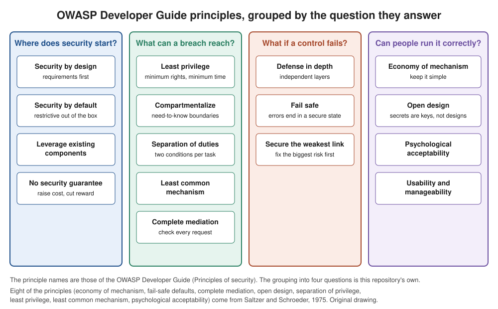

# OWASP security principles

## Summary

Security principles are short design rules that hold across languages, frameworks and technologies, such as "give every component only the access it needs" and "when something breaks, end in a safe state". They exist because most serious vulnerabilities are not exotic bugs but violations of a handful of old ideas, which is why OWASP lists them first in its Developer Guide and why the Top 10 category Insecure Design points back to them. This note covers the 16 principles of the OWASP Developer Guide, where they come from, how they conflict, how they map to weaknesses and controls, and how to use them in a design review.

Checked against the OWASP Developer Guide (Principles of security page), OWASP Top 10:2025, NIST SP 800-53 Rev. 5 and Saltzer and Schroeder (1975), 2026-10.

## Prerequisites

- [CIA triad](../../foundations/cia-triad/README.md): the properties the principles protect.
- [Defense in depth](../../foundations/defense-in-depth.md): one of the principles, covered in its own note.
- [Authorization](../../identity-and-access/authorization.md) and [authentication vs authorization](../../identity-and-access/authentication-vs-authorization.md).
- Basic Python 3 reading skill for the worked example.

## Core concepts

### Definition

A **security principle** is a general design rule that guides decisions in many situations and does not name a technology. It differs from related terms:

| Term | What it is | Example |
| --- | --- | --- |
| Principle | A rule for making design decisions | Deny access unless it is explicitly granted |
| Requirement | A testable statement about one system | Only the invoice owner and auditors can read an invoice |
| Control | A mechanism that implements a requirement | An authorization check in the invoice service |
| Weakness | A recurring flaw pattern, cataloged in CWE | CWE-862 Missing Authorization |

A principle is useful because you can apply it before there is code to scan. A scanner finds the missing check after the fact, and a design review that applies the principle prevents the gap.

### Where the principles come from



Three sources matter in practice:

- **Saltzer and Schroeder, 1975.** Eight principles for protecting information in computer systems: economy of mechanism, fail-safe defaults, complete mediation, open design, separation of privilege, least privilege, least common mechanism and psychological acceptability. The OWASP list contains all eight. This is the primary source and remains the reference point 50 years later. The 1883 date for Kerckhoffs is from memory and not re-checked.
- **OWASP Developer Guide, "Principles of security".** 16 principles, with the eight above plus security by design, security by default, no security guarantee, defense in depth, compartmentalize, usability and manageability, secure the weakest link and leveraging existing components. The guide describes them as a brief introduction and points to the Cheat Sheet Series for depth.
- **OWASP Secure Product Design Cheat Sheet.** A shorter list of four principles for product work: least privilege and separation of duties, defense in depth, zero trust, and security in the open.



The grouping in the picture (and in the tables below) is this repository's own. OWASP lists the principles without grouping. The four questions are a way to remember them and to organize a design review.

### Analogy

Think of how a submarine is designed. Watertight bulkheads limit a flood to one compartment (compartmentalize, least common mechanism). Valves default to the closed position when pressure control is lost (fail safe). Launch authority needs two keys turned by two people (separation of duties). Every hatch is checked each time it is opened, not only once at the dock (complete mediation). The crew follows procedures that are simple enough to execute under stress (economy of mechanism, psychological acceptability).

The analogy breaks in one place. A hull has physical boundaries that a flood cannot cross by itself. Software compartments are logical, so a bug in a shared library, a shared credential or a copied secret can cross them without any visible damage.

### Group 1: where does security start?

| Principle | Meaning (paraphrased from the OWASP Developer Guide) | Application example | Violation signal |
| --- | --- | --- | --- |
| Security by design | Identify security requirements first and treat them as part of system design, including secure operation and disposal | Threat model written before the first sprint, with abuse cases in user stories | Security review scheduled "before release" |
| Security by default | The out-of-the-box configuration is the most secure usable one, with only minimal functionality enabled and all else restricted | New tenants get MFA enforced, public sharing off and no sample accounts | Hardening guide that users must follow after install. CWE-1188 (Initialization of a Resource with an Insecure Default) |
| Leveraging existing components | Reuse tested components instead of adding new code and attack surface | Use the platform's session management and a maintained crypto library | Homegrown encryption, or an abandoned dependency kept for years |
| No security guarantee | No system is fully secure, so the goal is to make attacks costly and rewards small | Plan for detection and recovery, not only prevention | A requirement stating "the system must be unhackable" |

Notes:

- *Security by default* has a cost the OWASP text states openly: the most secure settings are not necessarily the most user-friendly, so the choice is a balance of risk analysis and usability testing. It matches the NIST SP 800-53 control CM-7 (Least Functionality), which limits systems to the functions, ports, protocols and services they need.
- *Leveraging existing components* is a trade-off, not a rule to always reuse. The OWASP guide argues that tested code is more likely to be secure, and OWASP Top 10:2025 A03 (Software Supply Chain Failures) shows the other side: every dependency is also a way in. Choose maintained components with a short update path and a known origin.
- *No security guarantee* sets the objective. It explains why detection (see [SIEM](../../defensive-operations/operations/siem.md)) and recovery belong in the design and not only prevention.

### Group 2: what can a breach reach?

| Principle | Meaning | Application example | Violation signal |
| --- | --- | --- | --- |
| Least privilege | Give a person or process only the minimum access needed, and only for the time needed | A reporting job gets `SELECT` on three views and a token that expires in 15 minutes | Application connects to the database as an administrator. CWE-250 (Execution with Unnecessary Privileges), CWE-269 (Improper Privilege Management) |
| Compartmentalize | Split access by need to know, so a breach has a bounded impact, but in moderation so the system stays manageable | Separate network segments and credentials per tenant tier | One flat network and one shared service account. CWE-653 (Improper Isolation or Compartmentalization) |
| Separation of duties | A task completes only when two or more conditions that are insufficient alone are met | A developer can open a deployment, a different person approves it | One account can create and approve a payment |
| Least common mechanism | Do not share mechanisms between users or processes at different privilege levels | Admin and customer sessions use different stores and signing keys | Shared cache or temp directory between privilege levels |
| Complete mediation | Check authorization on every request for every object, not only once | Server checks object ownership per call | Check only in the UI or the gateway, or a decision cached past revocation. CWE-862, CWE-863, CWE-639 |

Notes:

- *Least privilege* is a time dimension as well as a size dimension. The OWASP text includes the minimum time. Short-lived credentials and just-in-time elevation are the practical form. NIST SP 800-53 AC-6 is the control.
- *Separation of duties* is "separation of privilege" in Saltzer and Schroeder. NIST SP 800-53 AC-5 is the control, and CSF 2.0 Subcategory PR.AA-05 names both least privilege and separation of duties. See the [NIST CSF note](../../governance-and-compliance/frameworks/nist-cybersecurity-framework.md).
- *Complete mediation* has a time dimension too. ASVS 5.0 requirement 8.3.2 (level 3) asks that changes to the values behind authorization decisions apply immediately, or that mitigating controls detect and revert actions by a consumer who is no longer authorized, which matters for self-contained tokens. Checking at time A and acting at time B opens a race, and the classic weakness is CWE-367 (Time-of-check Time-of-use Race Condition). Zero Trust architectures are, among other things, an application of complete mediation to network access.
- Violations of this group dominate OWASP Top 10:2025 A01 (Broken Access Control), whose own text calls the root failure a violation of least privilege, commonly known as deny by default. Mapped CWEs in A01 include CWE-284, CWE-285, CWE-639, CWE-862 and CWE-863.

### Group 3: what if a control fails?

| Principle | Meaning | Application example | Violation signal |
| --- | --- | --- | --- |
| Defense in depth | Multiple security controls, so that no single failure leads to full compromise | WAF, input validation, parameterized queries, least-privilege database role, network isolation | All controls rely on one credential or one component |
| Fail safe | On an error, keep confidentiality, integrity and availability by defaulting to a secure state | Authorization code that cannot decide returns deny | `except: pass` around an access check. CWE-636 (Not Failing Securely ('Failing Open')) |
| Secure the weakest link | Resilience depends mostly on the weakest component, so fix the biggest risk first | Put effort on the unauthenticated upload endpoint before polishing the admin UI | Hardening effort spent evenly or by habit |

Notes:

- *Defense in depth* works only when layers are independent. Five controls that all trust the same admin password are one control. The standalone note is [defense in depth](../../foundations/defense-in-depth.md).
- *Fail safe* corresponds to NIST SP 800-53 SC-24 (Fail in Known State). OWASP Top 10:2025 A10 (Mishandling of Exceptional Conditions) is the new category built around it, and names CWE-209 and CWE-636 among the notable CWEs. The A10 text recommends rolling back every part of a transaction on error (failing closed) and handling errors in one central place.
- *Fail safe has a boundary.* "Fail closed" is right for an authorization check, and wrong for a fire-exit door lock, where life safety requires it to fail open. The principle says end in a secure state, and which state is secure is a decision about the asset. Write that decision down per component.

### Group 4: can people run it correctly?

| Principle | Meaning | Application example | Violation signal |
| --- | --- | --- | --- |
| Economy of mechanism | Choose the simplest implementation that works, because complexity breeds vulnerabilities | One authorization module used by every endpoint | Five different ways to check roles in one codebase |
| Open design | Design stays open to review, only keys and similar secrets stay hidden | Standard TLS and a published API with secret keys only | Security that depends on a hidden URL or secret algorithm. CWE-656 (Reliance on Security Through Obscurity) |
| Psychological acceptability | Controls should be easy to use and transparent, otherwise users "prop the doors open" | Passkeys or single sign-on in place of a 90-day password rotation | Staff share an account to avoid the approval workflow |
| Usability and manageability | Configuration, administration and integration of controls must not be overly complex, and should use open standards and automation | Policy as code in version control with tests | A control that only one person knows how to configure |

Notes:

- *Open design* is Kerckhoffs's idea applied to systems: the secret should be a key, not the design. It does not forbid keeping details private. OWASP's phrasing is that implementation details can stay secret, but the safety of the design must not depend on that secrecy.
- *Economy of mechanism* and *compartmentalize* pull in opposite directions. OWASP's text says compartmentalization must be used in moderation, and points to economy of mechanism as the counterweight.
- *Psychological acceptability* is a security argument, not a convenience argument. A control that users defeat provides no protection, and may be worse than nothing because it creates a false sense of coverage.

### How the principles conflict

Principles are not rules to maximize. They are forces to balance.

| Tension | Where it shows | How to resolve |
| --- | --- | --- |
| Compartmentalize vs economy of mechanism | Hundreds of micro-segments and roles nobody can reason about | Compartment by risk tier, and automate the policy |
| Least privilege vs psychological acceptability | Constant permission prompts push users to approve everything | Request access just in time with context, and reduce prompts for low-risk actions |
| Defense in depth vs economy of mechanism | Every added layer is more code and configuration | Prefer a few independent, simple layers over many overlapping ones |
| Fail safe vs availability | Closing on error can take the service down | Decide per component, add redundancy so a fail-closed node is not the only node |
| Leveraging existing components vs secure the weakest link | A popular dependency may be the weakest link | Track components in an SBOM, patch fast, remove what is unused |
| Open design vs operational secrecy | Publishing a design helps reviewers, and also attackers | Keep keys and credentials secret, and assume an attacker knows the design |

### Principles and OWASP Top 10:2025

This mapping is this note's interpretation. The CWE IDs are taken from the Top 10:2025 pages and checked on 2026-10.

| Top 10:2025 category | Principles most clearly violated | Mapped CWE examples (from the OWASP pages) |
| --- | --- | --- |
| A01 Broken Access Control | Least privilege, complete mediation | CWE-284, CWE-285, CWE-639, CWE-862, CWE-863 |
| A02 Security Misconfiguration | Security by default, least functionality (CM-7) | Not listed here |
| A03 Software Supply Chain Failures | Leveraging existing components (the risk side), secure the weakest link | Not listed here |
| A06 Insecure Design | Security by design, compartmentalize, open design, economy of mechanism | CWE-653, CWE-656, CWE-657 (Violation of Secure Design Principles), CWE-1125 (Excessive Attack Surface) |
| A10 Mishandling of Exceptional Conditions | Fail safe | CWE-209, CWE-636, CWE-248, CWE-274 |

Injection (A05) and several other categories are not captured by a single principle in this list. They are better explained by separating data from code and by input validation, which the Developer Guide treats as secure coding practice rather than as a principle. Do not force every weakness into a principle.

### Principles and NIST controls

The control catalog and its baselines are covered in [NIST SP 800-53](../../governance-and-compliance/frameworks/nist-sp-800-53/README.md).

| Principle | NIST SP 800-53 Rev. 5 control | Checked |
| --- | --- | --- |
| Least privilege | AC-6 Least Privilege | Control name verified in the Rev. 5 text |
| Separation of duties | AC-5 Separation of Duties | Verified |
| Security by default, minimal functionality | CM-7 Least Functionality | Verified |
| Fail safe | SC-24 Fail in Known State | Verified |
| Security by design (engineering principles) | SA-8 Security and Privacy Engineering Principles | Verified |
| Compartmentalize, defense in depth | SC-7 Boundary Protection | Name verified, the fit is this note's interpretation |

NIST SP 800-160 Volume 1 Revision 1 (Engineering Trustworthy Secure Systems) also lists design principles, for example Protective Failure, that fit the same ideas. It is the better source when you need to write the principles into a systems engineering process.

## Worked example

The scenario: a billing service of a fictional company (`example.com`) lets customers fetch invoices by numeric ID. The task is to show three principles at the code level: complete mediation, fail safe and separation of duties. This is a lab on synthetic data in a single file. Tested with Python 3.10.12, standard library only.

```python
from dataclasses import dataclass

INVOICES = {
    1: {"owner": "alice", "total": 120},
    2: {"owner": "bob", "total": 75},
}
ROLES = {"alice": {"customer"}, "bob": {"customer"}, "carol": {"auditor"}}


@dataclass(frozen=True)
class User:
    name: str


def get_invoice_vulnerable(user: User, invoice_id: int):
    # Authenticated, but never asks whether this user may see this object.
    return INVOICES[invoice_id]


def is_allowed(user: User, invoice_id: int) -> bool:
    inv = INVOICES.get(invoice_id)
    if inv is None:
        return False
    if inv["owner"] == user.name:
        return True
    return "auditor" in ROLES.get(user.name, set())


def get_invoice(user: User, invoice_id: int):
    # Complete mediation: the check runs on every call, on the server.
    # Fail safe: any error inside the check counts as a denial.
    try:
        allowed = is_allowed(user, invoice_id)
    except Exception:
        allowed = False
    if not allowed:
        raise PermissionError("denied")  # same message for "missing" and "forbidden"
    return INVOICES[invoice_id]


def approve_payment(requester: User, approver: User, amount: int):
    # Separation of duties: two different people must act.
    if requester == approver:
        raise PermissionError("requester cannot approve own payment")
    return f"{amount} approved by {approver.name}"


if __name__ == "__main__":
    alice, bob, carol = User("alice"), User("bob"), User("carol")
    print("vulnerable, alice reads bob's invoice:", get_invoice_vulnerable(alice, 2))
    for who, inv in [(alice, 1), (alice, 2), (alice, 99), (carol, 2)]:
        try:
            print(f"{who.name} -> invoice {inv}:", get_invoice(who, inv))
        except PermissionError as e:
            print(f"{who.name} -> invoice {inv}: PermissionError({e})")
    print(approve_payment(alice, bob, 500))
    try:
        approve_payment(alice, alice, 500)
    except PermissionError as e:
        print("same person:", e)
```

Output:

```text
vulnerable, alice reads bob's invoice: {'owner': 'bob', 'total': 75}
alice -> invoice 1: {'owner': 'alice', 'total': 120}
alice -> invoice 2: PermissionError(denied)
alice -> invoice 99: PermissionError(denied)
carol -> invoice 2: {'owner': 'bob', 'total': 75}
500 approved by bob
same person: requester cannot approve own payment
```

What to notice:

1. The first line is the classic broken object-level authorization flaw (CWE-639, OWASP Top 10 A01). The user is logged in, so authentication is fine, and any ID returns any invoice. Changing `2` to `3`, `4` and so on in a real API walks through the whole table.
2. `get_invoice` mediates every access. Alice gets her own invoice, is denied Bob's, and an auditor (a role with a legitimate need, a least-privilege decision) can read it.
3. Invoice 99 does not exist and returns the same `denied` as a forbidden invoice, so an attacker cannot use the difference to learn which IDs exist.
4. If `is_allowed` raised an exception (a corrupted record, a missing key), the `except` branch turns that into a denial. Removing the `try` or writing `allowed = True` in the handler is the fail-open version, and it is the pattern behind CWE-636.
5. `approve_payment` refuses when requester and approver are the same user. A production version identifies users by authenticated identity, never by a field in the request.

This example is intentionally small. In a real service the check belongs in shared code so that every endpoint uses it (economy of mechanism and complete mediation together), and the database role used by the service gets only the permissions it needs (least privilege). A test for each "denied" path should exist, which is how Top 10:2025 A06 recommends validating critical flows against the threat model.

### Design review with the principles

The 16-row [design review checklist](../../_assets/application-security/owasp-security-principles-design-review.csv) turns each principle into a question, with columns for evidence, status and notes. A practical way to use it:

1. Draw the data flow and trust boundaries of one feature (see [threat modeling](../../threat-modeling/threat-modeling.md) and [STRIDE](../../threat-modeling/methods/stride.md)).
2. Walk each principle against each boundary and component.
3. Record the evidence, such as a code location, a configuration or a test.
4. Turn each gap into a requirement or a ticket, and feed the result into the verification plan (OWASP ASVS, see [OWASP](owasp.md)).

## Trade offs and when to use it

### Where principles help

- Early design, when no scanner can help because there is no code.
- Reviewing architecture, vendor products and infrastructure as code, where "does it fail open" is a quick, high-value question.
- Training, because 16 names carry a lot of explanation.
- Writing requirements. A principle becomes a testable requirement once it names an asset and an actor.

### Where principles fall short

- **They are not testable as stated.** "Apply least privilege" cannot pass or fail. Convert it to a requirement (ASVS-style) and a test.
- **They conflict, and they do not rank themselves.** The review needs risk context to decide which tension to resolve which way.
- **They do not cover everything.** Input handling, cryptography details, secrets management and supply chain hygiene need their own guidance, for example the OWASP Cheat Sheet Series.
- **Some come from a different era.** Saltzer and Schroeder wrote about a time-sharing system. Concepts such as multi-tenant cloud, build pipelines and AI components extend the ideas, and the OWASP list does not fully cover them.

### Alternatives and companions

| Need | Use |
| --- | --- |
| Testable application requirements | OWASP ASVS |
| Awareness of the most common risks | OWASP Top 10 |
| Finding design threats systematically | STRIDE, PASTA, attack trees (see [threat modeling](../../threat-modeling/threat-modeling.md)) |
| Program-level security practices | OWASP SAMM |
| Organization-level governance | [NIST CSF](../../governance-and-compliance/frameworks/nist-cybersecurity-framework.md) |

## Common mistakes

| Mistake | Why it is wrong | Fix |
| --- | --- | --- |
| Treating a principle as a requirement | It cannot be tested as written | Write a concrete, testable requirement for each system |
| Checking authorization in the UI or the API gateway only | Direct calls bypass it, which violates complete mediation | Enforce in the service that owns the data, per object |
| Catching all exceptions and continuing | Turns an error into a fail-open path | Fail closed in access control, log, alert, and handle errors in one place |
| Returning different errors for "not found" and "forbidden" | Leaks which objects exist | Use the same response unless the user may know the object exists |
| Believing "internal only" means trusted | Removes layers, which violates defense in depth | Authenticate and authorize internal calls too |
| Stacking layers that share one dependency | Not independent | Check what each layer trusts, and break shared credentials apart |
| Hiding the design as the main protection | Violates open design, and fails once leaked | Keep keys secret, and assume the design is known |
| Maximum security settings with no usability test | Users work around them | Test controls with real users, and measure workarounds |
| Compartmentalizing everything | Unmanageable, so people disable it | Apply by risk tier and automate |
| Reusing a component without tracking it | Supply chain risk (A03) | Keep an SBOM, patch policy and owner for each dependency |

## Practice

1. Name the principle each statement violates: (a) the batch job runs as `root` to simplify permissions, (b) the order service trusts any request from the internal network, (c) the app shows a stack trace in the response, (d) the same engineer writes, reviews and deploys code to production, (e) the admin panel lives at an unlisted URL as its only protection.
2. In the example, replace `except Exception: allowed = False` with `except Exception: allowed = True`. Which principle does it violate, and which CWE describes it?
3. Explain a case where "fail safe" should mean fail open, and say how you would decide.
4. A team has a WAF, input validation and a parameterized query layer, and all three read the same shared secret to decide if a request is internal. Is this defense in depth?
5. Choose two principles that pull against each other in a design you know and describe how you would resolve the tension.
6. Convert "apply least privilege" for a reporting job into three testable requirements.

Hints and answers:

1. (a) Least privilege (CWE-250). (b) Complete mediation and defense in depth, since the internal network is not a trust boundary. (c) Fail safe, or more exactly the error-handling side of it, CWE-209. (d) Separation of duties. (e) Open design (CWE-656).
2. Fail safe. CWE-636, Not Failing Securely ('Failing Open'). Any bug in `is_allowed` would then grant access.
3. A door on an emergency exit, or a safety interlock where blocking the exit endangers lives. Decide by asking which failure harm is worse for the asset, document the choice, and compensate with other controls (an alarm on the open door).
4. Mostly no. The layers share one secret, so one leak removes all three. Replace the shared secret with independent mechanisms.
5. For example, compartmentalize against economy of mechanism: segment by risk tier (not per microservice), define the segments in code, and test the policy automatically.
6. For example: the job's database role has `SELECT` only on the three reporting views and fails on any write. The job's token expires within 15 minutes and cannot be refreshed after the job ends. A scheduled test confirms that a write attempt with the job's credentials is denied and logged.

## Further reading

- OWASP, Developer Guide, Principles of security. The source of the 16 principle names and descriptions used here: https://devguide.owasp.org/en/02-foundations/03-security-principles/
- OWASP Cheat Sheet Series, Secure Product Design Cheat Sheet. The four-principle product view, and the context, components, connections, code, configuration focus areas: https://cheatsheetseries.owasp.org/cheatsheets/Secure_Product_Design_Cheat_Sheet.html
- OWASP, Top 10:2025. A01, A06 and A10 are the categories most tied to the principles: https://owasp.org/Top10/2025/
- Saltzer and Schroeder, The Protection of Information in Computer Systems, Proceedings of the IEEE, 1975. The original eight principles: https://doi.org/10.1109/PROC.1975.9939
- NIST, SP 800-53 Rev. 5, Security and Privacy Controls for Information Systems and Organizations (2020). Controls AC-5, AC-6, CM-7, SC-24, SA-8 and SC-7: https://csrc.nist.gov/pubs/sp/800/53/r5/upd1/final
- NIST, SP 800-160 Volume 1 Revision 1, Engineering Trustworthy Secure Systems (2022). Design principles in a systems engineering process. Only skimmed for this note: https://doi.org/10.6028/NIST.SP.800-160v1r1
- MITRE, CWE-657 Violation of Secure Design Principles. The weakness entry that Top 10:2025 maps to Insecure Design: https://cwe.mitre.org/data/definitions/657.html
