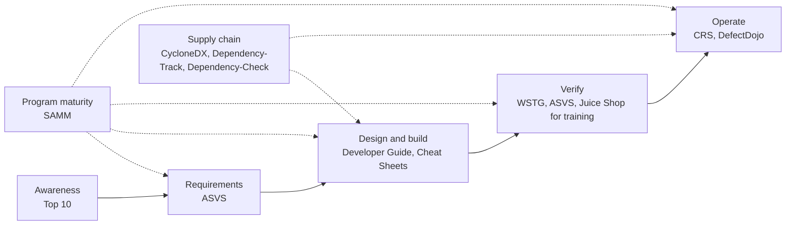

# OWASP

## Summary

OWASP, the Open Worldwide Application Security Project, is a nonprofit foundation that publishes free, community-written standards, guides and tools for application security. Its documents are the shared vocabulary of the field: the Top 10 for awareness, ASVS for requirements, the Web Security Testing Guide for testing, SAMM for program maturity and the Cheat Sheet Series for implementation advice. OWASP is not a regulator, a certifier or a vendor. Its documents are consensus guidance, so their authority comes from adoption and from how well they are maintained.

Checked against owasp.org (About, Projects, Top 10:2025), the OWASP project data on GitHub and the ASVS repository, 2026-10. Numbers of projects and releases change often.

## Prerequisites

- [Security overview](../../foundations/security-overview.md) and the [CIA triad](../../foundations/cia-triad/README.md).
- A rough idea of the software development life cycle (requirements, design, build, test, operate).
- For the principles that OWASP teaches as its foundation, see [OWASP security principles](owasp-security-principles.md).

## Core concepts

### Definition

OWASP is a 501(c)(3) nonprofit that works to improve the security of software. The OWASP project launched on 2001-12-01 and the OWASP Foundation, Inc. was incorporated as a U.S. nonprofit on 2004-04-21. Its core values, as stated on its website, are Open, Innovation, Global and Integrity (including vendor neutrality). All projects, documents and forums are free and open to anyone. The name was expanded to "Open Worldwide Application Security Project" from "Open Web Application Security Project" (the rename date, 2023, is from memory and unverified).

### Analogy

Think of OWASP as a public library with a reading list for builders. The library does not build or inspect houses. It publishes the building code commentary (ASVS), a list of the most frequent construction failures (Top 10), inspection manuals (Testing Guide), a maturity ladder for a builder's firm (SAMM) and short how-to pamphlets (Cheat Sheets).

The analogy breaks in one place. A library's books are reviewed by editors, while OWASP projects are volunteer-driven and their quality, update frequency and review depth vary. A flagship project and a one-person incubator project can carry the same logo.

### How OWASP is organized

- **Projects.** The unit of work. OWASP's public project data lists 414 entries in 2026-10, and the website says "275+ active projects". Each has a level. In the public data, level 4 marks flagship projects, which number 15. Lower levels include production, lab and incubator projects. The level-to-label mapping is from memory.
- **Chapters and events.** Local chapters and conferences, such as Global AppSec, spread the material. The website states 250+ chapters.
- **Licensing.** Documentation is typically under Creative Commons licenses (the ASVS repository states CC BY-SA 4.0). Tools use open source licenses that vary by project, so check each repository before reuse.

### The flagship projects

These 15 projects had level 4 in OWASP's public project data on 2026-10-01.

| Project | Kind | What it is for |
| --- | --- | --- |
| Top Ten Web Application Security Risks | Awareness document | Ranked list of the most critical web application risk categories |
| Application Security Verification Standard (ASVS) | Standard | Testable security requirements in three levels, version 5.0.0 released May 2025 |
| Web Security Testing Guide (WSTG) | Guide | Methodology and test cases for web application and API penetration tests |
| Cheat Sheet Series | Guide | Short, practical, topic-specific implementation advice |
| SAMM (Software Assurance Maturity Model) | Maturity model | Measuring and improving an organization's secure software practices |
| Mobile Application Security (MAS) | Standard and guide | Requirements and testing for mobile apps |
| Dependency-Check | Tool | Software composition analysis, finds known vulnerable components |
| Dependency-Track | Platform | Tracks components from software bills of materials and their vulnerabilities |
| CycloneDX (ECMA-424) | Standard | Software bill of materials format |
| DefectDojo | Platform | Aggregates and manages vulnerability findings |
| CRS (Core Rule Set) | Rule set | Generic attack detection rules for web application firewalls |
| Juice Shop | Training app | Deliberately vulnerable web application for practice |
| Security Shepherd | Training platform | Security training and challenges |
| Amass | Tool | Attack surface mapping and external asset discovery |
| OWTF | Tool | Offensive web testing framework |

Two points that surprise people:

- **ZAP is no longer an OWASP project.** The Zed Attack Proxy team announced on 2023-08-01 that ZAP was joining the Software Security Project and leaving OWASP, and the product is now just called ZAP. Older notes and courses still say "OWASP ZAP". The OWASP project list in 2026-10 still has an entry for it, but not at a flagship level.
- **The Developer Guide is not in the flagship list**, yet its Principles of security chapter is the foundation of [OWASP security principles](owasp-security-principles.md).

### How the pieces fit together

The flow in the figure is a typical reading order, not an official OWASP model. Read it as: use the Top 10 to raise awareness, choose an ASVS level as the requirement baseline, apply the Cheat Sheets while designing and coding, verify with the WSTG, run supply chain tools continuously, and use SAMM to measure how consistently the whole program does this.

### OWASP Top 10:2025

The Top 10 is a standard awareness document for developers and web application security. It reflects a broad consensus about the most critical risks, and is built from contributed data plus a community survey. The current edition is 2025, the 8th installment.

| ID | Category | Change from 2021 (per the OWASP introduction) |
| --- | --- | --- |
| A01 | Broken Access Control | Stays #1. SSRF is rolled into this category |
| A02 | Security Misconfiguration | Up from #5 |
| A03 | Software Supply Chain Failures | Expands A06:2021 Vulnerable and Outdated Components |
| A04 | Cryptographic Failures | Down from #2 |
| A05 | Injection | Down from #3 |
| A06 | Insecure Design | Down from #4 |
| A07 | Authentication Failures | Stays #7, renamed from Identification and Authentication Failures |
| A08 | Software or Data Integrity Failures | Stays #8 |
| A09 | Security Logging and Alerting Failures | Stays in position |
| A10 | Mishandling of Exceptional Conditions | New category |

OWASP describes two new categories and one consolidation for 2025. Use the Top 10 for what it is: a ranking of risk categories that helps prioritize awareness and training. It is not a complete list of vulnerabilities, not a compliance standard, and not a test plan. The more detailed note is [OWASP Top 10](owasp-top-10.md).

### ASVS levels

ASVS 5.0 defines requirements with identifiers of the form `<chapter>.<section>.<requirement>`, for example `8.2.2`, and three levels. The level descriptions below are paraphrased from the 5.0 text ("What is the ASVS"):

| Level | Purpose | Share of requirements |
| --- | --- | --- |
| 1 | Minimum, critical starting point: first-layer defenses against common attacks that need no other flaw or precondition | About 20% |
| 2 | The level most applications should strive for: less common attacks and more complex protections | About 50% at this level, so a level 2 application implements about 70% of ASVS (all of level 1 and level 2) |
| 3 | The highest assurance: mostly defense-in-depth mechanisms and hard-to-implement controls | About 30% |

The standard suggests choosing a level by risk. Its own example: an early-stage startup collecting limited sensitive data may start at level 1, while a bank would find it hard to justify less than level 3 for online banking. Organizations can tailor the standard by omitting chapters that do not apply, for example WebRTC if unused.

### How OWASP relates to other frameworks

| Framework | Scope | Relationship to OWASP |
| --- | --- | --- |
| [CWE](../../vulnerability-management/cwe.md) | Catalog of weakness types | The Top 10 categories are groups of CWEs, each category page lists its mapped CWEs |
| [CVE](../../vulnerability-management/cve.md) and [CVSS](../../vulnerability-management/cvss.md) | Specific vulnerabilities and their severity | Instances of the weaknesses OWASP describes |
| [MITRE ATT&CK](../../threat-intelligence/mitre/mitre-attack.md) | Adversary tactics and techniques | Describes what attackers do, while OWASP describes what builders get wrong. T1190 (Exploit Public-Facing Application) is the common bridge |
| [NIST CSF](../../governance-and-compliance/frameworks/nist-cybersecurity-framework.md) | Organization-level outcomes | CSF 2.0 includes secure software development (PR.PS-06) and supplier outcomes (GV.SC). OWASP provides the application-level how |
| [ISO/IEC 27001](../../governance-and-compliance/standards/iso-iec-27001.md) | Certifiable management system | OWASP gives technical requirements that a management system can reference |
| [SLSA](../supply-chain/slsa.md) | Build and supply chain integrity levels | Complements CycloneDX and Dependency-Track on the supply chain side |

## Worked example

The scenario: a feature at `example.com` lets customers download invoice PDFs at `/invoices/{id}`. A tester in an authorized engagement (a lab copy of the application, with written scope) shows that user A can read user B's invoice by changing `{id}`. The path below shows how the OWASP pieces are used end to end.

1. **Awareness: Top 10.** The flaw is Broken Access Control (A01:2025). The category page lists mapped weaknesses, including CWE-639 Authorization Bypass Through User-Controlled Key, CWE-862 Missing Authorization and CWE-863 Incorrect Authorization.
2. **Requirement: ASVS.** In ASVS 5.0, chapter V8 (Authorization) has the matching requirements. Requirement 8.2.2 (level 1) says data-specific access is restricted to consumers with explicit permission to specific data items, to mitigate IDOR and broken object level authorization. Requirement 8.3.1 (level 1) says authorization rules are enforced at a trusted service layer and not in controls an untrusted consumer can manipulate, such as client-side JavaScript. Add them to the backlog as acceptance criteria.
3. **Test: WSTG.** The guide has a test case for insecure direct object references in its authorization testing chapter (WSTG-ATHZ-04 in the 4.2 numbering). The tester repeats the request with a second account and compares responses. A 200 response with another user's data is a finding, and the same response for a nonexistent ID versus a forbidden ID is also worth noting because it leaks which IDs exist.
4. **Fix: Cheat Sheets and principles.** The Authorization and IDOR Prevention cheat sheets recommend server-side checks on every request. In terms of the [security principles](owasp-security-principles.md), this is complete mediation plus least privilege. A tested code version is in the worked example of that note.
5. **Regression: automation.** Add a test that logs in as two users and asserts a denial. Run it in CI.
6. **Measure: SAMM.** Record in the maturity model that the team now has authorization requirements, tests and review. Use the scores to decide the next improvement.
7. **Map to governance.** The result feeds an organizational outcome such as `PR.AA-05` (access permissions are defined in policy, managed, enforced and reviewed, and incorporate least privilege and separation of duties) in a CSF Profile.

Detection and mitigation, since this is an attack path: log denied object access with the user, object ID and source address, alert on one account requesting many sequential IDs, and enforce authorization in the service that owns the data. Rate limiting reduces enumeration speed but does not fix the flaw.

## Trade offs and when to use it

### Strengths

- Free, open and vendor neutral, so teams can adopt documents without licensing cost.
- Developer-oriented language, with concrete mitigations.
- Strong mapping to CWE, which links the guidance to testable weaknesses.
- Wide adoption makes OWASP a common language between developers, testers and auditors.

### Limits

- **Application focus.** OWASP covers application security far more than infrastructure, identity governance or detection engineering.
- **Variable maturity.** There are 414 project entries in the public data, and only 15 are flagship. Check the level, release date and activity of any project before relying on it.
- **Consensus lags reality.** The Top 10 is data-driven and built from contributed data and a survey, so it updates every few years. New attack classes appear in practice before they appear in the list.
- **Not a compliance regime.** Citing the Top 10 in a contract is common, but it is a ranked awareness list. Use ASVS when you need testable requirements.
- **Not a governance framework.** For risk, policy and oversight use [NIST CSF](../../governance-and-compliance/frameworks/nist-cybersecurity-framework.md) or ISO/IEC 27001.

### When to choose what

| Need | Use |
| --- | --- |
| Teach developers what goes wrong most often | Top 10 |
| Define and verify security requirements | ASVS |
| Plan a penetration test | WSTG |
| Fix a specific problem in code | Cheat Sheet Series |
| Measure and improve the whole program | SAMM |
| Inventory dependencies and track vulnerable ones | CycloneDX with Dependency-Track, or Dependency-Check |
| Practice safely | Juice Shop or Security Shepherd, on your own machine |

## Common mistakes

| Mistake | Why it is wrong | Fix |
| --- | --- | --- |
| Treating the Top 10 as a complete checklist | It lists categories, ranked by data and survey, and is not exhaustive | Use ASVS for requirements and WSTG for coverage |
| Quoting the 2021 list as current | The 2025 edition changed the ranking and added categories | Cite the edition year and check the current list |
| Calling ZAP an OWASP project in new material | It left OWASP in 2023 | Say "ZAP" and check its current home |
| Running scanners and calling it OWASP compliance | The Top 10 is an awareness list with no pass or fail, and scanners cannot see missing design decisions | Combine design review, ASVS requirements and manual testing |
| Skipping secure design and only fixing code | Insecure Design (A06) is its own category | Apply the [principles](owasp-security-principles.md) and threat modeling before coding |
| Using a deliberately vulnerable app on a shared network | Juice Shop and similar apps are meant to be exploitable | Run them locally or in an isolated lab |
| Testing a system without written permission | Illegal in most jurisdictions regardless of the guide used | Get a written scope and authorization before any testing |
| Ignoring supply chain tooling | A03 is now a top-three risk | Produce SBOMs and track component vulnerabilities |

## Practice

1. Which OWASP project would you open to find the exact test steps for insecure direct object references, and which one to write the acceptance criteria for the fix?
2. What changed between OWASP Top 10:2021 and 2025 for SSRF and for vulnerable components?
3. A vendor says "our product is OWASP Top 10 compliant". What questions do you ask?
4. Why is the OWASP Top 10 a poor substitute for a threat model?
5. Your team uses "OWASP ZAP" in its pipeline. What should you verify?
6. Map "a pipeline step that fails the build on a known vulnerable library" to the OWASP and NIST CSF pieces involved.

Hints and answers:

1. WSTG for the test steps (authorization testing chapter), ASVS for the requirements, and the Authorization and IDOR Prevention cheat sheets for the fix.
2. SSRF was rolled into A01 Broken Access Control, and A06:2021 Vulnerable and Outdated Components was expanded into A03 Software Supply Chain Failures.
3. Which edition, which ASVS level or test methodology, who verified it and when, what the scope was, and what evidence (report, test results) exists. OWASP does not certify products against the Top 10.
4. It ranks common categories across many applications and does not know your assets, trust boundaries or abuse cases.
5. Where the project is hosted and maintained now, the current license and release channel, and whether your pinned version still gets updates.
6. Dependency-Check or Dependency-Track with a CycloneDX SBOM. In CSF terms, vulnerability identification (ID.RA-01) and secure development practices (PR.PS-06).

## Further reading

- OWASP Foundation, About. Source of the founding dates, the values and the project and chapter counts: https://owasp.org/about/
- OWASP, Top 10:2025. The current list, the introduction that explains what changed, and the mapped CWEs per category: https://owasp.org/Top10/2025/
- OWASP, Application Security Verification Standard. Version 5.0.0 was released in May 2025 according to the project repository, and its V8 Authorization chapter was used in the worked example: https://owasp.org/www-project-application-security-verification-standard/
- OWASP, Web Security Testing Guide: https://owasp.org/www-project-web-security-testing-guide/
- OWASP, Software Assurance Maturity Model (SAMM): https://owasp.org/www-project-samm/
- OWASP Cheat Sheet Series, for example the Authorization Cheat Sheet: https://cheatsheetseries.owasp.org/cheatsheets/Authorization_Cheat_Sheet.html
- OWASP, Developer Guide. Its Principles of security chapter is summarized in [OWASP security principles](owasp-security-principles.md): https://owasp.org/www-project-developer-guide/
- ZAP blog, ZAP is Joining the Software Security Project (2023-08-01). The announcement that ZAP leaves OWASP: https://www.zaproxy.org/blog/2023-08-01-zap-is-joining-the-software-security-project/
