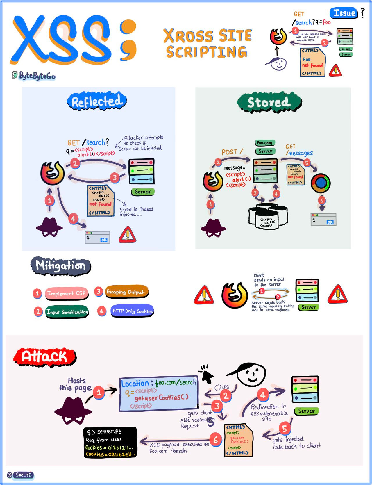

# XSS

## Summary

TODO: write two to four plain language sentences that say what this is and why it matters.

## Prerequisites

TODO: link the notes a reader should know first and state the assumed knowledge.

## What it is?

Cross-Site Scripting (XSS) is a prevalent security vulnerability that occurs when malicious scripts are injected into web pages, typically through improperly sanitized input fields. This vulnerability allows attackers to execute scripts in a victim's browser, potentially compromising data and system integrity.

## Occurrence

XSS emerges when user input is improperly handled and returned to the client without proper validation or sanitization. Below is a general flow of an XSS attack:

1. **Input Injection**: Malicious input is submitted via a form, URL, or other input methods.
2. **Server Processing**: The input is inadequately sanitized and stored or reflected in the response.
3. **Client Execution**: The script executes in the victim's browser, often without their knowledge, leading to unauthorized actions or data theft.

## Types

Understanding the distinction between the primary types of XSS attacks is crucial:

### Reflective XSS

- **Mechanism**: The injected script is immediately reflected in the server’s response and executed in the user’s browser.
- **Common Use Cases**: Exploited via malicious links or query parameters.
- **Example**: A phishing email contains a malicious URL that, when clicked, executes the script in the victim's browser.

### Stored XSS

- **Mechanism**: The malicious script is permanently stored on the server (e.g., in a database) and executed whenever a user accesses the affected page.
- **Common Use Cases**: Exploited through comment sections, user profiles, or message boards.
- **Example**: An attacker posts a malicious script in a public forum. Every user who views the post is exposed to the attack.

## Mitigation strategies

Preventing XSS requires a combination of robust coding practices and proactive security measures:

1. **Input Validation**: Ensure that all user inputs are strictly validated against expected formats.
2. **Output Encoding**: Escape user input before rendering it in the browser to neutralize malicious scripts.
3. **Content Security Policy (CSP)**: Implement CSP headers to restrict the execution of untrusted scripts.
4. **Sanitization Libraries**: Use trusted libraries to sanitize and filter inputs (e.g., OWASP’s ESAPI or similar tools).
5. **HTTPS Protocols**: Enforce secure communication channels to prevent interception of injected scripts.
6. **Educate Users**: Raise awareness about the risks of clicking on untrusted links or inputting data on dubious websites.

## User awareness

To proactively prevent XSS attacks:

- **Conduct Training**: Regularly educate developers and end-users about secure coding practices and recognizing potential XSS threats.
- **Promote Awareness Campaigns**: Share infographics, diagrams, and case studies that highlight the risks and prevention techniques.
- **Engage in Community Collaboration**: Share insights and strategies to collectively improve web security.

## Worked example

TODO: add a concrete, reproducible example that walks through the idea end to end.

## Trade offs and when to use it

TODO: cover benefits, costs, alternatives and the situations where this is the wrong choice.

## Common mistakes

TODO: list frequent misunderstandings and failure modes, each with its fix.

## Practice

TODO: add questions or small exercises, with answers or hints at the bottom.

## Further reading

TODO: add annotated links to primary sources.
