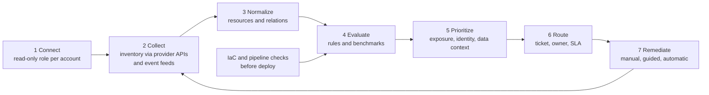

# Cloud security posture management (CSPM)

## Summary

Cloud security posture management (CSPM) is the continuous, automated checking of how a cloud environment is configured, against a policy or a benchmark, with findings that are prioritized and routed to someone who can fix them. It exists because in the cloud almost everything is a configuration object that anyone with the right permissions can change through an API, in seconds, and the most common way to lose data is a setting that was wrong, not an exploit. A CSPM tool reads the control plane of each cloud account (resources, policies, network rules, identities), evaluates rules, and tells you what is exposed, why it matters and what changed since yesterday. It does not replace vulnerability management, runtime detection or secure design. It answers one question well: "is the cloud set up the way we said it should be".

Checked against vendor and provider documentation fetched in 2026-10 (AWS, Microsoft, Google, Prisma Cloud, Check Point, Netskope, CrowdStrike, Orca), the CSA Top Threats 2024 report, the CSA Cloud Controls Matrix page, the OCC press release of 2020-08-06 and NIST SP 800-53 Rev. 5.2.0 data. I did not run any commercial product. Statements about products are what their documentation says.

## Prerequisites

- [Security posture management](security-posture-management.md): the umbrella note. CSPM is its cloud-configuration part.
- [CIA triad](../foundations/cia-triad/README.md): most posture findings are a loss of confidentiality (public exposure), integrity (unreviewed change) or availability (no backups, no redundancy) waiting to happen.
- [Defense in depth](../foundations/defense-in-depth.md) and [OWASP security principles](../application-security/owasp/owasp-security-principles.md): secure defaults, least privilege and fail safe are the principles a posture rule encodes.
- [CSA Cloud Controls Matrix](../governance-and-compliance/frameworks/csa-cloud-controls-matrix.md) and [NIST SP 800-53](../governance-and-compliance/frameworks/nist-sp-800-53/README.md) for the control vocabulary.
- Basic cloud knowledge: accounts or subscriptions, IAM roles, object storage, security groups.

## Core concepts

### Definition

**CSPM** is a class of tools and a practice that continuously assesses the configuration of cloud resources, detects deviations from a defined baseline (misconfiguration and drift), and supports remediation. The vendors and cloud providers describe it in consistent terms:

- AWS: Security Hub CSPM "provides you with a comprehensive view of your security state in AWS and helps you assess your AWS environment against security industry standards and best practices". It runs checks against security controls and generates control findings.
- Microsoft: CSPM "provides continuous visibility into the security state of your cloud assets and workloads, offering actionable guidance to improve your security posture in Azure, AWS, and GCP", and issues security recommendations to reduce misconfigurations and risks.
- Check Point: CSPM "checks your cloud environments' compliance with industry standards and best practices or your organization's security policies".
- Netskope: CSPM refers to "a suite of security tools and practices meant to identify and correct misconfiguration issues between organizations and the cloud".

There is no single standard definition (no ISO or NIST document defines CSPM), so the boundaries below are this note's reading of the documentation.

What CSPM is not:

| Often confused with | Difference |
| --- | --- |
| Vulnerability scanning | A CSPM rule looks at configuration ("this bucket is public"). A vulnerability scanner looks at software ("this package has a CVE"). Many platforms do both, from different data |
| Cloud workload protection (CWPP) | Protects what runs inside VMs and containers (agent or snapshot based). CSPM looks at the resources around them |
| Cloud detection and response (CDR) | Detects behavior (a user disabled logging). CSPM detects state (logging is disabled). CrowdStrike documents this split as indicators of attack (behavior) and indicators of misconfiguration (state) |
| CIEM | Entitlement analysis, who can do what. A CSPM rule can say "role has `*:*`". CIEM computes effective permissions across identities. See [security posture management](security-posture-management.md) |
| CNAPP | A bundle that includes CSPM next to workload, identity, IaC, data and runtime capabilities. Prisma Cloud, Falcon Cloud Security and CloudGuard describe themselves this way |

### Why it exists

**The cloud is an API.** Every resource, rule and permission can be created or changed by an API call. That is what makes the cloud fast, and it also means that a wrong value spreads at the same speed. In the shared responsibility model, the provider secures the infrastructure that runs the services ("security of the cloud" in AWS's words), and the customer is responsible for what they configure and put in the cloud ("security in the cloud"). AWS adds that the customer's share depends on the services they choose: more configuration work for infrastructure services, less for managed ones. CSPM audits the customer's half of that line.

**Misconfiguration is the leading cloud threat in the surveys.** The CSA Top Threats to Cloud Computing 2024 report (released 2024-08-05, based on a survey of over 500 experts) ranks "Misconfiguration and inadequate change control" first, ahead of identity and access management and insecure interfaces and APIs. It also lists "accidental cloud disclosure" and "unauthenticated resource sharing" among its 11 threats, which are the exposure patterns CSPM rules look for.

Three documented cases show how the problem looks in practice:

| Case | What happened | What a posture check could and could not do |
| --- | --- | --- |
| Microsoft storage exposure, 2022 | Microsoft and SOCRadar reported that a misconfigured Azure Blob Storage endpoint exposed data about some customers and prospects. Microsoft said it was an unintentional misconfiguration, not a vulnerability | A rule "container allows anonymous access" detects exactly this state, and would have done so continuously |
| Microsoft AI research SAS token, 2023 | Wiz Research reported that an Azure Shared Access Signature (SAS) token published in a GitHub repository granted full control of an entire storage account, with no expiry, exposing 38 TB of data including workstation backups with secrets. Wiz reported it on 2023-06-22, Microsoft revoked the token on 2023-06-24 | Rules on storage account SAS policies and key use help, but a leaked token is a secrets-management failure. Posture tools can flag the permissive account SAS capability, and secret scanning in code addresses the leak |
| Capital One, 2019 | An attacker used server-side request forgery against a misconfigured web application firewall to obtain temporary credentials, and accessed data of more than 100 million people (secondary reports). On 2020-08-06 the OCC assessed an $80 million penalty, citing failure to "establish effective risk assessment processes prior to migrating significant information technology operations to the public cloud environment" and to correct deficiencies in a timely manner | A CSPM tool flags over-permissive roles and exposed metadata settings. It does not find an SSRF flaw in an application, and it would not have replaced the missing risk assessment and remediation discipline that the regulator named |

The Capital One row matters because it shows the limit: the OCC's stated reasons were about governance and remediation, which a tool supports and cannot replace.

### Analogy

Think of a building inspector who walks the whole building every minute and compares it with the plans and the fire code: doors that should be locked, exits that should be clear, wiring that should be grounded. A CSPM tool is that inspector for a cloud environment. Its findings are "this door is propped open" and not "someone is in the building right now".

The analogy breaks in two places. First, a building rarely changes in an hour, while cloud resources are created and changed continuously, so the inspection has to be continuous and the findings need a time dimension (drift). Second, the inspector needs a master key. A CSPM tool must be given broad read access to every account, which makes the tool's own credentials a high-value target.

### Mechanism



**1 Connect.** The tool gets a role in each account. Prisma Cloud's AWS onboarding creates a role with permissions chosen by capability (misconfiguration scanning, identity security, agentless workload scanning, threat detection, serverless scanning), through a CloudFormation template, and uses an external ID in the trust policy. Orca says its role has "a few permissions, the most important being read-only permissions to the block storage layer". Checking the exact permission list of the role is the first security review of any CSPM product, see the "Common mistakes" table.

**2 Collect.** The tool calls provider APIs (describe and list calls) to build an inventory of resources and their configuration, and listens to events for changes. Check Point documents that it connects "with the correct platform APIs and platform notification services, such as SNS for AWS". Prisma Cloud publishes lists of the provider APIs it ingests per cloud. Collection frequency determines how stale a finding can be. An event-driven path shortens the gap, a periodic scan lengthens it. AWS notes that Security Hub CSPM only detects findings generated after enabling it, only in the Regions where it is enabled, and that most control findings need AWS Config to be enabled and recording.

**3 Normalize.** Resources from different services (and clouds) become records with a type, properties and relations (this instance uses this role, in this subnet, behind this load balancer). The relations are what enable prioritization later. See [multicloud CSPM](multicloud-cspm.md) for the cross-cloud difficulty.

**4 Evaluate.** Rules test resource properties. Every platform has its own rule language, and all of them have the same shape: a resource type, a condition, a severity and a remediation hint. Real examples from vendor documentation:

| Product | Rule language | Documented example |
| --- | --- | --- |
| Check Point CloudGuard | GSL, form `Target should Condition` | `SecurityGroup should not have inboundRules contain [port=22 and scope='0.0.0.0/0']` |
| Prisma Cloud | RQL, `config from cloud.resource where ...` with `api.name` and `json.rule` | `config from cloud.resource where cloud.type = 'azure' AND api.name = 'azure-network-usage' AND json.rule = StaticPublicIPAddresses.currentValue greater than 1` |
| AWS Security Hub CSPM | Security controls in standards, mostly implemented with AWS Config rules | FSBP, CIS, PCI DSS and NIST standards, each with controls |
| Microsoft Defender for Cloud | Recommendations in the Microsoft Cloud Security Benchmark, plus custom recommendations in the paid plan | secure score from recommendations |
| Netskope | Policy, profile and rule model, with custom rules in a domain specific language | CIS benchmarks and custom frameworks |

**5 Prioritize.** A flat list of thousands of misconfigurations is not usable. Platforms add context to separate "a public bucket with logs from a vendor" from "a public bucket with customer data behind an internet-facing server with an admin role". Prisma Cloud's attack path policies describe the idea: combine overly permissive identities, network exposure, infrastructure misconfiguration and vulnerabilities, and alert when a set of rules all match (their doc example: a VM that is vulnerable to a network-exploitable CVE, internet exposed, and holding overly permissive access to sensitive data is far more critical than any one of the three alone). Microsoft's Defender CSPM plan lists attack path analysis, internet exposure analysis and risk prioritization as paid features, and Google's Security Command Center documents attack exposure scores and attack paths.

**6 Route.** A finding without an owner is a report. Routing needs a resource-to-owner mapping (account, tag or label, team), a severity-based SLA, and a ticket or workflow integration. AWS supports automation rules and Amazon EventBridge custom actions to send findings to ticketing or remediation systems, Microsoft documents workflow automation and a ServiceNow integration (preview), and Netskope documents a Cloud Ticket Orchestrator (from a search summary of its documentation).

**7 Remediate.** Options range from a ticket with a fix hint, through a guided or one-click fix, to automatic remediation. Automatic remediation needs write permissions: Prisma Cloud states it "requires write access to your cloud platform to successfully execute the remediation commands" and its AWS onboarding gives the role read-write access when remediation is enabled. Check Point has CloudBots for automatic remediation, with a note that the assessment must be run again to verify the fix. Automatic fixes are the riskiest feature of the tool, because a wrong rule can change production.

**Shift left.** The same rules can run on infrastructure as code before deployment. Prisma Cloud calls these Build policies (for IaC templates and code repositories, using JSON query rather than RQL) next to Run policies for deployed resources. Check Point documents analysis of a proposed CloudFormation template before deployment. CrowdStrike lists IaC scanning among its modules. Preventive guardrails complement detection: AWS service control policies set maximum permissions for principals, Azure management groups cascade policy by inheritance, and Google Cloud organization policies flow down the hierarchy.

### Rules, benchmarks and standards

CSPM rules mostly come from four places:

1. **Provider best practice sets.** AWS Foundational Security Best Practices, the Microsoft Cloud Security Benchmark.
2. **CIS Foundations Benchmarks.** Consensus configuration guidance per cloud. The CIS site lists the Amazon Web Services Foundations benchmark at version 7.0.0 in 2026-10 (the page does not state the release date or the number of recommendations). Prisma Cloud's built-in standards list shows several earlier CIS versions per cloud, which also shows that a tool can lag a new benchmark release.
3. **Regulatory and industry standards.** PCI DSS, HIPAA, ISO 27001, NIST. Prisma Cloud lists, among others, CSA CCM v4.0.1, NIST 800-53 Rev. 5, NIST CSF v1.1, MITRE ATT&CK and GDPR. Netskope names CIS, PCI-DSS, NIST and HIPAA.
4. **Organization policy.** Custom rules for internal standards, such as "all storage must be tagged with a data classification".

The CSA Cloud Controls Matrix v4 is the provider-neutral reference: 197 control objectives in 17 domains, mapped to ISO, NIST, PCI and others, and meant to clarify the split of security roles between cloud providers and customers. For classic control mapping, NIST SP 800-53 controls that a CSPM program evidences include CM-2 (Baseline Configuration), CM-6 (Configuration Settings), CM-7 (Least Functionality), CM-8 (System Component Inventory), AC-6 (Least Privilege), SC-7 (Boundary Protection), SC-28 (Protection of Information at Rest), RA-5 (Vulnerability Monitoring and Scanning) and CA-7 (Continuous Monitoring). Control names were checked against the Rev. 5.2.0 catalog. In [NIST CSF 2.0](../governance-and-compliance/frameworks/nist-cybersecurity-framework.md) terms, CSPM supports `ID.AM-01` and `ID.AM-02` (inventories), `PR.PS-01` (configuration management practices), `PR.DS-01` and `PR.DS-02` (protection of data at rest and in transit) and `DE.CM-09` (monitoring of hardware, software, runtime environments and data).

A compliance score is not a posture score. Prisma Cloud's documentation says compliance standards only display results for the monitored resources that match the policies included in the standard, unlike the asset inventory, which shows pass and fail across all monitored resources. A 100% score against a benchmark with 50 checks says nothing about the rest of your estate.

### Native CSPM and third-party CSPM

| | AWS | Microsoft | Google Cloud |
| --- | --- | --- | --- |
| Product | AWS Security Hub CSPM | Microsoft Defender for Cloud: Foundational CSPM (free) and Defender CSPM (paid) | Security Command Center (Standard, Premium and the deprecated Enterprise tier, plus a Standard-legacy tier) |
| Scope | AWS accounts, aggregates findings from services such as GuardDuty, Inspector and Macie, and partner products | Azure, AWS, GCP, plus on-premises through Azure Arc, and DevOps platforms | Google Cloud. The Enterprise tier has connectors to AWS and Azure (its documentation lists connecting to AWS and Azure for configuration and resource data collection) |
| Standards | AWS FSBP, CIS, PCI DSS, NIST | Microsoft Cloud Security Benchmark and regulatory standards (paid plan) | Benchmarks including NIST, HIPAA, PCI-DSS and CIS |
| Notes from the docs | Needs AWS Config for most controls. 30-day free trial, then priced by checks and findings | Billing by resources enabled in subscriptions or connectors | The overview page states that the Enterprise tier will shut down on 2027-05-21 and that organizations on it move automatically to Premium on or after that date. Check the current tiers and the multicloud options before buying |

Native tools are the baseline. A third-party platform earns its place through coverage across providers, a common rule language and workflow, better context, and integration with the rest of the security stack. See [CSPM tools](cspm-tools.md).

### What good CSPM operations look like

- **Coverage first.** A tool that sees 60% of accounts is worse than useless, because it creates false assurance. Track the share of accounts, subscriptions and projects onboarded, and automate onboarding of new accounts.
- **Ownership.** Every resource maps to a team. Without it, findings go to the security team and stay there.
- **SLAs by risk, not by count.** For example, critical (internet-exposed with sensitive data) within 24 hours, high within 7 days. The numbers are an organization decision. Record exceptions with an owner and an expiry date, which is the cloud form of the plan of action and milestones in the [RMF](../governance-and-compliance/risk-management/risk-management-framework.md).
- **Fix classes, not instances.** When one team creates public buckets repeatedly, change the template, the guardrail or the training, not only the bucket (the same logic as RV.3 in the [SSDF](../application-security/supply-chain/nist-secure-software-development-framework.md)).
- **Prevention beside detection.** Service control policies, Azure Policy and organization policies block the bad setting. CSPM tells you where the guardrail has gaps.
- **Metrics.** Coverage, mean time to remediate by severity, number of open critical findings, average age of open findings, drift rate (new violations per week), exception count and age, and the false positive rate per rule.

## Worked example

The scenario: Example Corp (`example.com`) has a small AWS estate. The task is to build the core of a CSPM engine in 90 lines to see how rules, context and drift fit together. The inventory is synthetic and shaped like data a CSPM collects through cloud APIs. This is a teaching model, not a product design. Tested with Python 3.10.12, standard library only.

```python
from dataclasses import dataclass
from typing import Callable

SNAPSHOT_MON = {
    "s3:bucket": [
        {"id": "corp-invoices", "public": True,  "encrypted": True,  "logging": False, "tags": {"data": "customer-pii"}},
        {"id": "corp-assets",   "public": True,  "encrypted": True,  "logging": True,  "tags": {"data": "public-web"}},
        {"id": "corp-backups",  "public": False, "encrypted": False, "logging": True,  "tags": {"data": "customer-pii"}},
    ],
    "ec2:security-group": [
        {"id": "sg-web", "ingress": [{"port": 443, "cidr": "0.0.0.0/0"}]},
        {"id": "sg-adm", "ingress": [{"port": 22,  "cidr": "0.0.0.0/0"}]},
    ],
    "ec2:instance": [
        {"id": "i-web01", "sg": "sg-web", "role": "web-read-s3", "internet_facing": True},
        {"id": "i-adm01", "sg": "sg-adm", "role": "admin-full",  "internet_facing": True},
    ],
    "iam:user": [
        {"id": "alice", "mfa": True,  "key_age_days": 40},
        {"id": "bob",   "mfa": False, "key_age_days": 410},
    ],
}


@dataclass
class Rule:
    rid: str
    rtype: str
    severity: str                      # base severity from the benchmark or policy
    title: str
    violated: Callable[[dict], bool]


RULES = [
    Rule("S3-001", "s3:bucket", "high", "Bucket allows public access", lambda r: r["public"]),
    Rule("S3-002", "s3:bucket", "medium", "Bucket not encrypted at rest", lambda r: not r["encrypted"]),
    Rule("S3-003", "s3:bucket", "low", "Bucket access logging disabled", lambda r: not r["logging"]),
    Rule("NET-001", "ec2:security-group", "high", "SSH open to the internet",
         lambda r: any(i["port"] == 22 and i["cidr"] == "0.0.0.0/0" for i in r["ingress"])),
    Rule("IAM-001", "iam:user", "high", "User without MFA", lambda r: not r["mfa"]),
    Rule("IAM-002", "iam:user", "medium", "Access key older than 90 days", lambda r: r["key_age_days"] > 90),
]
WEIGHT = {"low": 1, "medium": 3, "high": 7}


def evaluate(snapshot):
    out = []
    for rule in RULES:
        for res in snapshot.get(rule.rtype, []):
            if rule.violated(res):
                out.append({"rule": rule.rid, "resource": res["id"], "severity": rule.severity,
                            "title": rule.title, "res": res})
    return out


def risk(finding, snapshot):
    """Base weight times context multipliers (the idea behind attack path and toxic combination)."""
    score, why = WEIGHT[finding["severity"]], []
    res = finding["res"]
    if res.get("tags", {}).get("data") == "customer-pii":
        score *= 3; why.append("holds customer PII")
    if finding["rule"] == "NET-001":
        for inst in snapshot["ec2:instance"]:
            if inst["sg"] == res["id"] and inst["internet_facing"] and inst["role"] == "admin-full":
                score *= 4; why.append(f"{inst['id']} behind it has an admin role")
    return score, why


findings = evaluate(SNAPSHOT_MON)
print(f"raw findings: {len(findings)} (severity only)")
ranked = sorted(((risk(f, SNAPSHOT_MON), f) for f in findings), key=lambda x: -x[0][0])
print("\nrisk-ranked:")
for (score, why), f in ranked:
    print(f"  {score:3d}  {f['rule']:8s} {f['resource']:14s} {f['title']}" + (f"  [{'; '.join(why)}]" if why else ""))

# Drift: a later snapshot after a change. Compare sets of (rule, resource).
SNAPSHOT_TUE = {k: [dict(r) for r in v] for k, v in SNAPSHOT_MON.items()}
SNAPSHOT_TUE["s3:bucket"][1]["public"] = False                                  # fixed
SNAPSHOT_TUE["s3:bucket"].append({"id": "corp-exports", "public": True, "encrypted": False,
                                  "logging": False, "tags": {"data": "customer-pii"}})  # new, risky
before = {(f["rule"], f["resource"]) for f in findings}
after = {(f["rule"], f["resource"]) for f in evaluate(SNAPSHOT_TUE)}
print("\ndrift Monday -> Tuesday")
print("  new   :", sorted(after - before))
print("  fixed :", sorted(before - after))
```

Output:

```text
raw findings: 7 (severity only)

risk-ranked:
   28  NET-001  sg-adm         SSH open to the internet  [i-adm01 behind it has an admin role]
   21  S3-001   corp-invoices  Bucket allows public access  [holds customer PII]
    9  S3-002   corp-backups   Bucket not encrypted at rest  [holds customer PII]
    7  S3-001   corp-assets    Bucket allows public access
    7  IAM-001  bob            User without MFA
    3  S3-003   corp-invoices  Bucket access logging disabled  [holds customer PII]
    3  IAM-002  bob            Access key older than 90 days

drift Monday -> Tuesday
  new   : [('S3-001', 'corp-exports'), ('S3-002', 'corp-exports'), ('S3-003', 'corp-exports')]
  fixed : [('S3-001', 'corp-assets')]
```

What to notice:

1. **Severity alone gives a flat list.** Both public buckets are "high" by rule. Context separates them: `corp-invoices` holds customer PII (score 21), while `corp-assets` is a web asset bucket that is probably public on purpose (score 7). Real tools do this with tags, data classification (DSPM) and relations.
2. **The top finding is a combination.** `sg-adm` is only an SSH rule violation on its own. With the relation "the instance behind it is internet-facing and has an admin role", it becomes the top risk (28). This is the mechanism behind attack path and toxic combination features, reduced to one relation.
3. **`corp-assets` is a candidate exception, not a defect.** A public web bucket is legitimate. The right response is a documented exception with an owner and an expiry date, not disabling the rule, and not letting it sit in the open findings list.
4. **Drift is a set difference.** Tuesday's snapshot adds a new risky bucket and fixes another. The `new` list is what an alert should go to the owner for, in minutes, not at the next quarterly review. Drift detection needs history, which is why tools store snapshots, and why AWS's note that findings only exist after you enable the service matters for the first weeks.
5. **What the example does not do.** It trusts the collector, it has no notion of who owns a resource, and it does not model identity (what `bob` can reach). Each is a real capability gap to check in a product.

## Trade offs and when to use it

### Benefits

- Continuous visibility into the configuration of an estate that changes daily, with a documented baseline.
- Detection of exposures such as public storage, open management ports, unencrypted data stores and disabled logging, at the speed they appear.
- Evidence for audits: point-in-time assessments, history and compliance mapping.
- A shared language between security, cloud platform and application teams (the same rule, the same finding).
- Foundation for further capabilities: attack path analysis, CIEM, IaC checks, DSPM.

### Costs and limits

- **Configuration, not behavior and not code.** CSPM does not see an SSRF flaw in an application, a stolen credential in use or malware on a host. Pair it with [detection](../defensive-operations/operations/siem.md), vulnerability management and secure development.
- **Alert volume and false positives.** Intentional configurations (a public web bucket) trigger rules. Without exceptions, tuning and prioritization, teams stop looking.
- **A high-value credential.** The CSPM role can read the configuration of every account. Treat the vendor connection like any privileged integration: review permissions, restrict, monitor its use, and separate read from remediation roles.
- **Remediation risk.** Automatic fixes can break production. Start with detection and tickets, then automate narrow, well-tested fixes.
- **Lag and coverage gaps.** New services may not be covered at launch, collection has delay, and API rate limits and regions affect completeness.
- **Cost model.** AWS prices by checks and findings, Microsoft by resources enabled, Prisma Cloud by credits per feature set. Cost grows with estate size, so model it before rollout.
- **Compliance is not security.** Passing a benchmark proves that the benchmark's settings are right.

### Alternatives and companions

| Need | Option |
| --- | --- |
| Prevent bad settings from being created | Guardrails: service control policies, Azure Policy, organization policies, and IaC pipeline checks |
| Find vulnerable software in workloads | Vulnerability management, workload scanning (agentless or agent-based), see [software composition analysis](../application-security/testing/software-composition-analysis.md) |
| Detect active attacks in the cloud | Cloud detection and response and [SIEM](../defensive-operations/operations/siem.md) on cloud audit logs |
| Understand who can do what | CIEM, see [authorization](../identity-and-access/authorization.md) |
| Find sensitive data | DSPM |
| One platform for all of the above | CNAPP, see [CSPM tools](cspm-tools.md) |

The wrong choice: relying on CSPM alone for a small estate with five accounts and a mature IaC pipeline, where native tools plus guardrails may be enough. The right choice: a growing estate with several teams creating resources, where drift is the real risk.

## Common mistakes

| Mistake | Why it is wrong | Fix |
| --- | --- | --- |
| Onboarding only the production accounts | Attackers use the forgotten test account, and posture drift is highest there | Onboard by organization hierarchy so that new accounts are added automatically |
| Giving the tool a broad write role from day one | Wide blast radius if the tool or its credentials are compromised | Start with read-only, add narrow remediation roles later |
| Never reading the permission list of the connector | The role may allow more than the features you use | Review the role (for example the capability-based CloudFormation template) and remove unused capabilities |
| Treating the compliance score as the posture | The score covers only the checks in the benchmark | Track coverage, risk-ranked open findings and drift as well |
| Prioritizing by finding count | Hundreds of low findings hide the one toxic combination | Prioritize by exposure and impact, use context |
| Suppressing noisy rules globally | Real findings disappear with the noise | Use scoped exceptions with owner and expiry date |
| Enabling automatic remediation broadly | A wrong rule changes production | Pilot on non-production, narrow rules, with rollback |
| Detection without prevention | The same issue returns every sprint | Add guardrails and fix templates |
| No owner mapping | Findings pile up with the security team | Map accounts, tags or labels to teams before rollout |
| Forgetting that the tool lags | A finding can be hours old and a fix can take time to show | Know the collection interval and re-run assessments to verify fixes |
| Expecting CSPM to find application flaws | It reads configuration | Combine with testing, see [OWASP](../application-security/owasp/owasp.md) |

## Practice

1. Define CSPM in two sentences and name three things it does not do.
2. Why is "public bucket" not a severity by itself? What context turns it into a critical finding?
3. Explain the difference between an indicator of misconfiguration and an indicator of attack. Which one is CSPM?
4. A CSPM tool shows 12,000 findings. Describe a plan to bring this to a workable list in two weeks.
5. In the worked example, add a rule that flags an instance with an admin role that is internet-facing, and a context rule that raises its score when the user `bob` (no MFA) can assume that role. What data does the engine need that it does not have today?
6. Why must the connector role of a CSPM tool be part of your threat model?
7. Which NIST SP 800-53 controls and CSF 2.0 outcomes would you cite as the basis for a CSPM program?

Hints and answers:

1. CSPM continuously assesses cloud configuration against a baseline, detects misconfiguration and drift, and supports remediation. It does not find software vulnerabilities in workloads, detect attacker behavior at runtime, or fix application code flaws.
2. Severity depends on exposure and impact. A public bucket with a public web site is intended. A public bucket with customer data, or an open SSH port to an instance with an admin role, is critical. Context: data classification, internet exposure, attached identity, relations to other resources.
3. An indicator of misconfiguration (IOM) is a static setting that is risky (storage allows public access). An indicator of attack (IOA) is behavior (a user changed a network rule to allow all). CSPM covers IOMs. IOAs belong to detection and response.
4. For example: filter to internet-exposed resources and sensitive data first, group by rule and by owner, fix classes with a guardrail or template change, create scoped exceptions for intentional cases, agree SLAs by risk tier, and track the trend. Day 1 to 3: scope and ownership, day 4 to 10: fix the critical combinations, day 11 to 14: guardrails and exceptions.
5. The engine needs identity data: role trust policies, who can assume the role, MFA state of principals, and the relation from the instance to the role. Without effective permission data (CIEM), the context rule cannot be computed.
6. It holds read access, and sometimes write access, to all accounts, often through a vendor cloud service. Compromise of the tool, the vendor or the credentials gives an attacker a map of your estate, and possibly a way to change it.
7. SP 800-53: CM-2, CM-6, CM-7, CM-8, AC-6, SC-7, SC-28, RA-5, CA-7. CSF 2.0: `ID.AM-01`, `ID.AM-02`, `PR.PS-01`, `PR.DS-01`, `PR.DS-02`, `DE.CM-09`.

## Further reading

- CSA, Top Threats to Cloud Computing 2024 (released 2024-08-05). The survey ranking that puts misconfiguration and inadequate change control first: https://cloudsecurityalliance.org/artifacts/top-threats-to-cloud-computing-2024
- CSA, Cloud Controls Matrix v4 (197 control objectives, 17 domains): https://cloudsecurityalliance.org/research/cloud-controls-matrix
- AWS, What is AWS Security Hub CSPM (service behavior, standards and the AWS Config dependency): https://docs.aws.amazon.com/securityhub/latest/userguide/what-is-securityhub.html
- AWS, Shared Responsibility Model, "Security of the Cloud" and "Security in the Cloud": https://aws.amazon.com/compliance/shared-responsibility-model/
- Microsoft, What is Cloud Security Posture Management (CSPM), Microsoft Defender for Cloud (Foundational and Defender CSPM, multicloud, attack path analysis): https://learn.microsoft.com/en-us/azure/defender-for-cloud/concept-cloud-security-posture-management
- Google Cloud, Security Command Center overview: https://docs.cloud.google.com/security-command-center/docs/security-command-center-overview
- Prisma Cloud documentation, Create a Custom Policy and Attack Path Policies: https://docs.prismacloud.io/content-collections/governance/create-a-policy.md and https://docs.prismacloud.io/content-collections/governance/attack-path-policies.md
- Check Point CloudGuard documentation, Cloud Security Posture Management and Governance Specification Language: https://sc1.checkpoint.com/documents/CloudGuard_Dome9/Documentation/PostureManagement/Posture.htm
- Wiz Research, 38TB of data accidentally exposed by Microsoft AI researchers (2023): https://www.wiz.io/blog/38-terabytes-of-private-data-accidentally-exposed-by-microsoft-ai-researchers
- OCC, news release on the Capital One penalty (2020-08-06): https://www.occ.gov/news-issuances/news-releases/2020/nr-occ-2020-101.html
- CIS, Benchmarks for AWS, Azure and Google Cloud, the source of the Foundations benchmarks (free for non-commercial use): https://www.cisecurity.org/cis-benchmarks
