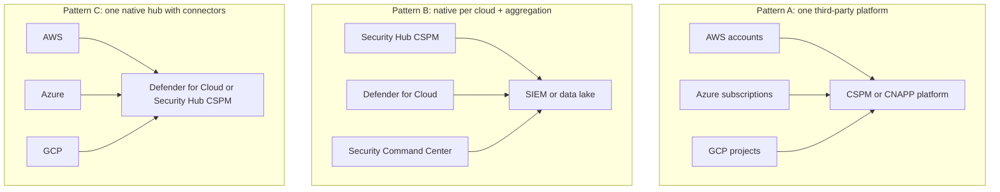

# Multicloud cloud security posture management (multicloud CSPM)

## Summary

Multicloud CSPM is cloud security posture management applied to an estate that spans more than one cloud provider (for example AWS, Azure and Google Cloud), so that one team can see, assess and fix configuration risk everywhere with one set of policies and one view of risk. The goal sounds simple. The difficulty is that each provider models the same ideas differently: the account hierarchy, the identity system, the meaning of "public", the logging, the policy language. A multicloud program therefore needs a normalization layer (a common model of resources and rules), a consistent ownership and exception process, and a deliberate choice between native tools per cloud, a third-party platform, or a mix. Getting this wrong produces three separate posture programs that cannot be compared.

Checked against documentation of AWS Organizations, Azure management groups, the Google Cloud resource hierarchy, AWS Security Hub CSPM (including its Azure integration), Microsoft Defender for Cloud, Google Security Command Center and four commercial CSPM vendors, fetched in 2026-10. Vendor behavior can change, and I did not run any product.

## Prerequisites

- [Cloud security posture management](cloud-security-posture-management.md): the single-cloud mechanism that this note extends. Read it first.
- [Security posture management](security-posture-management.md): the umbrella concept.
- [CSA Cloud Controls Matrix](../governance-and-compliance/frameworks/csa-cloud-controls-matrix.md): the provider-neutral control reference.
- [NIST CSF 2.0](../governance-and-compliance/frameworks/nist-cybersecurity-framework.md): a vocabulary that does not depend on a provider.

## Core concepts

### Definition

**Multicloud** means an organization uses services from two or more public cloud providers in production. **Multicloud CSPM** is CSPM that covers all of them under a common policy and reporting model. It is distinct from two neighboring ideas:

- **Hybrid** adds on-premises or private infrastructure. Microsoft documents extending CSPM to on-premises and hybrid resources through Azure Arc.
- **Multi-account in one cloud** is a scaling problem inside one provider (hundreds of AWS accounts). It uses the same tools as multicloud for onboarding and aggregation, but it does not have the semantic mismatch between providers.

Why organizations end up multicloud is not a security question, but it shapes the program: acquisitions bring a second cloud, teams pick the best service for a workload, a customer or regulator requires a specific provider, or the business wants an exit option. A common pattern is accident rather than strategy, which means the second cloud often arrives without the guardrails of the first. That is an opinion about common practice, not a measured statistic.

### Analogy

Think of a company with offices in three countries. The head office wants one safety standard for all buildings: exits clear, doors locked, fire alarms tested. But each country has a different building code, different words for the same things, different inspectors and a different layout of floors and rooms. A central safety manager can set the standard, but must translate it to each local code, keep one register of buildings, and compare results in a fair way.

The analogy breaks in one place. Buildings do not change daily. Cloud resources do, so the translation and the register have to be automated and the comparison has to account for drift.

### Why it is harder than single-cloud CSPM

**1. Different organizing hierarchies.** The scope on which you apply policy, and the way inheritance works, differ:

| Concept | AWS | Azure | Google Cloud |
| --- | --- | --- | --- |
| Top container | Organization with a single root | Microsoft Entra tenant, with a root management group (default name "Tenant root group") | Organization resource, the root of the hierarchy |
| Grouping | Organizational units (OUs), nested | Management groups, nested up to six levels (not counting the root and the subscription level), up to 10,000 per directory | Folders, optional |
| Unit of resource ownership and billing | Account | Subscription (contains resource groups) | Project |
| Policy that sets limits | Service control policies (maximum permissions for principals), resource control policies, declarative policies | Azure Policy and Azure RBAC assignments, inherited from management groups | IAM policies and organization policies, which "flow down the hierarchy" |
| Depth limit (documented) | Up to five levels of OUs, excluding the root and accounts in the lowest OUs | Six levels of management groups | Not checked |

Two gotchas from the documentation matter for posture:

- In AWS, service control policies do **not** restrict users or roles in the management account. AWS therefore recommends keeping resources out of the management account. A posture program should treat the management account as a special, high-value scope with its own checks.
- In Azure, assignments on the root management group apply to every resource in the directory, and Microsoft advises keeping assignments at that scope to "must have" only.

**2. Different identity models.** AWS uses IAM roles and policies (accounts trust each other through roles), Azure uses Microsoft Entra ID plus Azure RBAC role assignments inherited down the hierarchy, and Google Cloud uses IAM bindings plus organization policies. "Who can read this storage" is a different query in each, and effective permissions need provider-specific logic. This is the reason CIEM exists as its own capability, see [security posture management](security-posture-management.md).

**3. Different semantics for the same word.** "Public" means different things:

- AWS S3: a bucket can be public through its policy (the `PolicyStatus.IsPublic` result of the API), through ACLs, or be protected by four account or bucket level public access block settings.
- Azure Storage: public blob access is controlled by the account property `allowBlobPublicAccess`, then by the access level of each container, and reachability also depends on network rules (`networkAcls.defaultAction`).
- Google Cloud Storage: anonymous members (`allUsers`, `allAuthenticatedUsers`) in the IAM policy, constrained by the `publicAccessPrevention` setting of the bucket or an organization policy.

A rule "storage must not be public" therefore has three implementations that look at different fields, and agreeing on one intent matters more than matching field names.

**4. Different telemetry.** Each provider has its own audit log and its own change event stream. AWS CloudTrail, Azure Activity Log and Google Cloud audit logs carry similar facts in different schemas, at different latencies, and with different defaults for what is on. A drift detection that works well in one cloud can be blind in another because logging was never enabled.

**5. Different pace of change.** Services launch at different times in each cloud, and CSPM coverage for a new service varies by vendor. In a multicloud estate, the coverage gap is a union of the gaps of each provider.

### Normalization: the central design problem

To compare, report and write rules once, the tool needs a **normalized model**. There are three approaches, and products mix them.

| Approach | Idea | Example from documentation | Consequence |
| --- | --- | --- | --- |
| Provider-specific rules under one console | One UI and workflow, but each rule targets a provider entity and field | Prisma Cloud RQL queries name the provider API in `api.name` (for example an Azure network usage API). Check Point GSL has domain-specific functions per cloud (AWS, Azure, GCP, Alibaba Cloud, Kubernetes) | Easy to cover each cloud deeply. The same intent must be authored per cloud |
| Common abstraction layer | Resources are mapped to a vendor-neutral type, and rules are written once | This note's example below, and the "unified data model" that Orca describes (it combines data from SideScanning, the cloud control plane, CI/CD scans, authentication, audit logs and network probing) | One rule per intent, but the abstraction is lossy and each vendor's model is its own |
| Control-level mapping | Rules stay provider-specific, but they map to provider-neutral controls and standards | The CSA Cloud Controls Matrix v4 (197 control objectives in 17 domains), CIS benchmarks per cloud mapped to NIST, ISO, PCI | Good for reporting and audit, weaker for operations |

The honest conclusion for a program: **write the intent once in plain language, keep a test fixture for each cloud, and let each implementation be provider-specific.** For example, the intent "no object storage is reachable by anonymous users" has an AWS implementation, an Azure implementation and a GCP implementation, plus fixtures that prove each one flags a public example and passes a private example. The worked example below shows this in code.

### Architecture patterns



| Pattern | Strengths | Weaknesses | Documented support |
| --- | --- | --- | --- |
| A. Third-party platform for all clouds | One rule model, one workflow, one report, cross-cloud context | Another vendor with broad read access, licensing cost, coverage lags native services | Prisma Cloud (AWS, Azure, GCP, OCI, Alibaba Cloud onboarding), Falcon Cloud Security, Orca (AWS, Azure, Google Cloud, Kubernetes, Oracle Cloud, Alibaba Cloud), CloudGuard (AWS, Azure, GCP, Alibaba Cloud, Kubernetes), Netskope (AWS, Azure, GCP). See [CSPM tools](cspm-tools.md) |
| B. Native tools per cloud, aggregated in a SIEM or data lake | Deepest coverage per cloud, no extra vendor in the control plane | Three rule languages, three severity models, correlation work is yours | AWS Security Hub CSPM, Defender for Cloud and Security Command Center, each with export options |
| C. One native hub with connectors | Less to buy, single pane in the hub provider | Hub provider's coverage of other clouds may lag, and lock-in to the hub's model | Microsoft Defender CSPM supports Azure, AWS and GCP. AWS Security Hub CSPM can integrate with Azure and monitor it (CIS Microsoft Azure Foundations Benchmark v4.0 and AWS-curated Azure best practices, with 122 controls across both standards and separate security scores per provider). Google's Security Command Center Enterprise tier has AWS and Azure connectors, and the tier is announced to shut down on 2027-05-21 |

AWS's Azure integration is itself a sign of the market: even the native tools are becoming multicloud. It uses an Azure application registration with federated identity credentials, Azure role assignments and Event Hub infrastructure, and collects configuration data and Activity Log events. A federated credential instead of a stored secret is the right design for a cross-cloud connector, and a good checklist item for any product.

A decision rule that works in practice: pick pattern A when the estate is large and spread across clouds with a central security team, pattern B when each cloud is run by an independent platform team and you have a strong SIEM team, and pattern C when one cloud dominates and the others are small. The rule is this note's judgment.

### The connector problem

A multicloud CSPM needs read access to every cloud. That access is a security design problem in itself:

- **One role per account is not enough to review.** With hundreds of accounts the permission list must be generated from a template and pinned, and drift of the connector role must itself be monitored.
- **Prefer federation to stored secrets.** Prisma Cloud's AWS onboarding uses an IAM role with an external ID in the trust policy. AWS's Azure integration uses federated identity credentials. Avoid long-lived client secrets and keys where the provider offers a federated option.
- **Separate detection from remediation.** Remediation needs write access. Prisma Cloud states that its auto-remediation requires write access, and Check Point's CloudBots perform automatic remediation. Keep the read-only connector as the default and add narrow write roles per remediation use case.
- **Know what leaves your environment.** Read access to configuration may include secrets embedded in configuration (for example environment variables of functions) and sensitive metadata. Review the vendor's data handling, regional processing and retention. Orca's technical brief describes masking of discovered sensitive data in alerts and tagging snapshots for deletion after scanning, as an example of the kind of statement to ask for.
- **Network paths.** Agentless workload scanning creates snapshots and scanner infrastructure in your accounts. Prisma Cloud's documentation describes creating snapshots of host volumes, scanner instances and networking in each region, and cleaning them up afterwards, with default scans every 24 hours. That is a deployment in your account, and needs the same review as any other.

### Operating model for a multicloud program

| Topic | Practice |
| --- | --- |
| Inventory and ownership | One register of accounts, subscriptions and projects, each with an owner, an environment (production, test), a data classification and a business unit. Map provider tags (AWS and Azure tags, Google Cloud labels) to this register |
| Onboarding | Automate by hierarchy: onboard the AWS organization, the Azure management group and the GCP organization so new members are picked up (Prisma Cloud documents that agentless scanning enabled on an organization automatically scans accounts added to it) |
| Policy | One policy catalog of intents with a severity model, owners and rationale. Provider-specific implementations map to the intent |
| Baselines | Per cloud, start from CIS Foundations and the provider's own best-practice set, then reduce to the intents you enforce |
| Severity | One scale across clouds, calibrated with context (exposure, data, identity). Vendors' severities differ, so re-score if you aggregate |
| Exceptions | Central, with owner, reason, scope and expiry. One exception model for all clouds |
| Remediation | Fix at the source: the IaC module or landing zone. Guardrails per cloud (service control policies, Azure Policy, organization policies). CSPM measures gaps in the guardrails |
| Reporting | One scorecard with the same metrics per cloud: coverage, open critical findings, mean time to remediate, drift rate. Compare clouds with care, since check counts differ per provider |
| Compliance | Map once to CSF 2.0 or CCM, then to each framework. Avoid reporting the vendor's compliance percentages as if they were comparable |
| Quotas and cost | Collection uses provider APIs, which have rate limits and cost (AWS charges for AWS Config recording unless a Security Hub CSPM Azure connector handles it internally). Include these in the budget |

### Multicloud pitfalls in the controls themselves

| Pitfall | Example | Why it matters |
| --- | --- | --- |
| Logging defaults differ | Audit logs enabled in one cloud and missing in another | Drift and incident detection are blind where logs are off |
| Over-trust between clouds | A CI/CD pipeline holds credentials for all clouds | One compromise reaches every cloud, so treat the pipeline identity as top-tier |
| Identity federation misconfiguration | A trust policy that accepts any tenant or any repository | A cross-cloud trust is a path that attackers use |
| Region and data residency | Resources deployed in unapproved regions | A policy that exists in one cloud only |
| Shadow accounts | Accounts outside the organization hierarchy | Never onboarded, never scanned |
| Inconsistent encryption and key management | Customer-managed keys in one cloud, provider keys in another | Different recovery and access properties for the same classification |
| Network exposure semantics | Different default network rules per provider | The same "private subnet" label means different things |

## Worked example

The scenario: Example Corp (`example.com`) has object storage in AWS, Azure and Google Cloud. The security team wants one rule, "object storage must not be publicly reachable", and one report. The task is to build the normalization layer: a common schema, three provider adapters, and one rule. The input is synthetic JSON shaped like provider API responses. Field names follow the providers' documentation as I know it and were not re-checked against live APIs. Tested with Python 3.10.12, standard library only.

```python
from dataclasses import dataclass

aws = [  # S3: GetBucketPolicyStatus + GetPublicAccessBlock + GetBucketEncryption, merged by a collector
    {"Name": "acme-aws-logs", "PolicyStatus": {"IsPublic": False},
     "PublicAccessBlockConfiguration": {"BlockPublicAcls": True, "IgnorePublicAcls": True,
                                        "BlockPublicPolicy": True, "RestrictPublicBuckets": True},
     "ServerSideEncryptionConfiguration": {"Rules": [{"ApplyServerSideEncryptionByDefault": {"SSEAlgorithm": "aws:kms"}}]}},
    {"Name": "acme-aws-exports", "PolicyStatus": {"IsPublic": True},
     "PublicAccessBlockConfiguration": None, "ServerSideEncryptionConfiguration": None},
]
azure = [  # Microsoft.Storage/storageAccounts
    {"name": "acmeazbackups", "properties": {"allowBlobPublicAccess": False, "supportsHttpsTrafficOnly": True,
                                             "networkAcls": {"defaultAction": "Deny"}}},
    {"name": "acmeazshare", "properties": {"allowBlobPublicAccess": True, "supportsHttpsTrafficOnly": True,
                                           "networkAcls": {"defaultAction": "Allow"}}},
]
gcp = [  # Cloud Storage bucket resource plus its IAM policy
    {"name": "acme-gcp-ml", "iamConfiguration": {"publicAccessPrevention": "enforced"},
     "iam_members": ["group:data-team@example.com"]},
    {"name": "acme-gcp-media", "iamConfiguration": {"publicAccessPrevention": "inherited"},
     "iam_members": ["allUsers", "serviceAccount:render@example.iam.gserviceaccount.com"]},
]


@dataclass
class ObjectStore:
    provider: str
    name: str
    publicly_reachable: bool        # the one question the rule cares about
    evidence: str                   # keep the provider field for the analyst


def from_aws(b):
    pab = b.get("PublicAccessBlockConfiguration") or {}
    blocked = all(pab.get(k) for k in ("BlockPublicAcls", "IgnorePublicAcls", "BlockPublicPolicy", "RestrictPublicBuckets"))
    public = b["PolicyStatus"]["IsPublic"] or not blocked
    return ObjectStore("aws", b["Name"], public, f"IsPublic={b['PolicyStatus']['IsPublic']}, all four public access blocks on={blocked}")


def from_azure(a):
    p = a["properties"]
    public = p["allowBlobPublicAccess"] and p["networkAcls"]["defaultAction"] == "Allow"
    return ObjectStore("azure", a["name"], public,
                       f"allowBlobPublicAccess={p['allowBlobPublicAccess']}, networkAcls.defaultAction={p['networkAcls']['defaultAction']}")


def from_gcp(g):
    anon = [m for m in g["iam_members"] if m in ("allUsers", "allAuthenticatedUsers")]
    public = bool(anon) and g["iamConfiguration"]["publicAccessPrevention"] != "enforced"
    return ObjectStore("gcp", g["name"], public,
                       f"publicAccessPrevention={g['iamConfiguration']['publicAccessPrevention']}, anonymous members={anon}")


inventory = [from_aws(b) for b in aws] + [from_azure(a) for a in azure] + [from_gcp(g) for g in gcp]

print("one rule, three clouds: object storage must not be publicly reachable")
for s in inventory:
    print(f"  {'FAIL' if s.publicly_reachable else 'pass'}  {s.provider:5s} {s.name:16s} {s.evidence}")
fails = [s for s in inventory if s.publicly_reachable]
print(f"\n{len(fails)} of {len(inventory)} stores fail, by provider:", {p: sum(1 for s in fails if s.provider == p) for p in ("aws", "azure", "gcp")})
```

Output:

```text
one rule, three clouds: object storage must not be publicly reachable
  pass  aws   acme-aws-logs    IsPublic=False, all four public access blocks on=True
  FAIL  aws   acme-aws-exports IsPublic=True, all four public access blocks on=False
  pass  azure acmeazbackups    allowBlobPublicAccess=False, networkAcls.defaultAction=Deny
  FAIL  azure acmeazshare      allowBlobPublicAccess=True, networkAcls.defaultAction=Allow
  pass  gcp   acme-gcp-ml      publicAccessPrevention=enforced, anonymous members=[]
  FAIL  gcp   acme-gcp-media   publicAccessPrevention=inherited, anonymous members=['allUsers']

3 of 6 stores fail, by provider: {'aws': 1, 'azure': 1, 'gcp': 1}
```

What to notice:

1. **The rule is written once, the adapters are three.** All the provider knowledge lives in `from_aws`, `from_azure` and `from_gcp`. The rule and the report only know `publicly_reachable`. Adding a fourth cloud means a new adapter and a new fixture, not a new rule.
2. **Evidence is kept.** Each record carries the provider fields that produced the verdict, so an analyst can verify the result and see why it failed. A normalized verdict without evidence is unreviewable.
3. **The adapters encode judgment.** The AWS adapter fails closed: a bucket without all four public access blocks counts as reachable even if no policy makes it public today, because the guardrail is missing. The Azure adapter is a simplification: real exposure also depends on the container-level access setting. These choices must be reviewed and documented, since they decide which findings exist.
4. **Different failure modes per provider.** AWS fails here because the public access guardrail is missing, Azure because the account allows public access and the network is open, GCP because an anonymous member exists and prevention is not enforced. The remediation is therefore different per cloud, and the finding must route to the right fix, not only to the right owner.
5. **Test fixtures prove the rule.** Each adapter should have a public and a private fixture with the expected result (the six inputs above are that, in miniature). Run them whenever a provider's API or the adapter changes. A silent API change that makes an adapter always return "pass" is the multicloud version of a failing smoke detector.

### Onboarding checklist for a new cloud

1. Record the account, owner, data classification and environment in the register.
2. Create the connector with a read-only role, federated credentials where available, and a pinned permission list.
3. Confirm that the audit log and the configuration recorder are on in every region you use.
4. Run the baseline policy catalog in report-only mode, and sample ten findings by hand against the console.
5. Create the exceptions for intentional cases, with expiry dates.
6. Turn on routing to owners and SLAs.
7. Add guardrails (organization-level policies) for the top three recurring findings.
8. Add the cloud to the scorecard.

## Trade offs and when to use it

### Benefits

- One view of risk across providers, so leaders can prioritize without three dashboards.
- Reuse of policy intent, exception handling and reporting.
- Earlier detection of the weakest cloud: a new, unmanaged cloud often has the worst posture.
- Better negotiation position and clearer exit planning, since policies are not locked in one provider's tooling.

### Costs and limits

- **Lowest common denominator.** Normalization hides provider-specific features and risks. Keep provider-specific rules for what is unique.
- **Coverage lag.** A third-party tool supports a new service later than the provider does, and each cloud multiplies the gaps.
- **Operational cost.** Connectors, API quotas, and the effort of maintaining adapters and fixtures.
- **Concentration risk.** One platform with read access to everything is a high-value target.
- **Skill spread.** Experts need to know three clouds deeply to judge findings, and few do. Invest in provider-specific training and clear escalation.
- **Misleading comparisons.** The number of checks and the compliance percentage differ per provider, so "Azure scores 71% and AWS 84%" says little.

### When it is the wrong choice

- If the estate is overwhelmingly one cloud with a small second footprint, the native hub (pattern C) or even the native tool of each cloud may be enough.
- If the organization has no ownership model, adding a unified tool just centralizes the unowned findings.
- If the real problem is that nobody can create resources through reviewed pipelines, fix the pipeline and guardrails first.

### Alternatives

| Need | Option |
| --- | --- |
| Single cloud | [CSPM](cloud-security-posture-management.md) with the native tool |
| Compare tools | [CSPM tools](cspm-tools.md) |
| Preventive control across clouds | Organization-level policies per cloud, and IaC pipeline checks |
| Program-level view | [NIST CSF 2.0](../governance-and-compliance/frameworks/nist-cybersecurity-framework.md) Profiles per cloud estate |

## Common mistakes

| Mistake | Why it is wrong | Fix |
| --- | --- | --- |
| Assuming the same word means the same control ("public", "private subnet", "admin") | The meanings differ per provider | Define the intent in plain language, then implement and test per cloud |
| Treating all clouds with the same tool depth | The second and third cloud get shallow coverage | Check documented coverage per service and cloud, and add native checks where needed |
| Comparing compliance percentages across clouds | The check sets differ in size and quality | Compare coverage, risk-ranked open findings and time to remediate |
| Ignoring the AWS management account and the Azure root scope | Guardrails do not apply there the same way | Create specific checks and restrict use of those scopes |
| One shared admin role for the CSPM connector in all clouds | Large blast radius | Per-cloud least-privilege read roles, separate write roles for remediation |
| Not testing adapters | A silent API change breaks checks | Keep fixtures, run them on a schedule |
| Onboarding by hand | New accounts are never scanned | Onboard by hierarchy and alert on accounts outside it |
| Leaving logging off in the second cloud | Detection and drift tracking are blind | Make audit logging a baseline policy before onboarding |
| Writing the policy in vendor syntax only | You cannot move or compare | Keep intents, rationale and tests in your own repository |
| Different exception processes per cloud | Risk acceptance is inconsistent | One exception register with expiry |

## Practice

1. Map the following to the equivalent concept in the other two clouds: AWS account, Azure subscription, GCP project, AWS service control policy, Azure management group.
2. In AWS Organizations, why are resources best kept out of the management account from a posture point of view?
3. The rule "no public object storage" fails differently in the three clouds in the example. Which remediation does each failure need?
4. List three advantages and three risks of pattern A (one third-party platform).
5. A vendor says "we normalize everything across clouds". Which three questions test that statement?
6. Extend the worked example with a fourth adapter for a provider of your choice (use a synthetic JSON). What fixtures do you write first?
7. Design the evidence you would show an auditor for "we monitor configuration drift in all three clouds".

Hints and answers:

1. AWS account maps to Azure subscription and GCP project (a container for resources, ownership and billing). A service control policy sets maximum permissions for principals, the nearest equivalents are inherited Azure Policy and RBAC assignments on a management group, and Google Cloud IAM policies and organization policies on a folder or organization. The mapping is approximate, because each mechanism has different semantics (SCPs limit, they do not grant).
2. Service control policies do not restrict users or roles in the management account, so a resource there is not covered by the guardrails. AWS recommends keeping resources in member accounts.
3. AWS: enable the missing public access blocks and review the bucket policy. Azure: disable `allowBlobPublicAccess` on the account, and set the network default action to deny or restrict. GCP: remove `allUsers` from the IAM policy and enforce public access prevention.
4. Advantages: one rule model and workflow, cross-cloud context, one report. Risks: another privileged vendor connection, coverage lag, licensing cost growing with estate size.
5. How do you author one rule that covers several clouds, and what happens to provider-specific properties? How is coverage of a newly launched provider service tracked and communicated? How can I export my rules and findings if I leave?
6. A public fixture and a private fixture for the new provider, and a fixture where the evidence fields are missing, to confirm the adapter fails closed or reports "unknown" and not "pass".
7. The list of onboarded accounts with onboarding dates, the audit log and recorder status per account, sample drift findings with time to detection and time to remediation, the exception register, and the scorecard history.

## Further reading

- AWS, Terminology and concepts for AWS Organizations (root, OUs, management account, service control policies): https://docs.aws.amazon.com/organizations/latest/userguide/orgs_getting-started_concepts.html
- Microsoft, Organize your resources with management groups (hierarchy, inheritance, limits): https://learn.microsoft.com/en-us/azure/governance/management-groups/overview
- Google Cloud, Resource hierarchy (organization, folders, projects and policy inheritance): https://docs.cloud.google.com/resource-manager/docs/cloud-platform-resource-hierarchy
- AWS, Integrating Security Hub CSPM with Microsoft Azure: https://docs.aws.amazon.com/securityhub/latest/userguide/securityhub-azure.html
- Microsoft, What is Cloud Security Posture Management (CSPM), Defender for Cloud (multicloud support): https://learn.microsoft.com/en-us/azure/defender-for-cloud/concept-cloud-security-posture-management
- Google Cloud, Security Command Center overview (tiers and the Enterprise tier shutdown notice): https://docs.cloud.google.com/security-command-center/docs/security-command-center-overview
- CSA, Cloud Controls Matrix v4: https://cloudsecurityalliance.org/research/cloud-controls-matrix
- Orca Security, SideScanning technical brief (unified data model and deployment): https://orca.security/wp-content/uploads/2024/11/Orca-SideScanning-Technical-Brief-Digital.pdf
