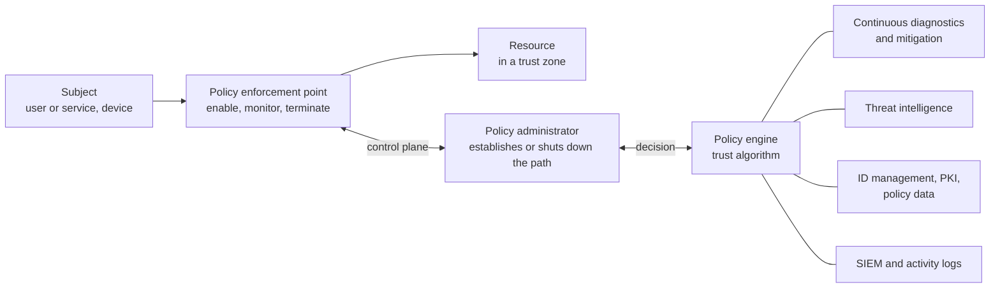

# NIST zero trust architecture (SP 800-207)

## Summary

Zero trust is an approach where being "inside the network" no longer earns trust. Every request to a resource is evaluated on its own, using the identity of the requester, the state of the device and the sensitivity of the resource, and access is granted per session with the least privilege needed. NIST SP 800-207 (August 2020) defines the model: seven tenets, three logical components (policy engine, policy administrator, policy enforcement point), several deployment approaches and a list of risks. It is an architecture, not a product, and it is applied step by step to workflows, not switched on in one project.

Checked against NIST SP 800-207 (August 2020), 2026-10. Later NIST guidance on zero trust implementation (such as example implementations from the NCCoE) was not reviewed for this note.

## Prerequisites

- [Authentication vs authorization](../identity-and-access/authentication-vs-authorization.md) and [authorization](../identity-and-access/authorization.md): zero trust is mostly continuous, per-request authorization.
- [Defense in depth](../foundations/defense-in-depth.md) and [OWASP security principles](../application-security/owasp/owasp-security-principles.md): least privilege and complete mediation are the core ideas.
- [Security posture management](security-posture-management.md): asset and configuration state feeds the access decision.

## Core concepts

### Definition

SP 800-207 describes zero trust as a set of principles for planning enterprise infrastructure and workflows, based on the idea that **network location alone does not imply trust**. The document avoids defining zero trust by what it excludes, and defines it by tenets. It notes that the tenets are an ideal goal, and that not all of them may be fully achievable at once. A **zero trust architecture (ZTA)** is an enterprise architecture that is planned according to these principles.

### Analogy

Compare an old castle with a modern airport. In the castle, once you pass the gate you walk freely. In an airport, every door checks your boarding pass again, a different pass opens different doors, and security staff watch for odd behavior. The airport assumes some people inside are not who they say they are.

The analogy breaks in one place. An airport has one trusted source of identity (the airline's ticket) and a physical layout the staff controls. A company has many identity sources, personal devices, cloud services and software agents, and some of the "doors" belong to other companies.

### The seven tenets

Paraphrased from SP 800-207, section 2.1:

1. **All data sources and computing services are resources.** Devices of all sizes and SaaS count, and personal devices may count if they access enterprise resources.
2. **All communication is secured regardless of network location.** Requests from inside the legacy perimeter get the same security requirements as any other. Protect confidentiality and integrity and authenticate the source.
3. **Access is granted per session.** Trust in the requester is evaluated before access, access uses least privilege, and access to one resource does not carry over to another.
4. **Access is determined by dynamic policy.** The observable state of client identity, application or service, and the requesting asset, and possibly behavioral and environmental attributes, feed policy. Policy varies with the sensitivity of the resource.
5. **The enterprise monitors and measures the integrity and security posture of all owned and associated assets.** No asset is inherently trusted. Subverted, vulnerable or unmanaged assets can be treated differently, including denial.
6. **All resource authentication and authorization are dynamic and strictly enforced before access.** This is a continuous cycle of obtaining access, scanning and assessing threats, adapting and re-evaluating trust. It expects identity, credential and access management (ICAM) and asset management in place, and includes multi-factor authentication for some or all resources.
7. **The enterprise collects as much information as possible about the current state of assets, network infrastructure and communications**, and uses it to improve policy creation and enforcement.

The document also lists six assumptions for a zero trust view of a network, for example that the entire enterprise private network is not an implicit trust zone and assets should act as if an attacker is present on it, that devices may not be owned or configurable by the enterprise, that remote subjects cannot fully trust their local network, and that assets and workflows moving between enterprise and nonenterprise infrastructure should keep a consistent security policy.

The tenets apply to work inside an organization or with partners, and not to anonymous public or consumer-facing processes: an organization cannot impose internal policy on external actors, though it may apply some zero trust policies to registered customers and similar users.

### Logical components



The diagram shows the model from SP 800-207, section 3: the policy decision point is split into a policy engine and a policy administrator, which talk to the policy enforcement point over a control plane, while application data uses a separate data plane. The data sources on the right inform the policy engine.

| Component | Role |
| --- | --- |
| Policy engine (PE) | Makes the decision to grant, deny or revoke access for a subject and resource, using enterprise policy and external input through a **trust algorithm**. Logs the decision |
| Policy administrator (PA) | Executes the decision. Establishes or shuts down the communication path, and generates session-specific authentication tokens or credentials. Tied closely to the PE, and in some products combined with it |
| Policy enforcement point (PEP) | Enables, monitors and terminates connections between a subject and a resource. May be one component or split into a client-side agent and a resource-side gateway, or a portal |

Data sources that support the decision include a continuous diagnostics and mitigation (CDM) system for asset state, industry compliance systems, threat intelligence feeds, network and system activity logs ([SIEM](../defensive-operations/operations/siem.md)), data access policies, enterprise PKI, ID management and security information.

### The trust algorithm

The trust algorithm (TA) is the process the policy engine uses to decide. NIST groups its inputs into the access request, a subject database (the "who", with attributes and privileges), an asset database with observable status, resource requirements, and threat intelligence. NIST distinguishes two variations:

| Variation | How it works | Strength | Weakness |
| --- | --- | --- | --- |
| Criteria-based | A set of attributes that must all be met, configured per resource | Predictable, easy to explain and audit | Rigid. A missing nice-to-have attribute still denies |
| Score-based | Computes a confidence score from weighted data sources and compares it to a per-resource threshold. If below, access is denied or reduced (for example read but not write) | Flexible, supports graded access | Weights can let a strong factor offset a missing essential factor |
| Singular | Evaluates each request alone | Fast | An attack that stays within the subject's allowed role can go unnoticed |
| Contextual | Takes the subject's recent history into account | Can detect subverted credentials used in an atypical pattern | The PE has to keep state and be informed by PA and PEPs |

### Deployment approaches

SP 800-207 describes three approaches to enact a ZTA, which a complete solution would combine:

- **Enhanced identity governance.** Identity and attributes drive policy. It fits open networks with visitors or frequent nonenterprise devices, and cloud services where you cannot deploy your own enforcement components. NIST warns that granting basic network connectivity leaves room for reconnaissance and denial of service.
- **Micro-segmentation.** Individual resources or groups sit on their own network segment behind a gateway acting as the PEP (an intelligent switch, a next-generation firewall, a gateway device, or host-based agents or firewalls). It requires an identity governance program as well.
- **Network infrastructure and software-defined perimeters.** Policy is enforced in the network layer.

It also describes four deployed variations of the abstract architecture: device agent or gateway-based, enclave-based, resource portal-based and device application sandboxing. Which one fits depends on the use case.

### Use cases and threats

NIST gives five deployment scenarios: an enterprise with satellite facilities, a multi-cloud or cloud-to-cloud enterprise, an enterprise with contracted services or nonemployee access, collaboration across enterprise boundaries, and an enterprise with public- or customer-facing services.

Section 5 lists the threats associated with a ZTA itself. Zero trust moves the target. The decision components become the thing worth attacking:

| Threat (SP 800-207, section 5) | Meaning |
| --- | --- |
| Subversion of the ZTA decision process | Compromising the PE or PA, or changing policy |
| Denial of service or network disruption | Disrupting the PEP or decision path so legitimate access fails |
| Stolen credentials or insider threat | Credentials still matter. Zero trust reduces but does not remove the problem |
| Visibility on the network | Encrypted traffic limits inspection, which needs other sources of context |
| Storage of system and network information | The collected data is itself sensitive |
| Reliance on proprietary data formats or solutions | Lock-in and interoperability gaps |
| Use of non-person entities in ZTA administration | Automated agents and AI may make decisions or hold credentials |

### Zero trust and the RMF

The final chapter of SP 800-207 discusses how a ZTA interacts with existing federal guidance, including the [NIST Risk Management Framework](../governance-and-compliance/risk-management/risk-management-framework.md), the Privacy Framework and federal ICAM architecture. For a reader outside government the practical point is that zero trust is an architecture you assess and authorize like any other system, and its components (PE, PA, PEP, data sources) need to be inside the system boundary and categorized at the highest impact of the resources they protect. The categorization advice is this note's reading, not a quotation from NIST.

How the tenets connect to controls and outcomes:

| Tenet | Related controls and outcomes (this note's mapping) |
| --- | --- |
| 2 Secure all communication | SC-8 transmission confidentiality and integrity, SC-7 boundary protection |
| 3 Per-session least privilege | AC-6 least privilege, AC-3 access enforcement, `PR.AA-05` |
| 4 and 6 Dynamic policy, strict enforcement | AC-3, IA-2, `PR.AA-03` (users, services and hardware are authenticated) |
| 5 Posture monitoring | CM-8 system component inventory (control from memory), `ID.AM-01`, `ID.AM-02`, `DE.CM-09` |
| 7 Collect information | AU family, SI-4 system monitoring, `DE.AE-03` |

## Worked example

The scenario: Example Corp (`example.com`) wants to see how a policy engine's trust algorithm behaves for two resources: a wiki (low sensitivity) and a payroll system (high). The toy engine below implements a criteria-based and a score-based algorithm, and keeps per-user state for a contextual factor. It is a teaching model, not a product design. Tested with Python 3.10.12, standard library only.

```python
from dataclasses import dataclass, field


@dataclass
class Request:
    user: str
    mfa: bool
    device_managed: bool
    patched: bool
    geo: str
    resource: str            # "wiki" (low) or "payroll" (high)


POLICY = {                   # per-resource policy, configured independently for each resource
    "wiki":    {"need": {"mfa": True}, "threshold": 40},
    "payroll": {"need": {"mfa": True, "device_managed": True, "patched": True}, "threshold": 80},
}
WEIGHTS = {"mfa": 40, "device_managed": 30, "patched": 20, "usual_geo": 10}


def criteria_based(r: Request) -> bool:
    # every listed attribute must hold, otherwise deny
    return all(getattr(r, k) == v for k, v in POLICY[r.resource]["need"].items())


@dataclass
class Engine:
    history: dict = field(default_factory=dict)   # state kept per subject: contextual evaluation

    def score_based(self, r: Request) -> tuple[int, bool]:
        usual = self.history.setdefault(r.user, {"geo": r.geo})["geo"] == r.geo
        score = (WEIGHTS["mfa"] * r.mfa + WEIGHTS["device_managed"] * r.device_managed
                 + WEIGHTS["patched"] * r.patched + WEIGHTS["usual_geo"] * usual)
        return score, score >= POLICY[r.resource]["threshold"]


pe = Engine()
cases = [
    Request("alice", True,  True,  True,  "PL", "payroll"),
    Request("alice", True,  False, True,  "PL", "payroll"),   # unmanaged laptop
    Request("alice", True,  False, True,  "PL", "wiki"),
    Request("alice", True,  True,  True,  "BR", "payroll"),   # same user, unusual location
    Request("bob",   False, True,  True,  "PL", "wiki"),      # no MFA
]
for r in cases:
    score, ok = pe.score_based(r)
    print(f"{r.user:5s} {r.resource:8s} geo={r.geo} mfa={r.mfa!s:5s} managed={r.device_managed!s:5s} "
          f"criteria={'allow' if criteria_based(r) else 'deny ':5s} score={score:3d} -> {'allow' if ok else 'deny'}")
```

Output:

```text
alice payroll  geo=PL mfa=True  managed=True  criteria=allow score=100 -> allow
alice payroll  geo=PL mfa=True  managed=False criteria=deny  score= 70 -> deny
alice wiki     geo=PL mfa=True  managed=False criteria=allow score= 70 -> allow
alice payroll  geo=BR mfa=True  managed=True  criteria=allow score= 90 -> allow
bob   wiki     geo=PL mfa=False managed=True  criteria=deny  score= 60 -> allow
```

What to notice:

1. **Per-resource policy (tenet 4).** The same unmanaged laptop is denied for payroll and allowed for the wiki. The decision depends on the resource, not on the network.
2. **Score-based can disagree with criteria-based.** The last line is the instructive failure: Bob has no MFA, the criteria-based algorithm denies, but the score-based one allows because a managed, patched device scores 60 and the wiki threshold is 40. A weighted score lets strong factors offset a missing essential factor. If a factor is mandatory, express it as a criterion in addition to the score. NIST does not prescribe an algorithm, and this failure mode is why the choice matters.
3. **Contextual factor.** Alice's request from an unusual country (`BR`) lowers her score by only 10 points, so it still passes with threshold 80. A contextual algorithm needs the weights and thresholds tuned, or a step-up authentication action instead of a pure allow or deny.
4. **State.** The `history` dictionary is the state a contextual PE must hold. In a real ZTA it has to be protected, because it is part of the decision (the "storage of system and network information" threat).

## Trade offs and when to use it

### Benefits

- Limits lateral movement: a compromised device or credential does not open the whole network.
- Fits hybrid and cloud environments where there is no single perimeter.
- Makes access decisions auditable (every decision is logged by the PE).
- Aligns with least privilege and complete mediation, see [OWASP security principles](../application-security/owasp/owasp-security-principles.md).

### Costs and limits

- **Dependency on the decision path.** The PE, PA and PEPs become critical components. An outage blocks access, so they need redundancy (the denial-of-service threat in section 5).
- **Identity quality.** ZTA depends on accurate identity, device inventory and asset state. A weak ICAM program undermines it.
- **Incremental migration.** NIST describes a ZTA as being introduced for workflows step by step, and hybrid operation with a legacy perimeter is expected for a long time.
- **Legacy and operational technology.** Systems that cannot run agents or support modern authentication need gateways or enclaves.
- **Marketing noise.** "Zero trust" is applied to many products. The tenets are a test: does the product actually evaluate each request per session with dynamic policy?

### Alternatives and companions

| Need | Option |
| --- | --- |
| Reduce lateral movement quickly | Network segmentation, as a first step toward micro-segmentation |
| Strong identity | [Authentication methods](../identity-and-access/authentication/authentication-methods.md), [OAuth](../identity-and-access/protocols/oauth.md), [OpenID Connect](../identity-and-access/protocols/openid-connect.md) |
| Cloud-specific posture | [Security posture management](security-posture-management.md) |
| Program-level view | [NIST CSF 2.0](../governance-and-compliance/frameworks/nist-cybersecurity-framework.md) outcomes such as PR.AA and PR.IR |

## Common mistakes

| Mistake | Why it is wrong | Fix |
| --- | --- | --- |
| Treating zero trust as a product to buy | SP 800-207 defines tenets and components, and no single product covers them all | Assess against the tenets and plan per workflow |
| Removing the perimeter before identity is solid | Decisions depend on identity and device data | Build ICAM and asset inventory first |
| Trusting the internal network for "legacy" apps | Violates tenet 2 | Add PEPs or gateways in front of legacy resources |
| Score-based policy with no mandatory criteria | A strong factor can offset a missing one (see the example) | Combine hard criteria with scores |
| Single point of failure in the PE or PA | Outage denies everyone, or a compromise grants everything | Redundancy, hardening, monitoring and change control of policy |
| Granting broad session access after one check | Violates per-session and continuous evaluation (tenets 3 and 6) | Re-evaluate on risk signals and at defined intervals |
| Ignoring non-person identities | Service accounts and agents hold credentials too (threat 5.7) | Include workload identity in the design |
| Collecting data with no protection | Telemetry is sensitive (threat 5.5) | Protect and limit access to PE data stores |

## Practice

1. State three of the seven tenets in your own words.
2. What are the roles of the policy engine, policy administrator and policy enforcement point, and which of them sits in the data path?
3. Explain criteria-based versus score-based trust algorithms and give one failure mode of each.
4. Why does SP 800-207 list the ZTA's own components as a threat surface?
5. A remote contractor on an unmanaged laptop needs access to one internal web application only. Which deployment approach fits and why?
6. Change the example weights so that MFA is mandatory for every resource without adding it to the criteria list. Why is that approach fragile?

Hints and answers:

1. For example: network location does not imply trust (2), access is granted per session with least privilege (3), the enterprise monitors the posture of all assets and no asset is inherently trusted (5).
2. The PE decides, the PA executes the decision and sets up or tears down the path, and the PEP enforces and sits in the data path (enables, monitors and terminates connections).
3. Criteria-based: all attributes must be met, rigid but predictable. Score-based: weighted score against a threshold, flexible but a strong factor can offset a missing essential one.
4. Because they decide access for everything. Subverting the decision process or disrupting it has more impact than compromising a single resource.
5. A resource portal or gateway-based approach with identity-driven policy (the enhanced identity governance approach), since the device is not managed and only one application is needed.
6. Keep the sum of all other weights below the threshold, so that no combination of factors without MFA can reach it (in the example, payroll needs 80 and the non-MFA factors add up to 60). It is fragile because changing other weights or thresholds later can silently break the invariant, so an explicit criterion is safer.

## Further reading

- NIST, SP 800-207, Zero Trust Architecture (August 2020). The primary source for the tenets, logical components, trust algorithm, scenarios and threats: https://nvlpubs.nist.gov/nistpubs/SpecialPublications/NIST.SP.800-207.pdf
- NIST, SP 800-53 Rev. 5 control families AC, IA, SC and SI, which carry the control form of the tenets: https://csrc.nist.gov/pubs/sp/800/53/r5/upd1/final
- NIST, The NIST Cybersecurity Framework (CSF) 2.0 (2024), outcomes in PR.AA and PR.IR: https://doi.org/10.6028/NIST.CSWP.29
