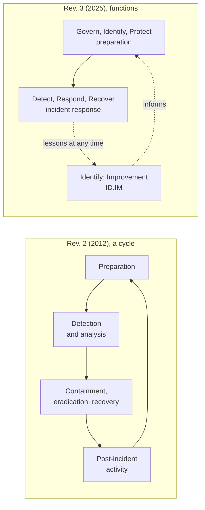

# NIST incident response lifecycle (SP 800-61)

## Summary

NIST SP 800-61 is the U.S. government's reference for handling cybersecurity incidents. For 13 years its Revision 2 (August 2012) defined the model that most of the industry still teaches: preparation, detection and analysis, containment, eradication and recovery, and post-incident activity. In April 2025 NIST withdrew Revision 2 and replaced it with Revision 3, which no longer presents a separate incident handling cycle. It treats incident response as part of cybersecurity risk management and writes the guidance as a profile of the six functions of the [NIST CSF 2.0](../../../governance-and-compliance/frameworks/nist-cybersecurity-framework.md). This note describes the whole lifecycle in both models, phase by phase, with the decision points that matter, and works through three incidents of increasing difficulty: an easy one (a phishing email), a medium one (ransomware with data theft) and an expert one (a stolen CI/CD token reaching a cloud account).

Checked against NIST SP 800-61 Rev. 2 (August 2012, withdrawn 2025-04-03) and Rev. 3 (April 2025), and MITRE ATT&CK technique pages, 2026-10.

## Prerequisites

- [Security operations center](../security-operations-center.md), [SIEM](../siem.md), [SOAR](../soar.md) and [SOP](../sop.md): the people, tools and procedures that execute incident response.
- [NIST Cybersecurity Framework](../../../governance-and-compliance/frameworks/nist-cybersecurity-framework.md): Revision 3 is organized by its Functions.
- [CIA triad](../../../foundations/cia-triad/README.md): the definition of an incident is a loss of one of the three properties.
- [False positive and false negative](../../detection/false-positive-false-negative.md): the detection errors that analysis has to handle.

## Core concepts

### Definitions

- An **event** is any observable occurrence involving computing assets (a login attempt, a software update).
- An **adverse event** is an event with a negative consequence, regardless of cause. Revision 3 addresses only adverse cybersecurity events.
- A **cybersecurity incident** is, quoting FISMA 2014 as Revision 3 does, an occurrence that actually or imminently jeopardizes, without lawful authority, the integrity, confidentiality or availability of information or an information system, or constitutes a violation or imminent threat of violation of law, security policies, security procedures or acceptable use policies.

Whether an adverse event is an incident often needs analysis and judgment. Revision 2 says this directly: determining whether an event is actually an incident is sometimes a matter of judgment, and in many cases a situation should be handled the same way whether or not it is security related (its example is an unexplained loss of internet connectivity every 12 hours). The CSF 2.0 outcome `DE.AE-08` captures the point: incidents are declared when adverse events meet defined incident criteria.

### Analogy

Think of a hospital's emergency plan. The 2012 model is the emergency ward procedure: prepare the ward, triage arrivals, treat, then review the case. The 2025 model puts the ward inside the whole health system: prevention programs, building safety, staff training and governance all count as part of how emergencies are handled, and lessons from each case are fed back at once instead of at a review after discharge.

The analogy breaks in one place. A hospital treats one patient per bed. A cyber incident can run for weeks, branch into sub-incidents, and involve suppliers, regulators and customers while the technical fight continues.

### Why NIST changed the model

Revision 3 explains the reason. When Revision 2 was written, incidents were relatively rare, usually narrow and well-defined, and response and recovery was usually done within a day or two, so it was realistic to treat incident response as a separate activity of a separate team in a circular life cycle. Today, in NIST's words, incidents occur frequently and cause far more damage, and recovery often takes weeks or months. Incident response is now a critical part of cybersecurity risk management and should be integrated across operations, and lessons learned should be shared as soon as they are identified, not after recovery concludes. Revision 3 also says that the details of how to perform incident response change so often and vary so much across technologies that they cannot be maintained in one static publication, so it focuses on risk management for all six CSF Functions and points to NIST's online mappings (the Cybersecurity and Privacy Reference Tool, CPRT) for implementation detail.

### The two models side by side




| Revision 2 phase | CSF 2.0 Functions in Revision 3 |
| --- | --- |
| Preparation | Govern, Identify (all Categories), Protect |
| Detection and analysis | Detect, Identify (Improvement Category), Respond |
| Containment, eradication and recovery | Respond, Recover |
| Post-incident activity | Identify (Improvement Category) |

The Revision 3 model has three levels. At the top is incident response itself (Detect, Respond, Recover). In the middle is Lessons Learned, the Improvement category (ID.IM) of Identify, connected by dashed lines to every Function because lessons are learned at any time. At the bottom is Preparation (Govern, Identify, Protect), which NIST says is not part of incident response but is broader risk management that supports it. NIST adds that organizations should use the life cycle model that suits them, and that larger and more technology-dependent organizations benefit more from a model that emphasizes continuous improvement.

## The lifecycle in depth

The following sections go through each stage using the Revision 3 structure, and add the Revision 2 detail that remains valuable. Quotations are short, and the rest is paraphrased.

### 1. Preparation (Govern, Identify, Protect)

Revision 3's Community Profile rates each CSF element for its relevance to incident response as High, Medium or Low. Most Preparation elements are Low or Medium because they serve risk management in general, and NIST says that does not mean they are unnecessary. The ones rated High show where preparation pays off most:

| High priority outcome | Why it matters for response |
| --- | --- |
| `GV.PO` Policy: cybersecurity policy includes an incident response policy | Authority and expectations exist before the incident |
| `ID.RA-02` Cyber threat intelligence is received | Better detection, and knowledge of attacker tactics and techniques |
| `ID.RA-05` and `ID.RA-06` Risk is understood and responses (accept, mitigate, transfer, avoid) are chosen | Incident decisions use the same risk language as everything else |
| `PR.DS-11` Backups are created, protected, maintained and tested | Recovery depends on them when integrity or availability is lost |
| `ID.IM-02`, `ID.IM-03`, `ID.IM-04` Exercises, operational lessons, and maintained plans | The improvement loop |

Medium priority elements add context. Examples with the Revision 3 recommendations: legal, regulatory and contractual requirements should include incident notification and breach reporting duties (`GV.OC-03`), roles and authorities for incident response should be in policy and the right people given the authority to act (`GV.RR-02`), incident-related decision making should be informed by other enterprise risks (`GV.RM-03`), supplier requirements should include vulnerability and incident disclosure and information sharing (`GV.SC-05`), suppliers should take part in incident planning and exercises (`GV.SC-08`), and inventories of hardware, software, services, data and data flows should be current and automatically updated so they help find affected assets and "shadow IT" (`ID.AM-01` to `ID.AM-08`). Logs are called particularly important for recording and preserving information that is vital to detection, response and recovery (`PR.PS-04`).

**Policy, plan and procedures.** Revision 2 and Revision 3 agree on the elements:

- **Policy** (organization specific): management commitment, purpose and objectives, scope, definitions, roles and authorities (including the authority to confiscate, disconnect or shut down assets and to monitor suspicious activity), reporting requirements, external communication and information sharing rules, handoff and escalation points, prioritization or severity ratings, performance measures, reporting and contact forms.
- **Plan**: mission, strategies and goals, senior management approval, organizational approach, how the team communicates with the organization and other organizations, metrics, a roadmap for maturing the capability, and how the program fits into the organization. Revision 2 asks for review at least annually.
- **Procedures** (SOPs): technical processes, techniques, checklists and forms, tested to validate accuracy and used for training. Playbooks are a common format, and Revision 3 points to the CISA incident and vulnerability response playbooks as examples. See [SOP](../sop.md).

**Team structure** (Revision 2): a central team, distributed teams (which must act as one coordinated entity), or a coordinating team (advice without authority, "a CSIRT for CSIRTs"). Staffing can be employees, partially outsourced (the most prevalent arrangement is 24/7 monitoring by a managed security services provider) or fully outsourced. Selection factors are the need for 24/7 availability, full-time versus part-time members (a part-time team is compared to a volunteer fire department), morale (the work is stressful), cost (including training and forensic tools) and staff expertise. Revision 3 widens the roles beyond handlers to leadership, technology professionals, legal, public affairs, human resources, physical security and asset owners, plus third parties such as a managed service provider or a cloud provider, whose responsibilities should be defined in contracts, including restrictions on what the provider may do.

**Tools and resources** (Revision 2): contact lists with primary and backup contacts and identity verification instructions, on-call information, incident reporting mechanisms (at least one that allows anonymous reports), an issue tracking system, encrypted communication, a war room, secure evidence storage, forensic workstations and software, packet sniffers and analyzers, spare equipment, trusted media with known-good programs, evidence accessories and chain-of-custody forms, port lists, documentation, network diagrams and critical asset lists, baselines of expected activity, cryptographic hashes of critical files, and images of clean installations. A **jump kit** is a portable case with these items, ready at all times and not to be borrowed from. Each handler should have two devices: an investigative one that can be contaminated (and must be rebuilt before reuse) and a standard one for reports and email.

**Prevention** (Revision 2): the team is not usually responsible for prevention but is "fundamental" to it, because too many incidents overwhelm response. The listed areas are risk assessments, host security (hardening, least privilege, auditing), network security (deny what is not expressly permitted), malware prevention at host, server and client levels, and user awareness and training.

### 2. Detect (DE)

Outcome: possible cybersecurity attacks and compromises are found and analyzed. Revision 3 rates every Detect element High.

**Continuous monitoring (`DE.CM`).** Monitoring should cover networks and network services (wired and wireless, flows, DNS and BGP, rogue networks), the physical environment (successful and failed access attempts, tampering with physical access controls), personnel activity and technology usage (anomalous activity, authentication attempts, deception technology), external service provider activities (remote and on-site administration, cloud services, internet providers), and computing hardware and software, runtime environments and their data (email, web, file sharing and collaboration for malware, phishing and exfiltration, authentication attempts, configuration drift, signs of tampering with security tools, endpoint health). It recommends tuning monitoring to reduce false positives and false negatives to acceptable levels, and considering threat information to find activity that would otherwise look benign.

**Adverse event analysis (`DE.AE`).** The volume of events is high, so technical solutions should filter large datasets to a subset suitable for human analysis. Revision 3 recommends SIEM and SOAR for continuous log monitoring, up-to-date threat intelligence in log analysis tools, manual review where automation is not sufficient, centralized log servers and event correlation, estimating impact and scope (`DE.AE-04`), providing information to authorized staff and tools including ticket creation (`DE.AE-06`), integrating threat intelligence and vulnerability disclosures (`DE.AE-07`), and declaring an incident against defined criteria while considering known false positives (`DE.AE-08`). It also advises finding incidents earlier in the attack life cycle: signs may be more obvious later, but impact and scope are much larger by then.

**Revision 2 detail on signs.** It distinguishes **precursors** (a sign that an incident may occur in the future, such as a vulnerability scanner in web server logs, an announced exploit for a service you run, or a threat from a group) from **indicators** (a sign that an incident may have occurred or may be occurring, such as an IDS alert on a buffer overflow attempt, antivirus alerts, unusual filenames, an auditing configuration change in a log, repeated failed logins from an unfamiliar system, or unusual traffic flows). Most attacks have no detectable precursors, so indicators dominate. Sources: IDPS and SIEM alerts, antivirus and antispam, file integrity checking, third-party monitoring, operating system, service and application logs, network device logs and flows (NetFlow, sFlow, IPFIX), public information such as the NVD, and people inside and outside the organization (record how confident the reporter is). It lists eight common **attack vectors** to organize procedures: external or removable media, attrition (brute force, DDoS), web, email, impersonation, improper usage, loss or theft of equipment, and other.

**Analysis recommendations** (Revision 2, section 3.2.4):

1. Profile networks and systems so that changes stand out (profiling alone is not accurate, use it as one technique).
2. Understand normal behavior.
3. Create a log retention policy (incidents may be discovered days, weeks or months later).
4. Correlate events across sources (a firewall log has the source IP, an application log has the username).
5. Keep host clocks synchronized (NTP), because inconsistent timestamps break correlation and evidence.
6. Maintain a knowledge base of the significance of indicators.
7. Use search engines for research (from a separate workstation).
8. Run packet sniffers to collect more data (some organizations require permission because of privacy).
9. Filter the data, but beware that showing only high-significance categories risks missing new activity.
10. Seek assistance from others when the cause or nature remains unclear.

**Documentation.** Start recording facts as soon as an incident is suspected. Record facts only, not opinions. Every step is timestamped, and when possible handlers work in pairs (one records, one operates). Revision 2 lists what the tracking system holds: status, summary, indicators, related incidents, actions taken, chain of custody, impact assessment, contacts, evidence list, comments and next steps. Incident data is sensitive and access should be restricted.

### 3. Respond (RS)

Revision 3 calls Respond "the core of incident response activities".

**Incident management (`RS.MA`).** The criticality of the decisions is stated plainly: evaluating overall risk and applying prioritization are "perhaps the most critical decision points". Key recommendations:

- Execute the plan with relevant third parties once an incident is declared, designate an incident lead, and contact the incident response provider if appropriate (`RS.MA-01`).
- Triage and validate reports with a preliminary review, estimate severity and urgency, and have ways for third parties to report incidents (`RS.MA-02`).
- Categorize by incident type (data breach, ransomware, account takeover, denial of service), prioritize by scope, likely impact, time criticality and resources, and choose strategies by balancing quick recovery against observing the attacker or investigating thoroughly. Every strategy has trade-offs (`RS.MA-03`).
- Do not handle incidents first-come, first-served. Use risk evaluation factors such as asset criticality, functional impact, data impact, stage of observed activity, threat actor characterization and recoverability (`RS.MA` notes).
- Track the status of every ongoing incident to find those that need more resources or a changed strategy. NIST distinguishes **escalation** (more resources or time frames) from **elevation** (involving a higher level of management) (`RS.MA-04`).
- Apply defined criteria to decide when to start recovery, taking possible operational disruption into account (`RS.MA-05`).

Revision 2's three prioritization factors are still useful, and its example categories are in the section on prioritization below.

**Incident analysis (`RS.AN`).** Establish the sequence of events, which assets were involved, the vulnerabilities, threats and threat actors involved, the underlying systemic root causes (`RS.AN-03`), check deception technology for attacker behavior, record actions with integrity and provenance preserved (`RS.AN-06`), collect incident data and metadata under evidence preservation procedures (`RS.AN-07`), and estimate and validate magnitude (`RS.AN-08`). On magnitude NIST warns that determining it is often one of the most challenging aspects, and that skipping it or doing it superficially may underestimate the incident and allow it to continue on other targets without monitoring.

**Evidence handling** (Revision 2, section 3.3.2): evidence is collected to resolve the incident and possibly for legal action, so how it was preserved must be documented. Evidence should be collected according to procedures agreed with legal staff and law enforcement, and accounted for at all times, with chain of custody forms for each transfer and a log with identifying information, the name and contact of everyone who handled it, time and date with time zone, and storage location. Acquire a snapshot of the system as early as possible, because an investigation changes the state of the machine. Formal evidence handling is usually not needed for every incident (most malware incidents do not merit it).

**Communication (`RS.CO`).** Revision 3 identifies four kinds of activity: coordination among parties with response roles, notification (formally informing affected customers, employees, partners and regulators), public communication, and voluntary information sharing (for example with a sector ISAC). Recommendations: have mechanisms in advance, follow procedures about what is reported to whom and when, comply with notification laws and regulations that are "evolving", notify affected third parties as required by regulation, law and contract, notify law enforcement and regulators based on criteria in the plan and with management approval, update senior leadership regularly on major incidents, inform human resources of malicious insider activity, and follow media communication procedures. Revision 2 lists typical parties to notify: the CIO, head of information security, local security officer, other response teams, system owner, human resources, public affairs, legal, US-CERT (required for federal agencies) and law enforcement, and recommends out-of-band communication methods.

**Mitigation (`RS.MI`).**

- **Containment** prevents the expansion of an incident (`RS.MI-01`). Revision 2 lists criteria for choosing a strategy: potential damage and theft, need for evidence preservation, service availability, time and resources needed, effectiveness (partial or full containment), and duration of the solution (an emergency workaround removed in hours, a temporary one in weeks, a permanent one). Create separate strategies for each major incident type, with criteria written down so that decisions are fast. Two warnings from the text: letting a known compromise continue to observe the attacker (for example in a sandbox) is dangerous, needs legal review, and may create liability if the attacker uses the system against others, and containment can itself cause damage. The example: a compromised host runs a process that pings another host periodically, and if you disconnect the host the failed pings can trigger the process to overwrite or encrypt the disk.
- **Eradication** mitigates the incident's effects (`RS.MI-02`): delete malware, disable breached accounts, identify and mitigate all exploited vulnerabilities, and find all affected hosts and services. Revision 3 adds that persistence mechanisms and entry points have to be eliminated.
- Automation: configure security technologies to perform some containment automatically (quarantine malware, move an endpoint to an isolated network, halt an infected container), consider authorizing providers (ISP, cloud provider) to act on your behalf for some incidents such as large DDoS, and always allow handlers to select and perform actions manually as well.
- Revision 2 says not to spend too long on **identifying the attacking host**. The team should stay focused on containment, eradication and recovery, because attribution can be time-consuming and futile, and an IP address is weak evidence (it can be spoofed, ignore pings or be reassigned).

### 4. Recover (RC)

Recovery restores systems to normal operation, confirms that they function normally and, where applicable, remediates vulnerabilities to prevent similar incidents. Operations include restoring from clean backups, rebuilding systems, replacing compromised files, installing patches, changing passwords and tightening controls. Revision 3 adds that when the threat actor is highly sophisticated and the full scope is not revealed, it may be necessary to replace hardware of compromised systems.

- **`RC.RP-01`:** begin recovery during or after response, and make sure people with recovery responsibilities know the plans and authorizations.
- **`RC.RP-02`:** select recovery actions on timeliness, precision and reliability (restoring only affected files versus all files), using the criteria in the plan, and reassess as needs change.
- **`RC.RP-03`:** verify the integrity of backups and other restoration assets (indicators of compromise, corruption) before using them.
- **`RC.RP-04`:** validate that essential services are restored in the right order, confirm with system owners, and monitor the performance of restored systems.
- **`RC.RP-05`:** check restored assets for indicators of compromise, remediate root causes before production use, and verify the correctness of restoration actions.
- **`RC.RP-06`:** declare the end of recovery against criteria and prepare an after-action report covering the incident, the response and recovery actions, and lessons learned.
- **`RC.CO`:** communicate recovery progress to stakeholders, update senior leadership, follow contractual protocols with suppliers, coordinate crisis communication with critical suppliers, and share public updates through approved channels, explaining the steps taken to recover and to prevent recurrence.

Revision 2 recommends a phased approach: for large incidents, recovery may take months, with early phases aimed at quick (days to weeks) high-value changes and later phases at longer-term changes. It also notes that once a resource has been attacked successfully it is often attacked again, so higher levels of logging or monitoring are part of recovery.

### 5. Lessons learned (ID.IM)

Revision 3 puts lessons learned in the Improvement category and says they should often be shared as soon as they are identified, not delayed until recovery concludes. Revision 2's guidance on the meeting is still the clearest:

- Hold it with all involved parties after a major incident, and optionally after lesser incidents, within several days of the end of the incident.
- Questions to answer: exactly what happened and at what times; how well staff and management performed, whether documented procedures were followed and were adequate; what information was needed sooner; whether steps taken may have inhibited recovery; what would be done differently next time; how information sharing could have been better; what corrective actions can prevent similar incidents; what precursors or indicators to watch for; and what additional tools or resources are needed.
- Prepare an agenda from participants' input, use a skilled moderator, record agreements and action items and send them to those who could not attend.
- Produce a follow-up report with a formal chronology of events and a monetary estimate of damage, and keep it for the period in your record retention policy.
- Use the data: to justify funding, to find systemic weaknesses and trends (feeding the risk assessment), and to measure the team. Collect actionable data and not data because it is available.

**Metrics.** Revision 2 lists the number of incidents handled (a measure of workload, not of quality, and not comparable between organizations because definitions differ), time per incident (labor, elapsed time from the start to discovery, to the initial impact assessment and to each stage of handling, response time to the first report, time to report to management and external bodies), and an objective assessment of each incident (adherence to procedures, which precursors and indicators were recorded, whether damage was done before detection, whether the cause and vector were identified, whether it is a recurrence, estimated monetary damage). Revision 3's recommendation is to periodically evaluate program performance (`ID.IM-01`), exercise with suppliers and third parties (`ID.IM-02`), and take improvements from real operations (`ID.IM-03`).

**Evidence retention** (Revision 2): set a policy that weighs the possibility of prosecution (possibly years), your data retention policies (a disk image of mail may conflict with a 180-day email retention rule) and cost. The text cites the U.S. General Records Schedule 24 for incident handling records (three years after follow-up is complete), which applies to federal agencies.

### Prioritization with Revision 2 categories

Revision 2 recommends rating three factors. Functional impact and information impact together give the business impact, and recoverability determines which responses are possible.

| Factor | Example categories from Revision 2 |
| --- | --- |
| Functional impact | None, Low (minimal effect, efficiency lost), Medium (lost ability to provide a critical service to a subset of users), High (no longer able to provide some critical services to any users) |
| Information impact | None, Privacy breach (sensitive personal information accessed or exfiltrated), Proprietary breach, Integrity loss (sensitive or proprietary information changed or deleted). Except for None, more than one can apply |
| Recoverability effort | Regular (predictable with existing resources), Supplemented (predictable with extra resources), Extended (unpredictable, outside help needed), Not recoverable (for example sensitive data exfiltrated and posted publicly, launch an investigation) |

These are examples that an organization adapts. Revision 3 lists the same idea more generally as risk evaluation factors.

### Decision points across the lifecycle

| Decision | Who decides, on what | Failure mode |
| --- | --- | --- |
| Declare an incident (`DE.AE-08`) | Analyst or duty manager against defined criteria | Declaring too late (no criteria) or declaring everything (alert fatigue) |
| Categorize and prioritize (`RS.MA-03`) | Incident lead, using impact and recoverability | First-come, first-served handling |
| Choose containment strategy (`RS.MI`) | Incident lead with system owner and legal, using the six criteria | Disconnecting without understanding side effects, or delaying containment to watch the attacker |
| Preserve evidence (`RS.AN-07`) | Incident lead with legal | Rebuilding before capturing, or no chain of custody when it was needed |
| Notify (`RS.CO-02`) | Legal, leadership, communications, using law and contract | Missing a legal clock, or inconsistent messages |
| Start recovery (`RS.MA-05`, `RC.RP-01`) | Incident lead with system owners, against criteria | Restoring while the attacker still has access |
| Declare the end of recovery (`RC.RP-06`) | Incident lead with leadership, against criteria | Closing without verified integrity and monitoring |

## Worked examples

Three incidents of increasing difficulty follow. In each, the actions are mapped to CSF 2.0 outcomes (the Revision 3 view) and to Revision 2 phases. All data is synthetic (RFC 5737 addresses, `example.com` and similar placeholders) and the scenarios are for a lab, a tabletop exercise or a defensive study, in an environment you are authorized to work in. The full scripts are in the [scripts directory](scripts/). Tested with Python 3.10.12, standard library only.

### Example 1 (easy): a reported phishing email

**Situation.** At 08:30 an employee, J. Kowalska, reports an email "from Accounts Payable" about an overdue invoice. She has not clicked the link. One mailbox, one user, no sign of compromise.

**What makes it easy.** The scope is one message, the evidence is complete in the message itself, the decision is binary (malicious or not), and containment is cheap and has no side effects. The difficulty is doing it consistently and recording it, which is why the easy case is the training ground for the process.

**Detect and analyze (Rev. 2: detection and analysis).**

| Step | Action | CSF 2.0 |
| --- | --- | --- |
| 1 | Receive the report through the reporting mechanism and open a ticket | `RS.MA-02` (reports triaged and validated) |
| 2 | Preserve the original message with headers (not a forwarded copy) and hash it | `RS.AN-07` |
| 3 | Check authentication results, sender identity consistency, and links | `DE.AE-02` |
| 4 | Search the mail system for the same sender, subject, and URL across all mailboxes | `DE.AE-03`, `DE.AE-04` (scope) |
| 5 | Declare an incident if criteria are met (a malicious message delivered to at least one user) | `DE.AE-08` |

The triage script automates step 3 on a synthetic message:

```python
auth = " ".join(msg.get_all("Authentication-Results", [])).lower()
for mech in ("spf", "dkim", "dmarc"):
    m = re.search(rf"{mech}=(\w+)", auth)
    if m and m.group(1) != "pass":
        findings.append(f"{mech.upper()} result is '{m.group(1)}'")
# ... identity mismatches between From, Reply-To and Return-Path, link text versus destination,
#     and a SHA-256 over the raw message as the evidence record (full script: scripts/triage-phishing-email.py)
```

Output:

```text
findings:
 - SPF result is 'fail'
 - DKIM result is 'none'
 - DMARC result is 'fail'
 - Reply-To domain 'invoices-example.net' differs from From domain 'example.com'
 - Return-Path domain 'invoices-example.net' differs from From domain 'example.com'
 - link text shows 'login.example.com' but goes to 'login.example.com.invoices-example.net'
 - destination 'login.example.com.invoices-example.net' only embeds 'example.com' as a label, it is not under that domain
first relay IP: 203.0.113.44
evidence sha256: 6b251bc9fef4e865...
verdict: malicious (7 signals, several of them correlated)
```

Read the output with care. The seven signals are not independent: SPF, DKIM and DMARC failures are one story about sender authentication, and the two identity mismatches are another. What convinces is the combination of an authentication failure, an identity mismatch and a deceptive link. The domain trick (`login.example.com.invoices-example.net` is a host under `invoices-example.net`) is the classic look-alike, and a script that checks "does the host contain my domain" would be fooled, which is why the last check tests whether the host is under the domain.

**Prioritize (Rev. 2 categories).** Functional impact None, information impact None so far (no click is known), recoverability Regular. Low priority, high confidence.

**Contain and eradicate (Rev. 2: containment, eradication and recovery).**

| Step | Action | CSF 2.0 |
| --- | --- | --- |
| 6 | Remove the message from all mailboxes, block the sender domain and the URL at the proxy and DNS | `RS.MI-01`, `RS.MI-02` |
| 7 | Check proxy and DNS logs for any visit to the URL, before the block and after | `DE.CM-09`, `RS.AN-08` (magnitude) |
| 8 | If any user visited and typed credentials: reset the password, revoke sessions and tokens, review recent sign-ins and mailbox rules, and treat as a new, medium incident | `RS.MI-02`, `PR.AA` |

**Recover.** Nothing to restore. Confirm that the block works, close the ticket against criteria (`RC.RP-06`).

**Lessons learned (`ID.IM-03`).** Short, 15 minutes. What stopped the email (nothing, SPF and DMARC failed but the gateway delivered it, so check the policy: is DMARC set to reject for `example.com`, and does the gateway enforce receiver-side DMARC results?). How long from delivery to report (the message was delivered at 08:14 and reported at 08:30, 16 minutes). Update the awareness material with this look-alike pattern.

**Time budget.** Triage 10 to 15 minutes, containment 10 to 15 minutes, with no escalation needed.

### Example 2 (medium): ransomware with data theft on a file server

**Situation.** At 23:18 (true time) the EDR raises an alert for ransomware behavior on the file server `fs01` at Example Corp (`example.com`). The server holds finance and payroll files. The on-call analyst declares an incident at 23:22. During the investigation it turns out that a service account `svc-backup` logged in through the VPN from an external address at 22:41, and that 18 GB were copied to an external address at 22:56, before the encryption started.

**What makes it medium.** Several systems and teams are involved (identity, network, backup, legal), the evidence is spread across logs with different clocks, the scope has to be estimated and not assumed, and containment decisions have trade-offs (isolating the host destroys volatile evidence and may trigger destructive behavior, keeping it online risks more encryption). The incident is also a data breach, so notification duties apply.

**Revision 2 lens: priority.** Functional impact Medium (finance cannot reach shared files), information impact Privacy breach and Integrity loss (payroll data was exfiltrated and encrypted), recoverability Supplemented (backups exist, restoring needs extra staff and about two days). This is a high priority incident, handled with an incident lead, legal and communications engaged.

**Timeline correlation.** Three log sources have clocks that disagree. Before reasoning about order you correct them. The script merges the sources with their known offsets and computes the elapsed-time measures that Revision 2 lists under "time per incident":

```python
def normalized():
    rows = []
    for name, src in SOURCES.items():
        for local, text in src["events"]:
            rows.append((t(local) - src["offset"], name, text))   # true time = reported time minus the clock's offset
    return sorted(rows)
# ... then intervals between the first malicious event, detection, declaration and each containment action
# (full script: scripts/correlate-incident-timeline.py)
```

Output:

```text
timeline (corrected to true time):
  22:41:10  vpn  login ok user=svc-backup from 198.51.100.23
  22:41:55  vpn  session assigned 10.0.4.17
  22:56:03  fs01 smb: user svc-backup copied 18 GB to 203.0.113.80
  23:17:50  fs01 mass rename *.docx -> *.locked begins
  23:18:30  edr  alert: ransomware behavior on fs01
  23:22:00  edr  incident declared by analyst
  23:29:45  edr  svc-backup disabled, sessions revoked
  23:33:30  fs01 host isolated from network (analyst action)

elapsed time (minutes):
  initial access -> exfiltration started : 14.9
  initial access -> detection            : 37.3 (attacker dwell before any alert)
  detection -> declaration               : 3.5
  detection -> host contained            : 15.0
  detection -> identity contained        : 11.2

without clock correction: host isolated 23:27:30, identity revoked 23:31:45 -> 'host first'
with clock correction   : host isolated 23:33:30, identity revoked 23:29:45 -> 'identity first'
```

What the output teaches:

1. **Clocks change the story.** Uncorrected, the logs say the host was isolated before the identity was revoked. Corrected, the identity was revoked first. In a post-incident review the first version would produce wrong conclusions about the response order, and in a legal setting inconsistent timestamps weaken the evidence. This is the reason Revision 2 says to keep clocks synchronized and to record the clock offset when you find one.
2. **The exfiltration came before the alert.** The data left 22 minutes before detection. The ransomware alert was the first signal, but the first malicious event was an unusual VPN login 37 minutes earlier. Lesson for detection engineering (`DE.CM-03`, `DE.AE-02`): alert on a service account logging in from an unusual location and on large outbound copies, not only on encryption.
3. **Identity containment was faster than host containment** (11.2 versus 15.0 minutes). That is a good order. A host is a copy of the problem, an identity is the way back in.

**Respond and recover.**

| Action | CSF 2.0 | Rev. 2 phase |
| --- | --- | --- |
| Open the incident, name an incident lead, bring in legal and the backup administrator | `RS.MA-01` | Detection and analysis |
| Categorize as data breach plus ransomware, prioritize (see above) | `RS.MA-03` | Detection and analysis |
| Capture volatile data and a disk image of `fs01` before reimaging, record chain of custody | `RS.AN-07` | Containment (evidence) |
| Decide on containment: disable `svc-backup`, revoke sessions, block the external destination, then isolate the host (after memory capture) | `RS.MI-01` | Containment |
| Check all other assets that `svc-backup` could reach and all hosts with the same logon pattern | `RS.AN-08` | Detection and analysis |
| Root cause: VPN credential of the service account was reused and had no second factor, and the account could read all shares | `RS.AN-03` | Detection and analysis |
| Eradicate: rotate the account and all secrets it could read, remove persistence found, patch or harden the VPN access | `RS.MI-02` | Eradication |
| Notify the data protection officer, regulators and affected employees as required by law and contract | `RS.CO-02`, `RS.CO-03` | Detection and analysis (notification) |
| Verify backup integrity before restoring, restore to a rebuilt server, verify and monitor | `RC.RP-03`, `RC.RP-05` | Recovery |
| After-action report and lessons learned | `RC.RP-06`, `ID.IM-03` | Post-incident activity |

**Containment trade-off in practice.** Revision 2's warning applies. Before isolating `fs01` the team checks whether the ransomware has a network-dependent kill behavior (such as an unreachable key server triggering a wipe), and captures memory if the decision allows. The decision is recorded with its reasons (`RS.MA-03` notes that every strategy has trade-offs).

**Notification.** The breach involves personal data of employees, so the notification duties of the applicable laws and contracts apply. The legal timelines vary by jurisdiction and sector, and are for the legal department and counsel to determine, which is why `GV.OC-03` puts them in preparation.

**Lessons learned.** Enforce MFA on all remote access including service accounts or replace service account interactive access with workload identities, restrict the account to the shares it needs (least privilege, `PR.AA-05`), alert on large outbound transfers and on service accounts logging in from outside, test backup restoration and its integrity checks (`PR.DS-11`), and write the clock offsets into the log management standard.

**Time budget.** Containment within about 15 minutes of detection in the example. Eradication and recovery take days.

### Example 3 (expert): stolen CI/CD token reaches a cloud account

**Situation.** A third-party vendor tells Example Corp (`example.com`) that its CI/CD service had a security incident and that secrets stored in pipeline settings may have been exposed. Example Corp's deployment pipeline uses a token that can assume the role `role/deploy` in its cloud account. Three days later the audit log shows `role/deploy` being used from an unfamiliar network, listing storage, creating an access key for a user `user/ci-admin`, and editing a role trust policy. Large reads of a customer exports bucket follow.

**What makes it expert.**

- **The first signal is external and ambiguous.** A vendor notification, not an alert, starts the incident. The trigger arrives before there is proof, and the team has to decide whether to treat it as an incident (`DE.AE-08` criteria, `GV.SC-08` supplier involvement).
- **The attacker's access is a graph, not a host.** There is no machine to isolate. Identity, trust relationships, keys and sessions form a graph, and removing the stolen credential leaves the paths that the attacker created.
- **Persistence is built from legitimate features:** an additional access key, a modified trust policy. This corresponds to MITRE ATT&CK techniques such as T1078.004 (Valid Accounts: Cloud Accounts), T1098.001 (Account Manipulation: Additional Cloud Credentials) and T1550.001 (Use Alternate Authentication Material: Application Access Token). The initial access is a supply chain compromise of the CI service (T1195.002), and the objective data theft uses T1530 (Data from Cloud Storage). Mapping is a labelling aid and does not replace analysis.
- **Containment changes production.** Revoking the deploy role stops deployments. Rotating signing keys affects releases and customers.
- **Third parties and the supply chain are part of the response.** The vendor, the cloud provider's support, customers who receive artifacts from the pipeline, and regulators all have roles.
- **Evidence is in provider logs** with retention limits and different clocks, and a cloud account has no disk to image, although volume snapshots and log exports can be preserved.
- **The compromise may have spread to what you ship** (the release signing key was readable), turning your incident into your customers' incident.

**Detect and analyze.**

| Step | Action | CSF 2.0 |
| --- | --- | --- |
| 1 | Treat the vendor notice as a trigger. Inventory every secret stored in that CI service and what each can do | `ID.AM-04` (supplier services), `GV.SC-08` |
| 2 | Look at the audit log for the exposure window: use of the deploy role from unexpected addresses, identity and trust changes, new credentials, storage reads | `DE.CM-06` (external service provider activity), `DE.AE-03` |
| 3 | Declare an incident when unauthorized use of the role is confirmed (not when the vendor emails) | `DE.AE-08` |
| 4 | Estimate magnitude: which identities and resources can the stolen token reach, directly and through other identities? | `RS.AN-08` |
| 5 | Preserve evidence early: export the audit logs to a separate account, snapshot affected resources, record who did what and when | `RS.AN-06`, `RS.AN-07` |

**Computing the closure.** Step 4 is the technical heart. The script models identities, the "can become" relationships (assume-role trust, token exchange, key creation rights), the resources each identity reaches, and the persistence found in the logs. It computes everything reachable from the stolen token, shows why rotating only the token fails, and derives the containment plan from the closure:

```python
def closure(start):
    seen, q = {start}, deque([start])
    while q:
        for nxt in CAN_BECOME.get(q.popleft(), []):
            if nxt not in seen:
                seen.add(nxt); q.append(nxt)
    return seen
# ... full model, the naive containment and the derived plan: scripts/compute-cloud-containment-closure.py
```

Output:

```text
identities reachable from the stolen token: ['role/artifact-write', 'role/data-read', 'role/deploy', 'user/ci-admin']
resources reachable: ['bucket/build-artifacts', 'bucket/customer-exports', 'bucket/release-signing-keys', 'iam:CreateAccessKey']

naive containment (rotate the CI token only):
  attacker can still become: ['role/artifact-write', 'role/data-read', 'user/ci-admin']
  data the attacker can still read: ['bucket/customer-exports']

containment plan derived from the closure:
   1 freeze changes to IAM in the account (so the picture stops moving)
   2 remove persistence on user/ci-admin: access-key AKIA-EXAMPLE-0001
   2 remove persistence on role/deploy: trust policy edited to trust external account 999999999999 (placeholder)
   3 revoke active sessions of role/artifact-write (deny tokens issued before now)
   3 revoke active sessions of role/data-read (deny tokens issued before now)
   3 revoke active sessions of role/deploy (deny tokens issued before now)
   3 revoke active sessions of user/ci-admin (deny tokens issued before now)
   4 rotate the CI secret and every secret the CI runner could read
   5 verify with a fresh closure computation, then re-enable changes
```

What the output teaches:

1. **The blast radius is larger than the compromised credential.** The token reaches three more identities and a bucket of customer exports through `user/ci-admin`, and it can read `bucket/release-signing-keys`, which turns a cloud incident into a software supply chain incident.
2. **Naive containment fails.** Rotating the CI token alone leaves the attacker holding the access key they created and the trust edit, so the customer exports remain readable. This is the cloud version of Revision 2's warning that handlers should not assume containment worked.
3. **The plan is derived, not recalled.** Freeze first so that the graph stops changing. Remove persistence. Revoke sessions for every identity in the closure (revocation by a deny on tokens issued before a time works because stolen tokens issued earlier stop working while legitimate new sessions can start). Rotate secrets. Verify by recomputing the closure. The ordering is the point: revoking sessions before removing the persistence lets the attacker create new ones.
4. **The model is a simplification.** Real clouds have resource policies, service control policies, conditions and cross-account paths, and a tool that computes effective permissions (CIEM) or your cloud provider's access analysis should replace this toy for the real computation.

**Respond (beyond containment).**

| Action | CSF 2.0 |
| --- | --- |
| Treat `bucket/release-signing-keys` as compromised: revoke and re-issue the signing keys, review all artifacts signed since the exposure window, and notify downstream consumers with a verification method | `RS.MI-02`, `RS.CO-02`, `GV.SC-05` |
| Coordinate with the CI vendor (what happened, scope, indicators) and with your cloud provider's support | `RS.CO-03`, `GV.SC-08` |
| Determine what data left (read logs for the exports bucket, object-level access logging if it was enabled, replication or copy to external accounts) | `RS.AN-03`, `RS.AN-08` |
| Legal: assess notification duties across jurisdictions, contracts with customers, and any filing obligations. As examples only, EU GDPR sets a 72 hour limit from awareness for notifying the supervisory authority where it applies, and the U.S. Securities and Exchange Commission requires public companies to disclose material cybersecurity incidents within four business days of determining materiality. Check current law with counsel | `RS.CO-02` |
| Threat hunt: search for the same actor in other accounts and environments, and for the techniques listed above | `DE.AE-07` |
| Decide on a disclosure and communication line for customers and the public | `RS.CO-03`, `RC.CO-04` |

**Recover.** Rebuild trust in the pipeline: new CI secrets with short lifetimes and workload identity (federation) instead of long-lived tokens, least-privilege roles per pipeline stage (`PR.AA-05`), separation between build and signing (the signing key must not be readable by the deploy role, compare SSDF PS.1 and PS.2 in [NIST SSDF](../../../application-security/supply-chain/nist-secure-software-development-framework.md)), verification that restored resources are clean (`RC.RP-05`), and a declared end of recovery with documented criteria (`RC.RP-06`).

**Lessons learned.** Supplier incident notification is a trigger, so a standing procedure for third-party incident notices is needed (`GV.SC-08`). Secrets in third-party systems should be inventoried and minimized. The cloud audit logs were the only evidence, so retention and alerting on identity changes (new keys, trust policy edits) is detection engineering work (`DE.CM-06`, `DE.AE-02`). Exercise with the vendor if the contract allows (`ID.IM-02`).

**Time budget.** Initial containment in hours if the plan exists, and a multi-week effort for the supply chain follow-up and notifications.

### How the three examples differ

| Dimension | Easy | Medium | Expert |
| --- | --- | --- | --- |
| Trigger | A user report | An EDR alert | A vendor notice, then log evidence |
| Scope | One message | A server, an account, a share | Identity graph, signing keys, customers |
| Evidence | The message itself | Logs on three systems with different clocks | Cloud audit logs, vendor data, snapshots |
| Containment risk | None | Medium: evidence loss, destructive triggers | High: production, releases and customers affected |
| Parties | Security | IT, legal, communications, backup | Plus vendor, cloud provider, customers, regulators |
| Decisive skill | Consistent triage | Timeline correlation and trade-offs | Graph thinking, supply chain response |
| Rev. 3 weight | Detect, Respond | All Functions, Recover heavy | All Functions plus Govern (suppliers, legal) |

## Trade offs and when to use it

### Using the Revision 3 profile

- **Strengths.** One taxonomy across prevention, response and governance. It connects incident response to risk management, lets teams reuse CSF Profiles and tooling, and gives implementation resources through the CPRT mappings.
- **Limits.** It is less prescriptive about operational steps than Revision 2, because NIST decided that detail cannot be kept current in one publication. Teams need playbooks, tool-specific guidance and technique knowledge from elsewhere (see [MITRE ATT&CK](../../../threat-intelligence/mitre/mitre-attack.md)).
- **Fit.** Good for program design, gap analysis and communication with executives and auditors. Less useful as a step-by-step runbook.

### Using the Revision 2 cycle

- It remains easy to teach, easy to put on a slide and widely used in certifications and older policies, and its operational detail (containment criteria, evidence handling, lessons learned questions) is still sound.
- Using it is acceptable if you say which model you use. NIST itself says organizations should choose the life cycle that suits them.

### Alternatives

| Need | Option |
| --- | --- |
| A different published cycle | The incident handling steps taught by SANS, see the [SANS note](../../../organizations/sans.md) |
| Operational playbooks | CISA incident and vulnerability response playbooks, which Revision 3 cites as examples |
| Evidence and forensics detail | NIST SP 800-86, cited by Revision 2 for integrating forensic techniques into incident response |
| Exercises | NIST SP 800-84, cited by both revisions for tests, training and exercises |
| Threat information sharing | NIST SP 800-150, cited by Revision 3 |
| Recovery planning | NIST SP 800-184, cited by Revision 3 |

### Limits of any lifecycle model

A lifecycle is a map. Real incidents loop (containment reveals a new scope), run in parallel (recovery of one system while another is still contained) and stall (waiting for legal or a vendor). The model's value is the shared vocabulary and the checklist of decisions, not the order of the arrows.

## Common mistakes

| Mistake | Why it is wrong | Fix |
| --- | --- | --- |
| Citing SP 800-61 Rev. 2 as current | NIST withdrew it on 2025-04-03 | Cite Rev. 3, and say "Rev. 2 model" for the legacy cycle |
| Treating Govern, Identify and Protect as outside incident response | They determine how well the response goes | Rate preparation readiness as part of response planning |
| Waiting for the post-incident meeting to learn | Revision 3 says lessons should be shared as soon as they are identified | Feed ID.IM during the incident |
| First-come, first-served handling | Revision 2 and 3 both warn against it | Prioritize by functional impact, information impact and recoverability |
| Declaring everything an incident, or nothing | Not every adverse event meets incident criteria, and late declaration costs time | Define criteria and record the declaration decision (`DE.AE-08`) |
| Reasoning about order with unsynchronized clocks | Produces false conclusions (see example 2) | Keep NTP in place and record offsets |
| Isolating a host without thinking | A malicious process may react to the disconnect | Review known behavior, capture volatile data, document the decision |
| Rotating the stolen credential and stopping | Persistence created by the attacker remains | Compute the reachable set, remove persistence, revoke sessions, verify (example 3) |
| Restoring from backups without verifying them | The backup may be tampered or infected (`RC.RP-03`) | Verify integrity before restoring |
| Rebuilding before capturing evidence | Forensic records need preserved integrity and provenance (`RS.AN-06`, `RS.AN-07`) | Capture images and logs first, then rebuild |
| Chasing attribution during the incident | Revision 2 warns it can be futile and distracts from the goal | Stay on containment, eradication and recovery |
| No agreement with suppliers on who does what | Revision 3 stresses clear contractual responsibilities | Define roles, information flows and authority in contracts (`GV.SC-05`, `GV.SC-08`) |
| Recording opinions as evidence | Revision 2: log only facts, put conclusions in reports | Separate the logbook from the analysis |

## Practice

1. Name the four Revision 2 phases and the CSF 2.0 Functions that replace them in Revision 3.
2. Define precursor and indicator and give an example of each. Which is more common?
3. List the six criteria Revision 2 gives for choosing a containment strategy.
4. An incident has Medium functional impact, Integrity loss information impact and Extended recoverability. What does that say about response priority and resources?
5. In Revision 3, which part of the model is "Lessons learned", and why is it drawn in the middle?
6. Explain the difference between escalation and elevation.
7. Easy example variation: the user did click the link and entered a password. Re-plan the response. What changes in priority, containment and evidence?
8. Medium example variation: the backup server was also encrypted. Which outcomes (CSF ID) become critical, and what would you do before declaring recovery?
9. Expert example variation: the cloud provider's own support portal account of an administrator was also used. Extend the closure model: what edges and what resources do you add?
10. Why do Revision 2 and 3 both advise against handling incidents on a first-come, first-served basis? Give a case where it would go wrong.

Hints and answers:

1. Preparation, Detection and analysis, Containment eradication and recovery, Post-incident activity. Preparation maps to Govern, Identify and Protect. Detection and analysis maps to Detect, Identify (Improvement) and Respond. Containment, eradication and recovery maps to Respond and Recover. Post-incident activity maps to Identify (Improvement).
2. A precursor suggests an incident may occur in the future (a vulnerability scanner in web logs). An indicator suggests it may be occurring or has occurred (an IDS alert, repeated failed logins). Indicators are far more common.
3. Potential damage and theft, need for evidence preservation, service availability, time and resources needed, effectiveness of the strategy, duration of the solution.
4. A moderate disruption but untrustworthy data and an unpredictable recovery, so it merits a strategic response with extra resources and outside help, and data cannot be trusted until validated.
5. It is the Improvement category (ID.IM) of Identify. It sits in the middle because lessons from every Function feed it and it informs every Function, continuously.
6. Escalation increases resources or time frames. Elevation involves a higher level of management.
7. Priority rises to medium or high. Containment adds password reset, session and token revocation, review of sign-ins and mailbox rules (including forwarding rules), and a search for use of the credential elsewhere. Evidence adds sign-in logs, mailbox audit logs and the endpoint if malware is suspected. The scope question (`RS.AN-08`) becomes the main one.
8. `RC.RP-03` (integrity of restoration assets) and `PR.DS-11` (backups protected and tested) fail, so recovery needs an offline or immutable copy or a rebuild from clean sources. Do not declare recovery until restored data is verified and the attacker's access is removed. Notify as required, and review backup isolation as a lesson.
9. Add an identity node for the administrator's provider-support account, an edge to the cloud account's administrative role (support access), and resources such as support case data and the ability to change contact details or reset credentials. Then include their removal and verification in the containment plan.
10. Because the first report may be low impact while a later one is critical. For example, an old low-severity malware alert is handled first, while a report of exfiltration from a finance server waits in the queue.

## Further reading

- NIST, SP 800-61 Rev. 3, Incident Response Recommendations and Considerations for Cybersecurity Risk Management: A CSF 2.0 Community Profile (April 2025). The current guidance and the source of the Revision 3 model and Community Profile: https://doi.org/10.6028/NIST.SP.800-61r3
- NIST, SP 800-61 Rev. 2, Computer Security Incident Handling Guide (August 2012, withdrawn 2025-04-03). The source of the four-phase cycle, precursors and indicators, containment criteria, evidence handling, lessons learned questions and impact categories: https://doi.org/10.6028/NIST.SP.800-61r2
- NIST, The NIST Cybersecurity Framework (CSF) 2.0 (2024), for the Functions and outcomes used in the mapping: https://doi.org/10.6028/NIST.CSWP.29
- NIST, SP 800-86 (forensic techniques), SP 800-84 (exercises), SP 800-150 (threat information sharing), SP 800-184 (recovery) and SP 800-92 (log management), cited by the two revisions. Not read for this note.
- CISA, Cybersecurity Incident and Vulnerability Response Playbooks, cited by Revision 3. Not read for this note.
- MITRE ATT&CK technique pages for T1078.004, T1098.001, T1195.002, T1530 and T1550.001: https://attack.mitre.org/
