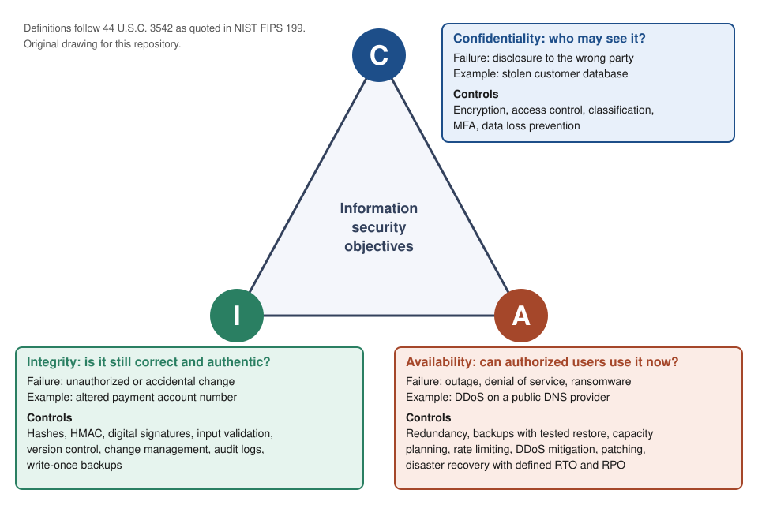

# CIA triad

## Summary

The CIA triad names three properties that information security tries to preserve: confidentiality (only the right parties can read the data), integrity (the data is correct and has not been changed improperly) and availability (authorized users can use the data and systems when they need them). Every security incident can be described as a loss of one or more of these properties, which makes the triad a common vocabulary for risk assessment, control selection and incident reporting. The three goals pull against each other, so a design is never "maximum C, I and A". It is a deliberate balance chosen for a specific asset.

Checked against NIST FIPS 199 (2004), NIST SP 800-53 Rev. 5, the MITRE ATT&CK technique pages named in the text, RFC 2104, RFC 6962 and RFC 9162, 2026-10. The scripts in the `scripts` directory were run with Python 3.10.12.

## Prerequisites

- [Security overview](../security-overview.md): what cybersecurity is and which assets it protects.
- Basic familiarity with hashing and encryption. The worked example below uses `openssl`, `sha256sum` and Python 3.10 on Linux.

## Core concepts

### The model in one picture



For comparison, the vendor infographic that was collected earlier for this note:


The triangle is a mnemonic, not a hierarchy. No corner is more important by default. Which property dominates depends on the asset: a medical record leans on confidentiality and integrity, a payment gateway on availability and integrity, a public marketing page almost entirely on integrity and availability.

### Definition

The triad is a model that classifies the security objectives for information and information systems into three properties. The U.S. FISMA law defines them, and NIST FIPS 199 quotes the definitions:

| Property | Statutory definition (44 U.S.C. 3542, as quoted in FIPS 199) | Loss, in FIPS 199 words |
| --- | --- | --- |
| Confidentiality | Preserving authorized restrictions on information access and disclosure, including means for protecting personal privacy and proprietary information | Unauthorized disclosure of information |
| Integrity | Guarding against improper information modification or destruction, and includes ensuring information non-repudiation and authenticity | Unauthorized modification or destruction of information |
| Availability | Ensuring timely and reliable access to and use of information | Disruption of access to or use of information or an information system |

The ISO/IEC 27000 vocabulary uses the same three terms with slightly different wording (paraphrased here, the standard text is not reproduced): information is not disclosed to unauthorized parties, information stays accurate and complete, and information is accessible and usable on demand by an authorized party.

Two details in these definitions matter for expert use:

- **Integrity covers destruction and authenticity.** It is not only "no bit flips". Deleting a record without authorization is an integrity loss, and so is accepting a forged record that was never altered in transit.
- **Availability includes timeliness.** A system that answers after 40 seconds may be "up" and still violate availability for a trading system. The requirement is a service level, not a boolean.

### Analogy

Think of a bank vault. Confidentiality is the wall and the lock: only people with the right key get in. Integrity is the seal on every deposit box and the ledger that records changes: you can tell if something was altered or swapped. Availability is the opening hours and the second entrance: the customer who has the right to enter can actually get in on Tuesday at 10:00.

The analogy breaks in one place. A vault holds physical objects that exist in one copy, so taking something out also removes it. Data is copied freely, so a confidentiality breach usually leaves no visible trace, which is why detection matters as much as prevention.

### Mechanism: how each property is attacked and protected

Each property has a failure that comes from attackers, a failure that comes from mistakes or the environment, and controls that address both.

| Property | Attacker-driven loss | Accidental or environmental loss | Preventive controls | Detective and recovery controls |
| --- | --- | --- | --- | --- |
| Confidentiality | Credential theft, interception, exfiltration | Misconfigured public storage, mis-sent email, lost laptop | Encryption at rest and in transit, access control, classification, MFA | Access logging, data loss prevention alerts, key rotation after exposure |
| Integrity | Tampering with data or code, log wiping, supply chain compromise | Operator error, software bug, disk corruption | Hashes and HMAC, digital signatures, input validation, least privilege on write, change management | File integrity monitoring, audit logs, checksums on backups, reconciliation |
| Availability | Denial of service, ransomware, wiper malware | Hardware failure, power loss, bad deploy, expired certificate | Redundancy, capacity planning, rate limiting, patching, DDoS mitigation | Monitoring and paging, tested restores, disaster recovery plan |

Three mechanisms deserve a closer look.

**Confidentiality is enforced by access control and cryptography, and bounded by key management.** Encryption moves the secret from the data to the key. If the key lives next to the data, the control collapses to nothing. Formal models give the precise rule. The Bell-LaPadula model (1973) forbids reading data at a higher classification ("no read up") and writing it to a lower one ("no write down"), so information can only flow upward.

**Integrity is enforced by detecting or preventing unauthorized change.** A cryptographic hash such as SHA-256 detects change, but anyone who can change the data can also recompute the hash. Detection that survives an active attacker needs a secret (HMAC) or a private key (digital signature), see [hashing algorithms](../../cryptography/hashing/hashing-algorithms.md) and [public key infrastructure](../../cryptography/public-key-infrastructure.md). The Biba model (1977) is the integrity counterpart of Bell-LaPadula: no read down, no write up, so low-trust data cannot contaminate high-trust data. The Clark-Wilson model (1987) takes the commercial view: data may only change through well-formed transactions by authorized parties, and duties are separated.

**Availability is enforced by removing single points of failure and by planning recovery.** Two numbers drive the design:

- **RTO (recovery time objective):** how long the service may be down.
- **RPO (recovery point objective):** how much data, measured in time, may be lost.

An availability target translates directly into a downtime budget, computed as `(1 - target) x 365 x 24 x 60` minutes per year:

| Target | Downtime per year |
| --- | --- |
| 99.9% | 525.6 min (8.76 h) |
| 99.99% | 52.56 min |
| 99.999% | 5.26 min |

Each extra nine usually costs a step change in architecture (multi-zone, multi-region, automated failover), not a linear amount of money.

### Each property in depth

#### Confidentiality

Confidentiality is easy to state and hard to keep, because data is copied, cached, logged, backed up and displayed in many places.

**Data states.** Controls differ by where the data is. *At rest* (disks, databases, object storage, backups): encryption with managed keys, access control on the storage, and care with copies. *In transit* (networks, APIs, message queues): transport encryption such as TLS with certificate validation, and protection of the endpoints, which see the plaintext. *In use* (memory, CPU, screens, process output): access control on the process, memory protection, and care with logs, crash dumps and screenshots. Hardware-based isolation of data in use exists, and is not covered here.

**Classification.** A scheme assigns labels (for example public, internal, confidential, restricted) and each label has handling rules for storage, sharing, retention and disposal. There is no universal scheme, so define yours with a short list of labels people can apply without a manual. A label with no handling rule is decoration. FIPS 199 impact levels (see the section on categorization below) are a different and complementary thing: they rate the harm of a loss, not the handling rule.

**Keys are the real boundary.** Encryption moves the secret from the data to the key. If the key is stored beside the ciphertext, readable by the same administrators or embedded in code, the control reduces to nothing. Review who can use a key (decrypt), who can administer it (change who can use it), where it is backed up and how it is rotated and revoked. Separating key administration from data administration is separation of duties applied to cryptography.

**Leakage without direct access.** Confidentiality also fails through error messages that expose internals (CWE-209, Generation of Error Message Containing Sensitive Information), through metadata (who talked to whom, how big, when), through aggregation and inference (individually harmless records that identify a person when joined), through side channels such as timing, and through backups, logs and test environments that copy production data. Data minimization is the most effective control: data you did not collect cannot leak.

**Failure patterns.** Public storage or sharing links, over-broad access that was never reviewed, misdirected email, stolen credentials, lost devices, insiders, and third parties holding copies. Detection signals include access from unusual places, bulk reads, new external sharing, and canary records or tokens that nobody should touch.

**Useful measures.** Number of publicly exposed data stores (see [CSPM](../../cloud-and-infrastructure-security/cloud-security-posture-management.md)), share of sensitive data stores with managed-key encryption, completion rate of access reviews, and time from "access no longer needed" to revocation.

#### Integrity

Integrity has several distinct meanings that are often mixed:

| Kind | Question | Example failure |
| --- | --- | --- |
| Data integrity | Is the content accurate and complete? | A report shows the wrong total because a record was changed |
| Source integrity (authenticity) | Did it really come from who it claims? | A forged invoice with a valid layout |
| System and software integrity | Is the system or code unmodified? | A backdoored update, a tampered configuration |
| Transaction integrity | Do multi-step changes complete consistently? | Money debited but not credited |
| Temporal integrity | Is the order and freshness right? | A replayed command, an old record presented as current |

**Mechanisms.** Each answers a different question:

| Mechanism | Detects or prevents | Limit |
| --- | --- | --- |
| Hash (for example SHA-256) | Detects accidental change | Anyone who can change the data can recompute it |
| HMAC (RFC 2104) | Detects change by anyone without the secret key | Shared key, so no non-repudiation |
| Digital signature | Detects change, proves origin, anyone can verify, supports non-repudiation | Depends on key protection and on how the verification key is trusted, see [public key infrastructure](../../cryptography/public-key-infrastructure.md) |
| Authenticated encryption (for example AES-GCM) | Confidentiality and integrity together | Nonce and key handling must be correct |
| Hash chain and Merkle tree | Makes a log or dataset tamper-evident, detects reordering and deletion | Needs an external anchor, see the worked example |
| Transparency log (Certificate Transparency, RFC 6962 and RFC 9162) | Publicly auditable append-only record | Detection after the fact, needs monitors |
| Write-once storage, immutable backups | Prevents modification and deletion for a period | Does not make the original data correct |
| Constraints and transactions (database) | Keeps data consistent | Only as good as the rules |
| Input validation, change control, separation of duties | Prevents bad changes and limits who can make them | Procedural controls need enforcement and review |
| Code signing, reproducible builds, provenance | Software integrity, see [SLSA](../../application-security/supply-chain/slsa.md) and the [SSDF](../../application-security/supply-chain/nist-secure-software-development-framework.md) | Trust in the signing process and key |

**Prevention versus detection.** Many integrity controls only detect. A mismatch of a hash is useless if nobody acts on it, so detection needs a response path.

**Protect the controls themselves.** Attackers who tamper with data also tamper with the evidence: MITRE ATT&CK lists Indicator Removal (T1070) as a defense evasion technique. Logs, monitoring agents and configuration need integrity protection beyond the system they describe, which is the reason for the external anchor in the example.

**Useful measures.** Share of artifacts and releases that are signed and verified, number of unauthorized changes detected and time to detect them, share of critical logs forwarded to a separate account or system, and the age of the last verified restore.

#### Availability

Availability has three parts: the service is reachable, it responds within the time users need (timeliness), and it has the capacity for the load. A service that answers after 40 seconds may be "up" and still violate the objective for a trading system.

**The arithmetic.** Steady-state availability of a component is `MTBF / (MTBF + MTTR)`, the mean time between failures divided by itself plus the mean time to repair. Two consequences follow. Reducing repair time helps as much as increasing time between failures, which is why automation of recovery and good runbooks are availability controls. And components in a chain multiply: a request that needs a web tier, an application tier and a database is available only when all three are.

**Composition and correlation.** For independent components, a chain (series) multiplies availabilities, and a redundant group (parallel) multiplies unavailabilities. The assumption of independence is where designs fail: replicas in the same zone, deployed by the same pipeline, using the same dependency (DNS, identity provider, certificate, clock) fail together. A common-cause model separates the unavailability into an independent part and a shared part, and redundancy only removes the independent part. The [compute-availability script](scripts/compute-availability.py) shows the effect, see the second worked example.

**Failure domains.** Think in layers: process, host, rack or zone, region, provider, and dependency. Include non-technical ones: a bad change, an expired certificate, a mistake by an administrator, a full disk, a lapsed contract.

**Attacks on availability.** Denial of service at network level (ATT&CK T1498, Network Denial of Service) and endpoint level (T1499), destructive attacks (T1485, Data Destruction), ransomware (T1486, Data Encrypted for Impact) and attacks on recovery itself (T1490, Inhibit System Recovery). Ransomware is both an availability attack (systems unusable) and an integrity question (is the restored data trustworthy).

**Recovery design.** RTO and RPO set the requirement, and the design follows: backups with tested restores, immutable or offline copies so that an attacker with administrator access cannot delete them, a documented order of restoration (dependencies first), and exercises that measure the real recovery time. A common rule of thumb for backups is 3-2-1 (three copies, on two media types, one off-site). Disaster recovery patterns range from backup and restore, through pilot light and warm standby, to active-active, with cost and recovery time moving in opposite directions.

**Useful measures.** Service level indicators against objectives, error budget consumption, measured restore time versus RTO, share of dependencies with a failover plan, and the age of the last successful restore test.

### CIA across the layers of a system

| Layer | Confidentiality | Integrity | Availability |
| --- | --- | --- | --- |
| Physical | Device theft, shoulder surfing, hardware access | Tampering with hardware or media | Power loss, fire, flood, theft |
| Network | Interception, exposed services | Injection, modification in transit | Flooding, routing failure, misconfigured rules |
| Host and platform | Credential theft, memory scraping | Unauthorized software or configuration change | Crashes, resource exhaustion, failed updates |
| Application | Broken access control, verbose errors | Missing validation, business logic abuse | Unbounded requests, expensive operations |
| Data | Over-broad sharing, weak key handling | Silent corruption, unreviewed bulk changes | Deletion, lack of backups |
| People and process | Phishing, mis-sent data, insider access | Unreviewed changes, collusion | Single points of knowledge, no on-call |

### Threats mapped to the triad

| Property | Attacker objective (DAD triad) | MITRE ATT&CK techniques (examples) | STRIDE category |
| --- | --- | --- | --- |
| Confidentiality | Disclosure | T1041 Exfiltration Over C2 Channel, T1530 Data from Cloud Storage, T1557 Adversary-in-the-Middle | Information disclosure |
| Integrity | Alteration | T1565 Data Manipulation (T1565.001 Stored Data Manipulation), T1195.002 Compromise Software Supply Chain, T1070 Indicator Removal | Tampering, repudiation |
| Availability | Denial | T1498 Network Denial of Service, T1499 Endpoint Denial of Service, T1485 Data Destruction, T1486 Data Encrypted for Impact, T1490 Inhibit System Recovery | Denial of service |

The technique titles were checked on the MITRE ATT&CK site. A technique can affect more than one property, so the placement shows the primary effect. See [MITRE ATT&CK](../../threat-intelligence/mitre/mitre-attack.md) and [STRIDE](../../threat-modeling/methods/stride.md).

### Categorizing a system with the triad (FIPS 199)

FIPS 199 turns the triad into an engineering input. For each information type, rate the potential impact of a loss of each property as low, moderate or high ("not applicable" is allowed only for confidentiality). The system takes the highest value per property (the high-water mark), and SP 800-53B maps the result to a baseline: all objectives low gives the low baseline, at least one moderate and none high gives moderate, and at least one high gives high. FIPS 199 defines the three impact levels by the expected effect on operations, assets and individuals: limited (a degradation that the organization can still perform its mission through), serious (a significant degradation), and severe or catastrophic.

The [categorize-system script](scripts/categorize-system.py) implements the rule with example values:

```python
def system_category(types):
    result = {}
    for idx, objective in enumerate(("confidentiality", "integrity", "availability")):
        level = max(LEVEL[v[idx]] for v in types.values())
        if objective != "confidentiality" and level == 0:
            raise ValueError("NA is only allowed for confidentiality")      # FIPS 199 rule
        result[objective] = NAME[level]
    return result
```

Output (impact values are examples, and the "system" in the last case is deliberately artificial):

```text
press releases               C=NA        I=MODERATE  A=LOW
employee payroll records     C=MODERATE  I=MODERATE  A=LOW
customer card tokens         C=HIGH      I=MODERATE  A=MODERATE
infusion pump dose limits    C=LOW       I=HIGH      A=HIGH

system holding ['press releases']
  SC = {'confidentiality': 'NA', 'integrity': 'MODERATE', 'availability': 'LOW'} -> baseline impact level: MODERATE

system holding ['press releases', 'employee payroll records']
  SC = {'confidentiality': 'MODERATE', 'integrity': 'MODERATE', 'availability': 'LOW'} -> baseline impact level: MODERATE

system holding ['press releases', 'employee payroll records', 'customer card tokens', 'infusion pump dose limits']
  SC = {'confidentiality': 'HIGH', 'integrity': 'HIGH', 'availability': 'HIGH'} -> baseline impact level: HIGH
```

Three lessons:

1. **A public press release is not "no impact".** Its confidentiality is NA, but defacement or forgery damages trust, so integrity is moderate and the system lands in the moderate baseline even though nothing in it is secret. The triad forces you to ask all three questions.
2. **The high-water mark makes mixing expensive.** The last system holds four information types and inherits the highest value on every axis, which raises the baseline for all of it. In practice this is an argument for segmenting systems by sensitivity, so that the high-impact data lives in a small, well-protected system and not in the shared one.
3. **The ratings are decisions, not measurements.** The system owner proposes them, and senior leaders approve them (task C-3 in the [RMF](../../governance-and-compliance/risk-management/risk-management-framework.md)). Record the reasoning, because it drives control selection in [SP 800-53](../../governance-and-compliance/frameworks/nist-sp-800-53/README.md).

### The triad in specific contexts

- **Cloud.** The provider secures the infrastructure ("security of the cloud") and the customer secures what they configure and store ("security in the cloud"), so each property has a customer-side failure: public storage (C), unreviewed configuration changes (I), no backups or single-zone design (A). [CSPM](../../cloud-and-infrastructure-security/cloud-security-posture-management.md) checks the configuration side of all three.
- **Operational technology and safety systems.** In industrial control and medical devices, the order of priority is often reversed in practice: availability and integrity (the pump delivers the correct dose when needed) come before confidentiality. This is a common practitioner convention and is not a rule from a single standard. The infusion pump in the categorization example rates confidentiality low and integrity and availability high for that reason.
- **Privacy.** Confidentiality is necessary but not sufficient for privacy. Purpose limitation, transparency and individual control are privacy concerns that the triad does not express, see the [NIST Privacy Framework](../../privacy-and-data-protection/nist-privacy-framework.md).
- **AI systems.** Model theft and training data leakage are confidentiality failures, data poisoning and prompt manipulation of automated decisions are integrity failures, and exhaustion of inference capacity is an availability failure. The [NIST AI RMF](../../ai-security/nist-ai-risk-management-framework.md) treats "secure and resilient" as one of seven characteristics of trustworthy AI.

### Relationship to other terms

The triad is the base for several derived ideas. Keeping them apart avoids a common confusion.

- **Authentication and authorization** are mechanisms that serve the triad. Authentication establishes who is acting, [authorization](../../identity-and-access/authorization.md) decides what that identity may do, see [authentication vs authorization](../../identity-and-access/authentication-vs-authorization.md). Neither is a fourth letter.
- **Non-repudiation** (the sender cannot later deny an action) is treated by FISMA as part of integrity. Many practitioners list it separately.
- **Parkerian hexad** (Donn Parker, 1998) extends the triad with possession or control, authenticity and utility. Its standard example for possession: a stolen but strongly encrypted tape is a loss of possession without a confidentiality loss.
- **DAD triad** (disclosure, alteration, denial) is the attacker-side mirror of the CIA triad. It describes what an adversary achieves instead of what the defender protects.
- **STRIDE** maps threat types onto security properties: information disclosure to confidentiality, tampering to integrity, denial of service to availability, spoofing to authentication, repudiation to non-repudiation and elevation of privilege to authorization. See [STRIDE](../../threat-modeling/methods/stride.md).
- **Risk assessment** with FIPS 199 rates the potential impact of a loss of each property separately as low, moderate or high. The overall system category takes the highest value per property (the "high water mark"). For example, an information type can be `{(confidentiality, HIGH), (integrity, MODERATE), (availability, MODERATE)}`. This is the formal bridge from the triad to control selection in [security controls](../../governance-and-compliance/frameworks/security-controls.md) and the [risk management framework](../../governance-and-compliance/risk-management/risk-management-framework.md).
- **NIST CSF 2.0** uses the triad directly. Several Protect categories, such as Data Security (PR.DS), are defined as protecting "the confidentiality, integrity, and availability" of data. See [NIST Cybersecurity Framework](../../governance-and-compliance/frameworks/nist-cybersecurity-framework.md).

### Real incidents seen through the triad

| Incident | Primary loss | Why |
| --- | --- | --- |
| Equifax breach, 2017 (exploited an Apache Struts flaw, CVE-2017-5638) | Confidentiality | Personal data of a very large number of people was exfiltrated |
| Stuxnet, discovered 2010 | Integrity | Malware changed industrial controller behavior while operators saw normal readings |
| Dyn DNS DDoS, October 2016 | Availability | A botnet flooded a DNS provider and many large sites became unreachable |
| NotPetya, 2017 | Availability and integrity | Wiper code disguised as ransomware destroyed data with no working decryption path |

Real incidents rarely hit one property. A ransomware attack is first a confidentiality loss when data is stolen for extortion, then an availability loss when systems are encrypted, and it can end as an integrity question when the restored data cannot be trusted.

## Worked example

The scenario is a payment instruction protected by encryption only. It shows that confidentiality does not imply integrity, and what the fix looks like. This is a lab exercise on your own machine with a throwaway key (key of 32 zero bytes, IV of 16 bytes of `0x11`). Never reuse a key and IV pair like this in a real system.

Tested with OpenSSL 3.0.2 and Python 3.10.12.

Step 1: encrypt a message with AES-256 in CTR mode, a mode that provides confidentiality only.

```bash
printf 'PAY 0100.00 TO ACCT 11112222' > msg.txt
KEY=$(printf '00%.0s' $(seq 32)); IV=$(printf '11%.0s' $(seq 16))
openssl enc -aes-256-ctr -K $KEY -iv $IV -in msg.txt -out msg.enc
xxd msg.enc | head -3
```

Output:

```text
00000000: 6e12 3559 2797 a578 70c0 769d f389 83a7  n.5Y'..xp.v.....
00000010: 287b e73a 0647 f0be 1070 9c7f            ({.:.G...p..
```

An observer sees random-looking bytes. Confidentiality holds.

Step 2: an attacker who knows the message layout, but not the key, flips ciphertext bits. In CTR mode, XOR-ing a ciphertext byte with `known ^ wanted` changes the plaintext byte from `known` to `wanted`.

```bash
python3 - <<'PY'
d = bytearray(open('msg.enc', 'rb').read())
for i, (k, w) in enumerate(zip(b'0100', b'9900')):
    d[4 + i] ^= k ^ w          # offset 4 is where "0100" starts in "PAY 0100.00"
open('msg.tampered', 'wb').write(d)
PY
openssl enc -d -aes-256-ctr -K $KEY -iv $IV -in msg.tampered
```

Output:

```text
PAY 9900.00 TO ACCT 11112222
```

The receiver decrypts without any error and pays 9900.00 instead of 100.00. Confidentiality was intact and integrity was lost completely.

Step 3: add an HMAC over the ciphertext (encrypt-then-MAC) and verify it before decrypting.

```bash
python3 - <<'PY'
import hmac, hashlib
k = bytes(32)                                   # demo MAC key, use a separate random key in practice
tag = hmac.new(k, open('msg.enc', 'rb').read(), hashlib.sha256).digest()
bad = hmac.new(k, open('msg.tampered', 'rb').read(), hashlib.sha256).digest()
print('tag matches original :', hmac.compare_digest(tag, tag))
print('tag matches tampered :', hmac.compare_digest(tag, bad))
PY
```

Output:

```text
tag matches original : True
tag matches tampered : False
```

The tampered message is rejected before decryption. In production, use an authenticated encryption mode (AES-GCM or ChaCha20-Poly1305) instead of assembling the two parts by hand, because it does this check for you.

Step 4: a plain hash only detects accidental change.

```bash
printf 'PAY 0100.00 TO ACCT 11112222' | sha256sum
printf 'PAY 0100.00 TO ACCT 11112222x' | sha256sum
```

Output:

```text
87195fa727564ccbebb1e9b9184735ac07d38aa4385ef3b7be580b20b70e913d  -
c707ef77f2e9f424a9a295de1dc4fa3a088f787680f010b6ee26029a534b2912  -
```

One added byte gives a completely different digest. But an attacker who can edit the message can also publish a new digest next to it, so a hash stored beside the data protects against corruption, not against an adversary.

### Worked example 2: a tamper-evident log

The scenario: an access log must support an investigation later, so an attacker who gains administrator rights will try to edit it. A hash chain makes each entry depend on the previous one, so editing an entry breaks the chain from that point. The [verify-hash-chain-log script](scripts/verify-hash-chain-log.py) shows four cases. Tested with Python 3.10.12, standard library only.

```python
def entry_hash(prev, record):
    return hashlib.sha256((prev + json.dumps(record, sort_keys=True)).encode()).hexdigest()

def verify(chain, anchor=None):
    prev = "0" * 64
    for i, e in enumerate(chain):
        if entry_hash(prev, e["record"]) != e["hash"]:
            return f"BROKEN at entry {i}"
        prev = e["hash"]
    if anchor is not None and prev != anchor:
        return "chain is internally consistent but the head does not match the external anchor"
    return "ok"
```

Output:

```text
1 untouched          : ok
2 edit one entry     : BROKEN at entry 2
3 rewrite the chain  : ok (without an anchor)
4 same, with anchor  : chain is internally consistent but the head does not match the external anchor
```

Case 2 shows that editing a single entry is detected. Case 3 shows the limit: an attacker with write access to the whole log recomputes every hash after the edit, and the chain is consistent again. Case 4 shows the fix: the head hash was published somewhere the log writer cannot edit (another account, a signed message, a ticket), so the rewritten chain no longer matches. The general rule is that integrity evidence must live outside the trust boundary of whoever you are protecting against. This is also why Certificate Transparency uses public append-only logs with independent monitors, and why logs are forwarded to a separate system.

### Worked example 3: an availability budget

The scenario: a three-tier service has a 99.95% availability target at the user level. The [compute-availability script](scripts/compute-availability.py) shows the arithmetic and what redundancy really buys. Tested with Python 3.10.12, standard library only.

```python
series = lambda *xs: math.prod(xs)
parallel = lambda *xs: 1 - math.prod(1 - x for x in xs)
web, app, db = 0.9995, 0.999, 0.9995
a_serial = series(web, app, db)
a_app2 = series(web, parallel(app, app), db)
beta = 0.2                                   # share of unavailability that is a common cause
u = 1 - app
a_pair = 1 - (beta * u + ((1 - beta) * u) ** 2)
```

Output:

```text
target      downtime per year
  99.000%      5256.0 min  (  87.60 h)
  99.900%       525.6 min  (   8.76 h)
  99.990%        52.6 min  (   0.88 h)
  99.999%         5.3 min  (   0.09 h)

single node: MTBF 2000 h, MTTR 4 h -> A = 0.99800 (1049 min/year)

web 0.9995 x app 0.999 x db 0.9995 in series       -> 0.99800 (1051 min/year)
same, app tier duplicated (independent)          -> 0.99900 (526 min/year)
app tier duplicated, common-cause share 20%      -> 0.99880 (631 min/year)
redundancy promised 525 min/year saved, correlated failure delivers 420
```

What to notice:

1. **The chain is weaker than any link.** Three components of 99.95%, 99.9% and 99.95% give 99.80% together, which is 1,051 minutes of downtime per year, not the 99.9% of the weakest link.
2. **Duplication of one tier halves the downtime in the ideal case** (526 minutes per year). That assumes independent failures.
3. **Correlation takes back 20% of the benefit.** If a fifth of the application tier's unavailability is a common cause (same zone, same release, same dependency), the duplicated pair delivers 631 minutes, and the saving is 420 minutes instead of 525. The beta-factor value is an assumption you have to estimate from incident history, and it is often larger than people expect.
4. **MTTR is a lever.** A node with an MTBF of 2,000 hours and an MTTR of 4 hours is 99.8% available. Halving the repair time to 2 hours moves it to about 99.9%, which is as good as doubling its time between failures.
5. **The model leaves out planned maintenance, partial degradation and the user's latency view.** Treat the numbers as a design check, not a promise, and measure real availability against the objective.

## Trade offs and when to use it

### The properties conflict

| Tension | Example | Typical resolution |
| --- | --- | --- |
| Confidentiality vs availability | Strict MFA and short sessions slow legitimate users. Encrypted backups with lost keys are unrecoverable | Break-glass procedures, key escrow with dual control |
| Confidentiality vs integrity | Encrypting logs hides them from analysts. Heavy logging copies sensitive data into many places | Log redaction, separate access tiers for logs |
| Integrity vs availability | Strict validation rejects data that a downstream system needs. Fail-closed on a signature error stops a service | Decide per asset whether the failure mode is open or closed, and document it |
| Availability vs confidentiality | Replication across regions increases the number of copies to protect | Replicate encrypted data, control keys centrally |

The rule that settles most conflicts: rate the impact of each property per asset (FIPS 199 style), then spend control budget on the highest-rated property first.

### Strengths

- Simple enough for non-specialists, so it works for board communication and requirements.
- Maps cleanly to impact ratings, control families and incident classification.
- Applies at every layer: a single field, a service, a whole company.

### Limits and alternatives

- **The triad is incomplete.** It does not express privacy, safety, accountability, authenticity or resilience. Use the Parkerian hexad, the NIST privacy and safety extensions, or add explicit requirements for the missing property.
- **It is not a method.** It tells you what to protect, not how to find threats. Pair it with [threat modeling](../../threat-modeling/threat-modeling.md) and risk assessment.
- **It treats assets in isolation.** Attack chains cross properties, and the [defense in depth](../defense-in-depth.md) principle is needed to reason about layers.
- **Safety-critical systems often reverse the usual order.** In industrial control systems, availability and integrity typically outrank confidentiality. This is a common practitioner convention, not a rule from a single standard.

## Common mistakes

| Mistake | Why it is wrong | Fix |
| --- | --- | --- |
| Treating confidentiality as the whole of security | Many damaging incidents (ransomware, tampering) never expose data | Rate all three properties for every asset |
| Assuming encryption gives integrity | The worked example shows undetected modification of valid ciphertext | Use authenticated encryption, or sign or MAC the data |
| Storing the checksum next to the file and calling it integrity protection | An attacker who edits the file edits the checksum | Use HMAC or signatures with keys the attacker does not hold, or store hashes in a separate trusted location |
| Equating availability with uptime of one server | Users experience the service, not the host | Define service-level objectives, and test failover and restore |
| Counting backups that were never restored | An untested backup is an assumption | Schedule restore tests and record the measured RTO and RPO |
| Listing authentication as the fourth letter | It is a mechanism that supports the triad | Keep the model at three and track mechanisms separately |
| Setting the same classification for all data | It wastes controls on low-value data and underprotects crown jewels | Classify per information type and review it |

## Practice

1. A hospital's patient portal is encrypted and access-controlled, but a bug lets any logged-in patient change the dosage field of their own prescription record. Which property is lost, and which control family addresses it?
2. A system must reach 99.99% availability. What is the yearly downtime budget, and how does it compare with a 4-hour planned maintenance window each month?
3. Give one example where improving confidentiality reduces availability, and one control that limits the damage.
4. Using the FIPS 199 notation, categorize a public press-release website and an internal HR database. Which property dominates for each?
5. Why does storing a SHA-256 digest next to a downloaded installer on the same server fail against an attacker who compromised the server? What does the vendor do instead?
6. Explain why ransomware with data theft touches all three properties.
7. A team rates a public marketing site as "no impact" because it contains no secrets. Which FIPS 199 ratings would you challenge, and what baseline would result?
8. In the hash chain example, which additional control would make case 3 impossible without detection, and where must it live?
9. A system has components with availabilities 99.9%, 99.95% and 99.99% in series. Compute the combined availability and downtime per year. Then add a second independent replica of the 99.9% component and recompute.
10. Explain why placing high-impact data in a shared, moderate-impact system is costly or risky, using the high-water mark.
11. Map each of these to a property and an ATT&CK technique: a wiper deletes file shares, an attacker alters invoice bank details in a database, a cloud bucket is read by an unauthorized party.

Hints and answers:

1. Integrity. Authorization checks on write operations (server-side, per object), plus audit logging and change approval for clinical data.
2. 52.56 minutes per year. Four hours per month is 48 hours per year, so the planned maintenance alone exceeds the budget by a factor of about 55. Either the maintenance must be zero-downtime or the target is not achievable as stated.
3. Mandatory MFA with a hardware token that a user loses. Break-glass accounts with dual-control approval and full logging limit the damage.
4. The press site is roughly `{(C, NA), (I, MODERATE), (A, MODERATE)}`, where integrity dominates because defacement damages trust. The HR database is roughly `{(C, HIGH), (I, MODERATE), (A, LOW)}`. These ratings are an example, not a rule, and depend on the organization.
5. The attacker replaces both the file and the digest. Vendors sign the artifact with a private key and publish the verification key through a separate channel.
6. Confidentiality (data stolen for extortion), availability (systems encrypted), integrity (restored or recovered data may have been altered and must be validated).
7. Integrity (defacement and forgery damage trust) and availability (an outage has a cost). Confidentiality can be NA. With integrity MODERATE and availability LOW the result is the moderate baseline.
8. An external anchor: publish the head hash somewhere the log writer cannot modify, or sign it with a key the writer does not hold, and forward logs to a separate system.
9. 0.999 x 0.9995 x 0.9999 = 0.99840, about 841 minutes per year. With a second independent replica of the 99.9% component its availability becomes 1 - 0.001^2 = 0.999999, giving 0.999999 x 0.9995 x 0.9999 = 0.99940, about 316 minutes per year. The weakest remaining components (99.95% and 99.99%) now dominate.
10. The system must be protected to the highest level of any information it holds on every property. All other data in it carries the cost of high-impact controls, and a compromise of the shared system exposes the high-impact data. Segment by sensitivity.
11. A wiper: availability (and integrity), T1485 Data Destruction. Altered bank details: integrity, T1565 Data Manipulation (T1565.001 Stored Data Manipulation). Unauthorized bucket read: confidentiality, T1530 Data from Cloud Storage.

## Further reading

- NIST, FIPS 199, Standards for Security Categorization of Federal Information and Information Systems (2004). The primary source for the definitions and the low, moderate, high impact scheme: https://nvlpubs.nist.gov/nistpubs/FIPS/NIST.FIPS.199.pdf
- NIST, SP 800-53 Rev. 5, Security and Privacy Controls for Information Systems and Organizations (2020). The control catalog that implements the objectives: https://csrc.nist.gov/pubs/sp/800/53/r5/upd1/final
- NIST, The NIST Cybersecurity Framework (CSF) 2.0, CSWP 29 (2024). Shows where the triad appears in the Protect function: https://doi.org/10.6028/NIST.CSWP.29
- Saltzer and Schroeder, The Protection of Information in Computer Systems, Proceedings of the IEEE, 1975. The early statement of confidentiality, integrity and availability failures as "unauthorized release, modification and denial of use": https://doi.org/10.1109/PROC.1975.9939
- Bell and LaPadula (1973), Biba (1977) and Clark and Wilson (1987). The formal confidentiality and integrity models behind the "no read up" and "well-formed transaction" rules. Described from memory of the original papers and not re-checked online, so treat the details as unverified.
- Donn B. Parker, Fighting Computer Crime (1998). Source of the Parkerian hexad. Not checked online.
- MITRE ATT&CK, technique pages for T1041, T1070, T1195.002, T1485, T1486, T1490, T1498, T1499, T1530, T1557 and T1565, used in the threat mapping: https://attack.mitre.org/
- IETF, RFC 2104 (HMAC: Keyed-Hashing for Message Authentication): https://www.rfc-editor.org/rfc/rfc2104
- IETF, RFC 6962 (Certificate Transparency) and RFC 9162 (Certificate Transparency Version 2.0), as examples of public append-only logs for integrity: https://www.rfc-editor.org/rfc/rfc6962 and https://www.rfc-editor.org/rfc/rfc9162
- NIST, SP 800-37 Rev. 2 and SP 800-53B for how impact levels drive baseline selection: see the [RMF note](../../governance-and-compliance/risk-management/risk-management-framework.md) and the [SP 800-53 note](../../governance-and-compliance/frameworks/nist-sp-800-53/README.md).
- ISO/IEC 27000, Information security management systems - Overview and vocabulary. Source of the ISO wording of the three terms. The text is paywalled, so the definitions above are paraphrased.
