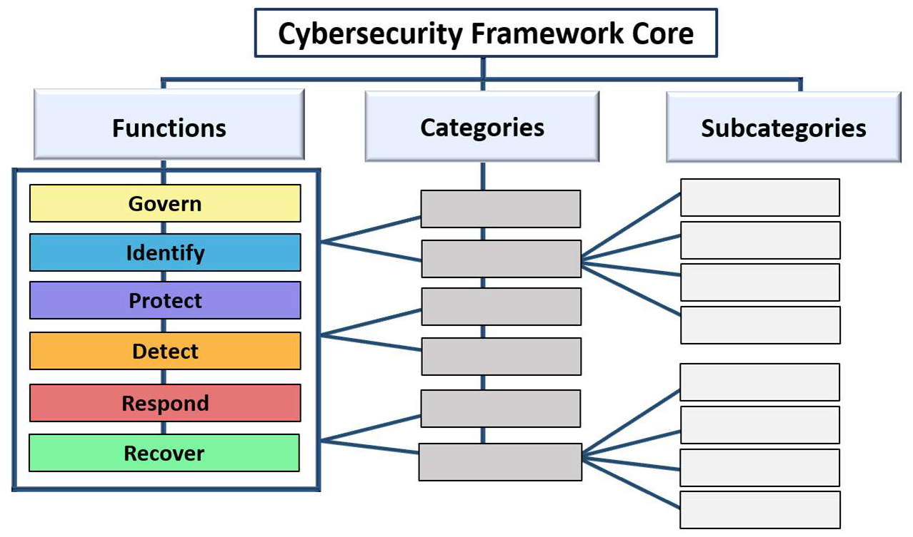
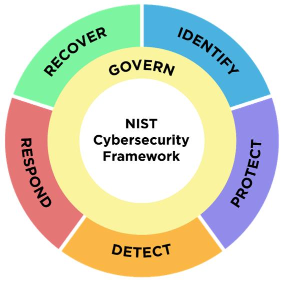
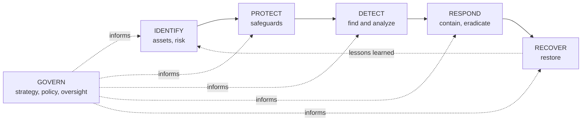
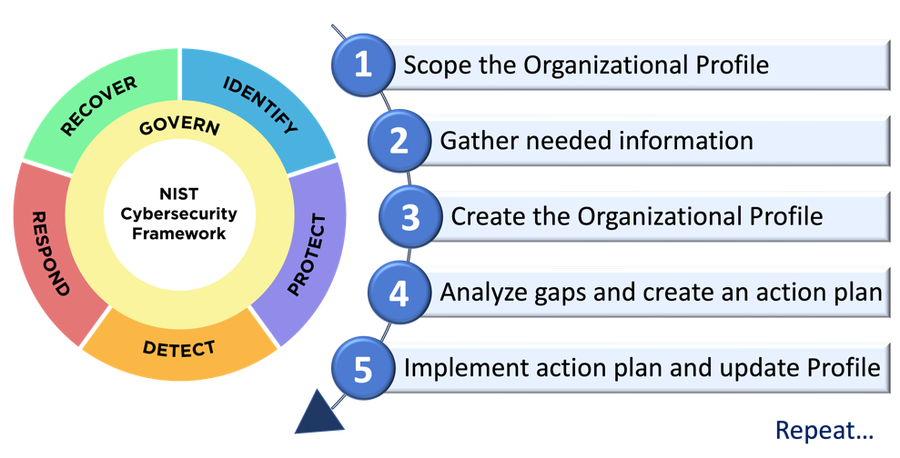
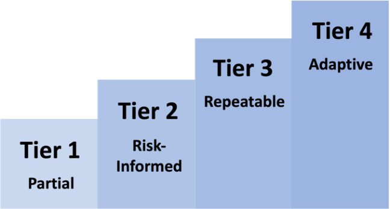
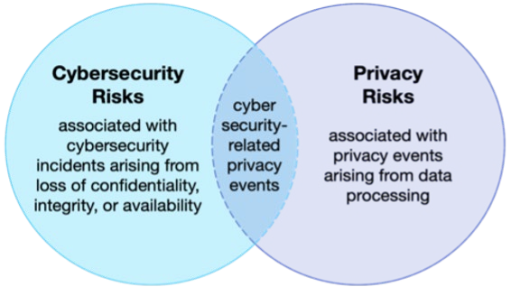

# NIST Cybersecurity Framework (CSF)

## Summary

The NIST Cybersecurity Framework (CSF) is a catalog of cybersecurity outcomes, written in plain language, that any organization can use to describe where it is, decide where it should be and explain the difference to executives, auditors and suppliers. It does not say which tools or controls to buy. It says which results a mature program produces, such as "backups are created, protected, maintained, and tested", and leaves the how to the organization. Version 2.0 (February 2024) adds a sixth function, Govern, which makes cybersecurity a leadership and enterprise risk topic instead of a purely technical one.

Checked against NIST CSWP 29, CSF 2.0 (2024-02-26), 2026-10. The history of versions 1.0 and 1.1 is from memory and is marked as unverified where it appears.

## Prerequisites

- [CIA triad](../../foundations/cia-triad/README.md): the CSF repeatedly refers to protecting confidentiality, integrity and availability.
- [Information risk management](../risk-management/information-risk-management.md): risk, likelihood, impact, risk appetite.
- [Security controls](security-controls.md): the difference between an outcome and a control.
- Awareness of [NIST](../../organizations/nist.md) and its publication series (SP 800, CSWP, IR).

## Core concepts

### Definition

The CSF is a voluntary, risk-based, outcome-oriented framework published by the U.S. National Institute of Standards and Technology. It consists of three parts that are described in the standard itself:

- **CSF Core:** a taxonomy of high-level cybersecurity outcomes, organized as Functions, Categories and Subcategories.
- **CSF Organizational Profiles:** a way to describe the current and target cybersecurity posture in terms of the Core's outcomes.
- **CSF Tiers:** a characterization of the rigor of an organization's cybersecurity risk governance and management practices, applied to Profiles.

Around the document, NIST maintains online resources: Informative References (mappings to other standards), Implementation Examples, Quick-Start Guides and Community Profiles.

It is sector-, country- and technology-neutral. The Core applies to IT, IoT and OT, and to cloud, mobile and AI systems, according to the CSF 2.0 text.

### What the CSF is not

- It is **not a standard you certify against.** There is no CSF certificate issued by NIST. Organizations describe themselves "aligned with" or "using" the CSF.
- It is **not a checklist.** NIST states that the outcomes are not a list of actions to perform, and that the order and size of Functions, Categories and Subcategories does not imply sequence or importance.
- It is **not a control catalog.** Controls live in documents such as NIST SP 800-53, ISO/IEC 27001 Annex A or the [CIS Controls](cis-controls.md). The CSF points to them through Informative References.

### Analogy

Think of a building inspection checklist written in terms of results: "occupants can leave within two minutes", "the structure carries its design load". It does not say whether you reach that with steel or concrete. Two builders can use the same list, produce different buildings and still be compared against each other.

The analogy breaks in one place. A building code has a pass or fail verdict from an inspector. The CSF has no verdict. How well an outcome is achieved is a judgment the organization records in its Profile, and a different organization can rate the same situation differently. That is why the CSF is a communication tool and not an audit standard.

### Why it exists

In the early 2010s, critical infrastructure operators faced the same problem: each regulator, supplier and insurer asked for security evidence in a different vocabulary, and executives could not compare programs. U.S. Executive Order 13636 (February 2013) directed NIST to build a framework with industry, and version 1.0 appeared in February 2014 (unverified date, from memory). Version 1.1 followed in April 2018 and version 2.0 on 2024-02-26. The renaming matters: before 2.0 the document was called the "Framework for Improving Critical Infrastructure Cybersecurity", and CSF 2.0 states that this title is no longer used. The audience grew from critical infrastructure to every organization.

### Structure of the Core

The hierarchy has three levels. CSF 2.0 contains **6 Functions, 22 Categories and 106 Subcategories**. The counts of Categories and Subcategories were derived by counting the identifiers in Appendix A of CSWP 29. For comparison, CSF 1.1 had 5 Functions, 23 Categories and 108 Subcategories (from memory, not re-checked).

Identifiers follow the pattern `FUNCTION.CATEGORY-NN`, for example `PR.DS-11`. The numbering of Subcategories is intentionally not sequential. Gaps mark CSF 1.1 Subcategories that were relocated in 2.0. The full machine-readable list is in the [profile template](../../_assets/governance-and-compliance/nist-csf-2-profile-template.csv), generated from Appendix A.

### The six Functions

Each Function is named after a verb. They are drawn as a wheel because they relate to one another, and Govern sits in the centre because it informs how the other five are carried out. NIST says the Functions should be addressed concurrently: Govern, Identify, Protect and Detect happen continuously, while Respond and Recover must be ready at all times and run when an incident occurs.

The diagram shows the usual reading order, not a mandatory sequence. In the CSF text, Govern, Identify and Protect help prevent and prepare for incidents, while Govern, Detect, Respond and Recover help discover and manage them.

#### Govern (GV)

Outcome: the organization's cybersecurity risk management strategy, expectations and policy are established, communicated and monitored. This is the function that connects cybersecurity to enterprise risk management (ERM).

| Category | ID | Meaning |
| --- | --- | --- |
| Organizational Context | GV.OC | Mission, stakeholders, legal and contractual requirements and dependencies that shape risk decisions |
| Risk Management Strategy | GV.RM | Priorities, constraints, risk appetite and tolerance, assumptions |
| Roles, Responsibilities, and Authorities | GV.RR | Who is accountable, with what resources, and how HR practices include cybersecurity |
| Policy | GV.PO | Policy is established, communicated, reviewed and enforced |
| Oversight | GV.OV | Results are reviewed to adjust the strategy |
| Cybersecurity Supply Chain Risk Management | GV.SC | Supplier risk is managed, from due diligence to the end of the relationship |

Examples: `GV.RM-02` (risk appetite and risk tolerance statements are established, communicated and maintained), `GV.RR-01` (leadership is responsible and accountable for cybersecurity risk), `GV.SC-04` (suppliers are known and prioritized by criticality).

##### Govern in detail

Govern is the Function that most readers new to CSF 2.0 skip, so it is listed here in full. The outcome wording below is NIST's (from Appendix A of CSWP 29, with typographic dashes replaced by hyphens). The Function has 6 Categories and 31 Subcategories, which is the largest of the six (Identify has 21, Protect 22, Detect 11, Respond 13, Recover 8).

**Organizational Context (GV.OC), 5 Subcategories**

| ID | Outcome (NIST wording) |
| --- | --- |
| GV.OC-01 | The organizational mission is understood and informs cybersecurity risk management |
| GV.OC-02 | Internal and external stakeholders are understood, and their needs and expectations regarding cybersecurity risk management are understood and considered |
| GV.OC-03 | Legal, regulatory, and contractual requirements regarding cybersecurity - including privacy and civil liberties obligations - are understood and managed |
| GV.OC-04 | Critical objectives, capabilities, and services that external stakeholders depend on or expect from the organization are understood and communicated |
| GV.OC-05 | Outcomes, capabilities, and services that the organization depends on are understood and communicated |

**Risk Management Strategy (GV.RM), 7 Subcategories**

| ID | Outcome (NIST wording) |
| --- | --- |
| GV.RM-01 | Risk management objectives are established and agreed to by organizational stakeholders |
| GV.RM-02 | Risk appetite and risk tolerance statements are established, communicated, and maintained |
| GV.RM-03 | Cybersecurity risk management activities and outcomes are included in enterprise risk management processes |
| GV.RM-04 | Strategic direction that describes appropriate risk response options is established and communicated |
| GV.RM-05 | Lines of communication across the organization are established for cybersecurity risks, including risks from suppliers and other third parties |
| GV.RM-06 | A standardized method for calculating, documenting, categorizing, and prioritizing cybersecurity risks is established and communicated |
| GV.RM-07 | Strategic opportunities (i.e., positive risks) are characterized and are included in organizational cybersecurity risk discussions |

**Roles, Responsibilities, and Authorities (GV.RR), 4 Subcategories**

| ID | Outcome (NIST wording) |
| --- | --- |
| GV.RR-01 | Organizational leadership is responsible and accountable for cybersecurity risk and fosters a culture that is risk-aware, ethical, and continually improving |
| GV.RR-02 | Roles, responsibilities, and authorities related to cybersecurity risk management are established, communicated, understood, and enforced |
| GV.RR-03 | Adequate resources are allocated commensurate with the cybersecurity risk strategy, roles, responsibilities, and policies |
| GV.RR-04 | Cybersecurity is included in human resources practices |

**Policy (GV.PO), 2 Subcategories**

| ID | Outcome (NIST wording) |
| --- | --- |
| GV.PO-01 | Policy for managing cybersecurity risks is established based on organizational context, cybersecurity strategy, and priorities and is communicated and enforced |
| GV.PO-02 | Policy for managing cybersecurity risks is reviewed, updated, communicated, and enforced to reflect changes in requirements, threats, technology, and organizational mission |

**Oversight (GV.OV), 3 Subcategories**

| ID | Outcome (NIST wording) |
| --- | --- |
| GV.OV-01 | Cybersecurity risk management strategy outcomes are reviewed to inform and adjust strategy and direction |
| GV.OV-02 | The cybersecurity risk management strategy is reviewed and adjusted to ensure coverage of organizational requirements and risks |
| GV.OV-03 | Organizational cybersecurity risk management performance is evaluated and reviewed for adjustments needed |

**Cybersecurity Supply Chain Risk Management (GV.SC), 10 Subcategories**

| ID | Outcome (NIST wording) |
| --- | --- |
| GV.SC-01 | A cybersecurity supply chain risk management program, strategy, objectives, policies, and processes are established and agreed to by organizational stakeholders |
| GV.SC-02 | Cybersecurity roles and responsibilities for suppliers, customers, and partners are established, communicated, and coordinated internally and externally |
| GV.SC-03 | Cybersecurity supply chain risk management is integrated into cybersecurity and enterprise risk management, risk assessment, and improvement processes |
| GV.SC-04 | Suppliers are known and prioritized by criticality |
| GV.SC-05 | Requirements to address cybersecurity risks in supply chains are established, prioritized, and integrated into contracts and other types of agreements with suppliers and other relevant third parties |
| GV.SC-06 | Planning and due diligence are performed to reduce risks before entering into formal supplier or other third-party relationships |
| GV.SC-07 | The risks posed by a supplier, their products and services, and other third parties are understood, recorded, prioritized, assessed, responded to, and monitored over the course of the relationship |
| GV.SC-08 | Relevant suppliers and other third parties are included in incident planning, response, and recovery activities |
| GV.SC-09 | Supply chain security practices are integrated into cybersecurity and enterprise risk management programs, and their performance is monitored throughout the technology product and service life cycle |
| GV.SC-10 | Cybersecurity supply chain risk management plans include provisions for activities that occur after the conclusion of a partnership or service agreement |

How to read these outcomes as an expert:

- **Govern is about decisions and evidence, not tooling.** Almost every Govern outcome is evidenced by a document, a meeting record or a decision, for example an approved risk appetite statement for GV.RM-02, a RACI or board charter for GV.RR-01 and GV.RR-02, or a supplier register with criticality ratings for GV.SC-04. A scanner cannot show that these outcomes are met.
- **Strategy flows down, results flow up.** GV.RM and GV.PO set direction, and GV.OV (oversight) closes the loop by reviewing outcomes and adjusting the strategy. A program with policies but no GV.OV evidence has a plan and no feedback.
- **Risk appetite and risk tolerance come first.** GV.RM-02 is the anchor for the other Functions. Target Profile ratings, Tier choices, recovery time objectives and the decision to accept a risk all refer back to it. Without it, "good enough" has no definition.
- **GV.RM-07 treats opportunities as positive risk.** The CSF text says risk responses cover both negative risks (mitigate, transfer, avoid, accept) and positive risks (realize, share, enhance, accept).
- **Supply chain gets a full Category (GV.SC, 10 Subcategories).** It runs from program and strategy (GV.SC-01), through supplier roles, prioritization and due diligence (GV.SC-02 to GV.SC-07), to incident planning with suppliers (GV.SC-08), security practices across the product life cycle (GV.SC-09) and end-of-relationship provisions (GV.SC-10). See NIST SP 800-161 in the [NIST frameworks overview](nist-frameworks-overview.md).
- **Where the content came from.** CSF 1.1 had a Governance category (ID.GV), a Business Environment category (ID.BE), a Risk Management Strategy category (ID.RM) and a Supply Chain category (ID.SC) inside Identify. The 2.0 Govern Function consolidates and expands these. This list of 1.1 categories is from memory and not re-checked, but the 2.0 mapping tables on NIST's site are the authoritative source.

Typical evidence for a Govern assessment (this note's suggestion, not a NIST list):

| Category | Evidence an assessor would ask for |
| --- | --- |
| GV.OC | Mission statement mapped to critical services, register of legal and contractual requirements, stakeholder analysis |
| GV.RM | Risk management strategy, risk appetite statement with thresholds, record of how cyber risk enters the enterprise risk register |
| GV.RR | Role descriptions, accountability for the CISO and executives, budget linked to risk, HR practices such as screening and offboarding |
| GV.PO | Approved cybersecurity policy with owner, review dates and communication records |
| GV.OV | Management review minutes, KPI and KRI reports, changes made to the strategy after reviews |
| GV.SC | Supplier inventory with criticality tiers, contract security clauses, supplier assessments, supplier involvement in incident exercises |

#### Identify (ID)

Outcome: the organization's current cybersecurity risks are understood. This covers assets such as data, hardware, software, systems, facilities, services and people, and also suppliers.

| Category | ID | Meaning |
| --- | --- | --- |
| Asset Management | ID.AM | Inventories, prioritization by criticality, and lifecycle management of assets |
| Risk Assessment | ID.RA | Vulnerabilities, threats, likelihood, impact, risk response, vulnerability disclosure handling |
| Improvement | ID.IM | Improvements found through evaluations, tests, exercises and operations |

Examples: `ID.AM-01` (inventories of hardware), `ID.AM-02` (inventories of software, services and systems), `ID.RA-01` (vulnerabilities are identified, validated and recorded), `ID.RA-05` (threats, vulnerabilities, likelihoods and impacts are used to understand inherent risk and prioritize response). Link: [CVE](../../vulnerability-management/cve.md), [CVSS](../../vulnerability-management/cvss.md), [threat modeling](../../threat-modeling/threat-modeling.md).

#### Protect (PR)

Outcome: safeguards to manage cybersecurity risk are used.

| Category | ID | Meaning |
| --- | --- | --- |
| Identity Management, Authentication, and Access Control | PR.AA | Credentials, authentication, authorization with least privilege and separation of duties, physical access |
| Awareness and Training | PR.AT | General and role-specific training |
| Data Security | PR.DS | Data at rest, in transit and in use, plus backups |
| Platform Security | PR.PS | Configuration, patching and retirement, logging, preventing unauthorized software, secure development |
| Technology Infrastructure Resilience | PR.IR | Network protection, environmental threats, resilience mechanisms, capacity |

Examples: `PR.AA-05` (access permissions are defined in policy, managed, enforced and reviewed and incorporate least privilege and separation of duties), `PR.DS-11` (backups are created, protected, maintained and tested), `PR.PS-06` (secure software development practices are integrated and monitored through the software development life cycle). Link: [authorization](../../identity-and-access/authorization.md), [authentication methods](../../identity-and-access/authentication/authentication-methods.md).

#### Detect (DE)

Outcome: possible cybersecurity attacks and compromises are found and analyzed.

| Category | ID | Meaning |
| --- | --- | --- |
| Continuous Monitoring | DE.CM | Networks, physical environment, personnel activity, service providers and runtime environments are monitored |
| Adverse Event Analysis | DE.AE | Events are analyzed, correlated, enriched with threat intelligence, and declared as incidents against defined criteria |

Examples: `DE.CM-01` (networks and network services are monitored), `DE.AE-03` (information is correlated from multiple sources), `DE.AE-08` (incidents are declared when adverse events meet the defined incident criteria). Link: [SIEM](../../defensive-operations/operations/siem.md), [security operations center](../../defensive-operations/operations/security-operations-center.md), [IDS](../../defensive-operations/detection/ids.md).

#### Respond (RS)

Outcome: actions regarding a detected incident are taken.

| Category | ID | Meaning |
| --- | --- | --- |
| Incident Management | RS.MA | Executing the plan, triage, categorization, escalation, criteria for starting recovery |
| Incident Analysis | RS.AN | Root cause, forensic records with preserved integrity and provenance, magnitude estimate |
| Incident Response Reporting and Communication | RS.CO | Notification and information sharing as required by laws, regulations and policy |
| Incident Mitigation | RS.MI | Containment and eradication |

Examples: `RS.MA-02` (incident reports are triaged and validated), `RS.AN-06` and `RS.AN-07` (actions, incident data and metadata are recorded with integrity and provenance preserved), `RS.MI-01` (incidents are contained), `RS.MI-02` (incidents are eradicated). See also the incident response cycle in the [NIST note](../../organizations/nist.md).

#### Recover (RC)

Outcome: assets and operations affected by an incident are restored.

| Category | ID | Meaning |
| --- | --- | --- |
| Incident Recovery Plan Execution | RC.RP | Selecting, scoping, prioritizing and performing recovery, verifying backups and restored assets, declaring the end of recovery |
| Incident Recovery Communication | RC.CO | Internal, external and public updates during recovery |

Examples: `RC.RP-03` (the integrity of backups and other restoration assets is verified before using them for restoration), `RC.RP-05` (the integrity of restored assets is verified and normal operating status is confirmed), `RC.CO-04` (public updates on recovery are shared using approved methods and messaging).

Notice how the Subcategory text uses the CIA vocabulary: PR.DS-01, PR.DS-02 and PR.DS-10 each protect "the confidentiality, integrity, and availability" of data in one state (at rest, in transit, in use), and PR.IR-04 targets availability through resource capacity.

### Profiles

An **Organizational Profile** describes an organization's posture in terms of the Core's outcomes. It has one or both of:

- a **Current Profile**: which outcomes the organization achieves or attempts to achieve today, and to what extent.
- a **Target Profile**: the outcomes selected and prioritized, considering new requirements, technology adoption and threat intelligence trends.

A **Community Profile** is a baseline published for a sector, technology, threat type or other shared use case, and an organization can use it as the basis for its own Target Profile. NIST hosts examples on the CSF website.

The five steps in the figure are: scope the Profile, gather information, create the Profile, analyze the gaps between Current and Target and create an action plan (for example a risk register or a Plan of Action and Milestones), then implement and update. A Profile can be scoped to the whole organization, a business system, or a single threat such as ransomware against financial systems.

Profiles also work outward. A Current Profile can be shared with prospective customers or partners, and a Target Profile can express requirements to suppliers.

### Tiers

Tiers characterize the rigor of risk governance (Govern) and risk management (Identify to Recover). Appendix B of CSWP 29 gives a notional illustration for each, which is paraphrased below.

| Tier | Governance, in short | Risk management, in short |
| --- | --- | --- |
| 1 Partial | Application of the risk strategy is ad hoc, priorities are not tied to objectives or threats | Limited organizational awareness, case-by-case practice, little information sharing, suppliers' risks largely unknown |
| 2 Risk Informed | Practices approved by management but not organization-wide policy, priorities informed by risk objectives or threats | Awareness exists but no organization-wide approach, assessments are not repeatable, information shared informally |
| 3 Repeatable | Practices formally approved as policy, reviewed and updated as business and threats change | Organization-wide approach, information shared routinely, consistent response to change, supplier risk acted on formally |
| 4 Adaptive | Cybersecurity risk is monitored alongside financial and other risk, budget follows the current and predicted risk environment | Practices adapt from lessons learned and predictive indicators, near real-time information, constant sharing inside and with authorized third parties |

Three points that experts often get wrong:

- Tiers apply to **practices**, not to technical strength. A Tier 4 organization can still have a vulnerable system, and a Tier 2 organization can run a very hardened one.
- Tiers are **optional** ("an organization can choose to use the Tiers").
- Higher is **not always better**. NIST encourages progression when risks or mandates are greater, or when a cost-benefit analysis indicates a feasible and cost-effective reduction of risk. A Tier 4 target for every outcome is rarely justified.

### Informative References, Implementation Examples and Quick-Start Guides

These online resources are updated more often than the PDF.

- **Informative References** map Core outcomes to standards, guidelines and regulations. A reference can be narrower than a Subcategory (one SP 800-53 control among several needed) or broader (a policy requirement that partly addresses many Subcategories).
- **Implementation Examples** give notional, action-oriented steps, with verbs such as share, document, develop, perform, monitor, analyze, assess and exercise. They are not a baseline of required actions.
- **Quick-Start Guides** distill parts of the CSF into first steps for specific audiences, including small organizations, enterprise risk management and the move from 1.1 to 2.0.

### What changed from 1.1 to 2.0

| Area | CSF 1.1 | CSF 2.0 |
| --- | --- | --- |
| Functions | 5 (Identify, Protect, Detect, Respond, Recover) | 6, adds Govern |
| Governance | Category inside Identify (ID.GV) | Own Function, with strategy, roles, policy, oversight |
| Supply chain | Category inside Identify | Category GV.SC, with links to cybersecurity supply chain risk management |
| Improvement | Spread across functions | Category ID.IM, covering improvement across all Functions |
| Scope | Critical infrastructure focus | All organizations, sizes and sectors |
| Supporting material | Mostly inside the document | Online Informative References, Implementation Examples, Quick-Start Guides, Community Profiles |

The 1.1 column is from memory and has not been re-checked against the 1.1 text. The 2.0 column is from CSWP 29.

### Where the CSF fits among other NIST documents

The full map is in [NIST frameworks and key publications](nist-frameworks-overview.md). The relationships that matter most for the CSF:

| Document | Scope | Relationship to the CSF |
| --- | --- | --- |
| [SP 800-53 Rev. 5](nist-sp-800-53/README.md) | Control catalog for systems and organizations | Primary source of controls referenced by CSF outcomes |
| SP 800-37 and the [Risk Management Framework](../risk-management/risk-management-framework.md) | System-level lifecycle of categorizing, selecting, implementing, assessing, authorizing and monitoring | CSF 2.0 says it can complement the RMF's selection and prioritization of SP 800-53 controls. SP 800-37 Rev. 2 maps its tasks to CSF 1.1 identifiers |
| SP 800-30 | Risk assessment guide | Supports Identify and Govern outcomes |
| [NIST Privacy Framework](../../privacy-and-data-protection/nist-privacy-framework.md) | Privacy risk | Used together with the CSF |
| [NIST AI RMF](../../ai-security/nist-ai-risk-management-framework.md) | AI risk | Cited in CSF 2.0 as a sibling that also uses Functions, Categories and Subcategories |
| [SP 800-61 Rev. 3](../../defensive-operations/operations/nist-incident-response/README.md) | Incident response | Published as a CSF 2.0 Community Profile |
| IR 8286 series, SP 800-221 | Cybersecurity within enterprise risk management | Detail behind Govern |

The CSF versus other frameworks, in practice:

| Framework | Nature | Typical use alongside the CSF |
| --- | --- | --- |
| [ISO/IEC 27001](../standards/iso-iec-27001.md) | Certifiable management system standard | The CSF gives the outcome map and Profile, ISO 27001 gives the certifiable management system |
| [CIS Controls](cis-controls.md) | Prioritized safeguards | Concrete implementation guidance for many Protect, Detect and Identify outcomes |
| [MITRE ATT&CK](../../threat-intelligence/mitre/mitre-attack.md) | Adversary behavior knowledge base | Drives Detect priorities and test cases, which the CSF does not specify |
| [Security controls](security-controls.md) | Control types and families | How outcomes become implemented safeguards |

### Using the CSF to communicate

The figure shows the bidirectional flow the CSF is designed for. Executives pass priorities and risk appetite down, managers turn them into Target Profiles, practitioners implement and report measures (key performance and key risk indicators), and the results flow back up through risk registers and progress reports. Govern is the function that structures the top half of this exchange.

## Worked example

The scenario is fictional. Example Corp (`example.com`) is a 200-person software-as-a-service company. The board asks one question: "How ready are we for ransomware against our billing system?" The method below is an illustrative way to apply the five Profile steps. The 0 to 3 rating scale and the weights are this note's own device, not part of the CSF.

**Step 1: scope.** Billing platform and its supporting identity, backup and monitoring services. Threat: ransomware with data theft.

**Step 2: gather.** Existing backup runbook, the identity provider configuration, the IT asset list, the last incident report, and the cyber insurance questionnaire.

**Step 3: create the Profile.** Pick the Subcategories that matter for the scope, rate the current state, set a target. Rating scale: 0 = nothing, 1 = ad hoc, 2 = defined and documented, 3 = defined, tested and measured. Weight (1 to 3) reflects relevance to ransomware.

**Step 4: gap analysis.** Priority score = (target - current) x weight.

| Subcategory | Outcome (short) | Current | Target | Weight | Score |
| --- | --- | --- | --- | --- | --- |
| RC.RP-03 | Backup integrity verified before restoration | 0 | 3 | 3 | 9 |
| PR.DS-11 | Backups created, protected, maintained and tested | 1 | 3 | 3 | 6 |
| RS.MA-01 | Incident response plan executed with third parties | 1 | 3 | 2 | 4 |
| PR.AA-03 | Users, services and hardware authenticated | 2 | 3 | 3 | 3 |
| DE.CM-01 | Networks and network services monitored | 2 | 3 | 2 | 2 |
| DE.AE-08 | Incidents declared against defined criteria | 1 | 2 | 2 | 2 |
| ID.AM-02 | Software, services and systems inventoried | 1 | 2 | 2 | 2 |
| ID.RA-01 | Vulnerabilities identified, validated, recorded | 2 | 3 | 2 | 2 |
| GV.RM-02 | Risk appetite and tolerance statements established | 0 | 2 | 1 | 2 |
| PR.PS-01 | Configuration management practices applied | 1 | 2 | 1 | 1 |

The ranking says: the biggest gap is not a tool but an untested restore path (RC.RP-03 and PR.DS-11 together make up 15 of the 33 total points). Reading the table with a practitioner's eye:

- Backups exist (current 1 for PR.DS-11) but nobody has ever restored from them and verified integrity, which is the same lesson as the integrity half of the [CIA triad](../../foundations/cia-triad/README.md).
- Without GV.RM-02 nobody can say how much downtime is acceptable, so the targets above are guesses until the board sets a tolerance.

**Step 5: action plan.** Quarter 1: restore test of the billing database into an isolated environment, with checksum verification and a measured recovery time (RC.RP-03, PR.DS-11). Quarter 1: tabletop exercise of the incident response plan with the cloud provider and the legal adviser (RS.MA-01). Quarter 2: risk appetite statement approved by the board (GV.RM-02). Then repeat the exercise and update the Current Profile.

NIST publishes a ready-made Community Profile for this exact scenario: NIST IR 8374 Revision 1, *Ransomware Risk Management: A Cybersecurity Framework 2.0 Community Profile* (June 2026, superseding the February 2022 report). Its Table 1 highlights Subcategories across all six Functions as priority target outcomes for ransomware. Nine of the ten Subcategories in the table above (all except DE.AE-08) also appear in that profile, which was checked by searching the report for the identifiers. For a real exercise, start from NIST's profile instead of choosing from scratch, and adapt it to your environment. The same document warns that organizations are encouraged to include the full set of Subcategories in their programs and that the ransomware selection is specific to ransomware risk.

For a real exercise, start from the [profile template](../../_assets/governance-and-compliance/nist-csf-2-profile-template.csv) (106 rows, one per Subcategory, with empty columns for current tier, target tier, priority, owner, evidence and gap), filter it to the scope, and fill the columns. Illustrative mapping of a few outcomes to SP 800-53 controls that can implement them (check NIST's official Informative References for the authoritative mapping):

| Subcategory | Related SP 800-53 Rev. 5 control |
| --- | --- |
| PR.AA-05 | AC-5 Separation of Duties, AC-6 Least Privilege |
| PR.PS-01 | CM-2 Baseline Configuration, CM-7 Least Functionality |
| PR.DS-11 | CP-9 System Backup |
| DE.CM-01 | SI-4 System Monitoring |
| RS.MA-01 | IR-4 Incident Handling |

The AC-5, AC-6 and CM-7 names were checked in the SP 800-53 Rev. 5 text. The other control IDs are from memory.

## Trade offs and when to use it

### Benefits

- A shared vocabulary for executives, engineers, auditors and suppliers.
- Scales from a five-person company to a national regulator, because it prescribes outcomes only.
- Works as a map over other standards, so one assessment can feed several compliance regimes.
- Free, and the Core is available in machine-readable form on the NIST website.

### Costs and limits

- **No verdict.** Self-assessment ratings are subjective. Two assessors can produce different Profiles, so comparison across organizations needs calibration.
- **Outcomes are coarse.** `DE.CM-01` does not tell you which log sources, which detections or which retention. You need a second source (CIS, ATT&CK, vendor guidance) for the how.
- **Governance outcomes are hard to measure.** Rating GV outcomes needs evidence such as board minutes and approved policies, not tooling output.
- **Effort is front-loaded.** A full 106-row Profile for a whole organization takes weeks of interviews. Scope it.

### Alternatives and when another choice is better

| Need | Better fit |
| --- | --- |
| A certificate to show customers | ISO/IEC 27001 (or SOC 2 where the market expects it) |
| Authorization of a U.S. federal system | NIST RMF with SP 800-53 baselines |
| A prioritized to-do list for a small team | CIS Controls implementation groups |
| Application-level security requirements | OWASP ASVS, see [OWASP](../../application-security/owasp/owasp.md) |
| Threat-informed detection engineering | MITRE ATT&CK |

The CSF is the wrong tool when the question is "which exact configuration setting should I use". It is the right tool when the question is "what should our program cover and how do we explain our priorities".

## Common mistakes

| Mistake | Why it is wrong | Fix |
| --- | --- | --- |
| Treating the 106 Subcategories as a checklist to complete | NIST says the outcomes are not a list of actions, and the order and size imply no priority | Select and prioritize Subcategories through a Target Profile |
| Aiming for Tier 4 everywhere | Tiers describe rigor, and NIST ties progression to risk and cost-benefit | Choose a Tier per scope, justified by risk and mandates |
| Reading Tiers as a measure of technical security | Tiers describe governance and management practice | Assess technical control strength separately |
| Skipping Govern because it is "paperwork" | Govern defines risk appetite, roles and policy, and without it the other five Functions have no priorities | Start the first Profile with GV.OC, GV.RM and GV.RR |
| Over-investing in Protect, under-investing in Detect, Respond and Recover | Prevention fails eventually, and the figures show all Functions must run concurrently | Rate all six Functions for the scope, and exercise Respond and Recover |
| Using CSF 1.1 category names and numbering in a 2.0 assessment | Identifiers changed, for example ID.GV moved into Govern | Use the CSF 2.0 Core and the NIST Reference Tool |
| Claiming "NIST certified" | NIST does not certify against the CSF | Say "aligned with" and state the Profile scope |
| Producing a Profile once and filing it | Posture, threats and requirements change | Repeat the cycle on a schedule and after major change |
| Scoring from opinion with no evidence | A rating nobody can verify gives false comfort | Record evidence per rating (a column in the template) |

## Practice

1. List the six CSF 2.0 Functions and say which one was added in 2.0 and why it sits in the middle of the wheel.
2. Which Function and Category does each outcome belong to? (a) "Incidents are contained", (b) "Suppliers are known and prioritized by criticality", (c) "Log records are generated and made available for continuous monitoring", (d) "Improvements are identified from security tests and exercises".
3. What is the difference between a Current Profile, a Target Profile and a Community Profile?
4. An executive says "we are Tier 2, so we are insecure". Explain what is wrong with this statement.
5. Your assessment finds RC.RP-03 at 0 while PR.DS-11 is at 3. Is that plausible? What would you check?
6. Explain why a company with ISO/IEC 27001 certification might still use the CSF.
7. Build a Target Profile for a 10-person fintech startup focused on credential theft. Which Categories would you include first, and why?

Hints and answers:

1. Govern, Identify, Protect, Detect, Respond, Recover. Govern was added. It is central because it sets strategy, risk appetite, roles and policy that inform all other Functions.
2. (a) Respond, Incident Mitigation (RS.MI-01). (b) Govern, Cybersecurity Supply Chain Risk Management (GV.SC-04). (c) Protect, Platform Security (PR.PS-04). (d) Identify, Improvement (ID.IM-02).
3. Current shows today's achieved outcomes, Target shows the selected and prioritized desired outcomes, Community is a published baseline for a shared use case that can seed a Target Profile.
4. Tiers describe the rigor of governance and risk management practices, not the technical security level, and Tier 2 can be a reasonable target depending on risk and cost-benefit.
5. It is possible when backups are tested for completeness but nobody verifies integrity before a restore. Check whether restores are performed from a trusted copy and whether checksums or signatures are verified, since an attacker may have tampered with backups.
6. ISO 27001 certifies a management system, while the CSF gives an outcome map, Profiles for gap analysis and a vocabulary for executives and suppliers.
7. Reasonable first picks: GV.RM and GV.RR for ownership and appetite, ID.AM for assets, PR.AA for authentication and access, PR.AT for training, DE.CM for monitoring, RS.MA for incident management. The exact choice depends on the threat model and should be justified.

## Further reading

- NIST, The NIST Cybersecurity Framework (CSF) 2.0, NIST CSWP 29 (2024). The primary source for everything stated as verified in this note: https://doi.org/10.6028/NIST.CSWP.29
- NIST Cybersecurity Framework website. Hosts the Reference Tool, Informative References, Implementation Examples, Quick-Start Guides, Community Profiles and Organizational Profile templates: https://www.nist.gov/cyberframework
- NIST, NIST IR 8374 Rev. 1, Ransomware Risk Management: A Cybersecurity Framework 2.0 Community Profile (June 2026). A published Community Profile for the ransomware scenario used in the worked example: https://doi.org/10.6028/NIST.IR.8374r1
- NIST, SP 800-61 Rev. 3, Incident Response Recommendations and Considerations for Cybersecurity Risk Management: A CSF 2.0 Community Profile (April 2025). Shows how a Community Profile is written, see [NIST incident response guidance](../../defensive-operations/operations/nist-incident-response/README.md): https://doi.org/10.6028/NIST.SP.800-61r3
- NIST, SP 800-53 Rev. 5, Security and Privacy Controls for Information Systems and Organizations (2020). The main control catalog behind many Informative References: https://csrc.nist.gov/pubs/sp/800/53/r5/upd1/final
- NIST, Integrating Cybersecurity and Enterprise Risk Management (ERM), NIST IR 8286 and the 8286A to 8286D series. The CSWP 29 text lists these as the resources on the relationship between cybersecurity risk management and ERM. Not read in full for this note.
- NIST SP 800-221 and SP 800-221A, on governing ICT risk within an enterprise risk portfolio. Listed in CSWP 29. Not read in full for this note.
