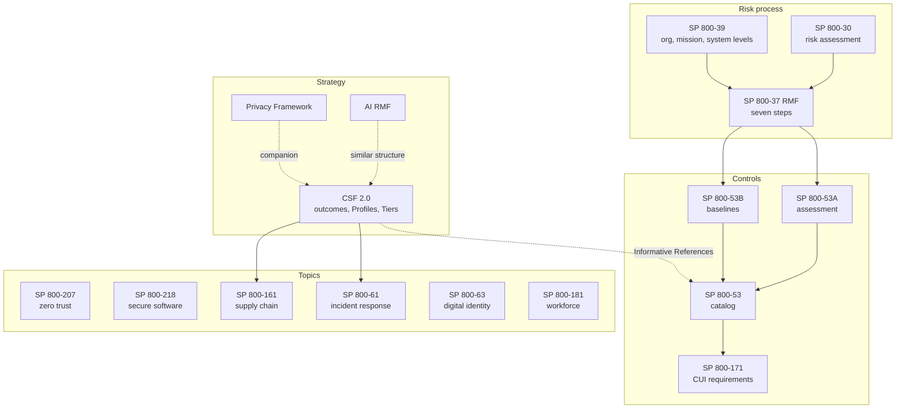

# NIST frameworks and key publications

## Summary

NIST publishes dozens of cybersecurity and privacy documents, and they are built to fit together: a risk-management model at the top, outcome frameworks for programs, control catalogs and baselines for systems, and topic guides for identity, software, zero trust, supply chain, incident response, privacy and AI. This note is the map. It says what each major document is for, how recent it is, where it plugs into the others, and which one to open for a given question. The deeper notes are linked from each row.

Checked against the NIST documents named in each row (publication dates read from the documents themselves unless marked), 2026-10. Items marked "not verified" were taken from secondary sources or memory.

## Prerequisites

- [NIST as an organization](../../organizations/nist.md): who NIST is, what the publication series mean.
- [CIA triad](../../foundations/cia-triad/README.md) and [information risk management](../risk-management/information-risk-management.md).

## Core concepts

### Definition

"NIST framework" is used loosely. It can mean one of three kinds of document, and it helps to separate them:

| Kind | What it contains | Examples |
| --- | --- | --- |
| Framework (outcomes or functions) | A taxonomy of desired outcomes, with profiles and tiers or similar | CSF 2.0, Privacy Framework, AI RMF |
| Process framework | Steps, roles and decision points | RMF (SP 800-37), SP 800-39, SP 800-30, SSDF as practices |
| Control or requirement catalog | Numbered safeguards or requirements, with baselines | SP 800-53, SP 800-171, FIPS 200 |
| Architecture or topic guide | Reference models and recommendations | SP 800-207 (zero trust), SP 800-63 (digital identity), SP 800-61 (incident response), SP 800-161 (supply chain) |

NIST states in the CSF 2.0 text that the CSF should be used together with other resources, so that the whole stack is the intended way to use them.

### Analogy

Think of a city's planning system. The CSF is the city's published goals ("clean air, safe streets"). The RMF is the permit process for a single building: who applies, who inspects, who signs. SP 800-53 is the building code with its numbered sections. SP 800-207, 800-63 and 800-218 are specialist handbooks for specific trades (electrical, plumbing). The Privacy and AI frameworks are separate goal documents for adjacent problems. Nobody reads the whole code, you start from the question.

The analogy breaks in one place. A city's goals, permits and codes are enforced by law. NIST documents are voluntary for private organizations, and are binding only where a law, contract or policy makes them so (for example, federal agencies under FISMA and OMB policy, or contractors under a contract clause).

### The map

The diagram shows relationships stated in the NIST texts: CSF 2.0 refers to SP 800-53 in its Informative References discussion, SP 800-37 builds on SP 800-39's three-level model and on SP 800-30 risk assessment, SP 800-53B and 800-53A support the RMF, SP 800-171 Rev. 3 derives its discussions from SP 800-53, and SP 800-61 Rev. 3 is a CSF 2.0 Community Profile. The two dashed lines (Privacy Framework and AI RMF) express companion or structural similarity, as described in CSWP 29.

### Document by document

Each row lists what the document is, its status as read from the document, and the one idea to remember.

| Document | Status (from the document) | What it is | Deeper note |
| --- | --- | --- | --- |
| **CSF 2.0**, CSWP 29 | 2024-02-26 | Outcome taxonomy: 6 Functions (Govern, Identify, Protect, Detect, Respond, Recover), 22 Categories, 106 Subcategories, plus Profiles and Tiers | [NIST CSF](nist-cybersecurity-framework.md) |
| **RMF**, SP 800-37 Rev. 2 | December 2018 | Seven-step process (Prepare, Categorize, Select, Implement, Assess, Authorize, Monitor) with 47 tasks, ending in an authorizing official's risk decision | [RMF](../risk-management/risk-management-framework.md) |
| **SP 800-39** | March 2011 | Risk management at three levels (organization, mission and business process, system), with the cycle frame, assess, respond, monitor | [RMF](../risk-management/risk-management-framework.md) |
| **SP 800-30 Rev. 1** | September 2012 | Guide to risk assessments in four steps: prepare, conduct, communicate and share, maintain | [Information risk management](../risk-management/information-risk-management.md) |
| **FIPS 199** | February 2004 | Security categorization: low, moderate, high impact per confidentiality, integrity, availability | [CIA triad](../../foundations/cia-triad/README.md) |
| **FIPS 200** | March 2006 | Minimum security requirements for federal systems. 17 of the 20 SP 800-53 families align with it | [SP 800-53](nist-sp-800-53/README.md) |
| **SP 800-53 Rev. 5** (Release 5.2.0 on 2025-08-27) | September 2020, release 2025 | Catalog of 20 families, 300 base controls and 714 enhancements (OSCAL count, version 5.2.0) | [SP 800-53](nist-sp-800-53/README.md) |
| **SP 800-53B** | 2020 | Low (149), moderate (287), high (370) and privacy (96) baselines, tailoring and overlays | [SP 800-53](nist-sp-800-53/README.md) |
| **SP 800-53A Rev. 5** | January 2022 | Assessment procedures: objectives, examine, interview, test, depth and coverage | [SP 800-53](nist-sp-800-53/README.md) |
| **SP 800-61 Rev. 3** | April 2025, replaces Rev. 2 (withdrawn 2025-04-03) | Incident response as a CSF 2.0 Community Profile | [Incident response](../../defensive-operations/operations/nist-incident-response/README.md) |
| **IR 8374 Rev. 1** | June 2026, supersedes IR 8374 (February 2022) | Ransomware Risk Management: a CSF 2.0 Community Profile that highlights Subcategories across all six Functions | [NIST CSF](nist-cybersecurity-framework.md) |
| **SP 800-218 SSDF v1.1** | February 2022 | 19 secure software development practices in 4 groups | [SSDF](../../application-security/supply-chain/nist-secure-software-development-framework.md) |
| **SP 800-207** | August 2020 | Zero trust architecture: 7 tenets, policy engine, policy administrator, policy enforcement point | [Zero trust](../../cloud-and-infrastructure-security/nist-zero-trust-architecture.md) |
| **SP 800-171 Rev. 3** | May 2024 | Security requirements to protect the confidentiality of controlled unclassified information (CUI) in nonfederal systems, in 17 families | This note |
| **SP 800-161 Rev. 1 Update 1** | 2024-11-01 (Rev. 1 was 2022-05-05) | Cybersecurity supply chain risk management practices | This note |
| **SP 800-63-4** | July 2025, supersedes 800-63-3 | Digital identity guidelines, with companion volumes 63A-4, 63B-4 and 63C-4 | [Authentication and authorization](../../identity-and-access/authentication-vs-authorization.md) |
| **SP 800-181 Rev. 1** (NICE Framework) | November 2020 | Workforce framework: Task, Knowledge and Skill statements and work roles | This note |
| **SP 800-160 Vol. 1 Rev. 1** | November 2022 | Systems security engineering: engineering trustworthy secure systems | [RMF](../risk-management/risk-management-framework.md) |
| **Privacy Framework 1.0** | 2020-01-16 | Privacy risk framework with five Functions: Identify-P, Govern-P, Control-P, Communicate-P, Protect-P | [Privacy Framework](../../privacy-and-data-protection/nist-privacy-framework.md) |
| **AI RMF 1.0**, NIST AI 100-1 | January 2023 | AI risk framework: Govern, Map, Measure, Manage | [AI RMF](../../ai-security/nist-ai-risk-management-framework.md) |

### The documents that most people mix up

**CSF vs RMF.** The CSF answers "what should our cybersecurity program achieve and how are we doing". The RMF answers "is this system acceptable to operate, who accepted the risk, on what evidence". An organization can run a CSF Profile for its whole program and an RMF authorization for each system. SP 800-37 itself maps tasks to CSF constructs, and CSF 2.0 says it can complement the RMF's selection and prioritization of SP 800-53 controls. The detail is in the [RMF note](../risk-management/risk-management-framework.md).

**SP 800-53 vs SP 800-171.** SP 800-53 is the full catalog for federal systems. SP 800-171 Rev. 3 is a smaller set of security requirements, designed for use by federal agencies in contracts or agreements with nonfederal organizations that handle CUI, and it protects the confidentiality of that information. Its discussions are derived from 800-53 control discussions, and the document says that it is companion to SP 800-171A (assessment procedures). Revision 3 organizes requirements in 17 families (Access Control, Awareness and Training, Audit and Accountability, Configuration Management, Identification and Authentication, Incident Response, Maintenance, Media Protection, Personnel Security, Physical Protection, Risk Assessment, Security Assessment and Monitoring, System and Communications Protection, System and Information Integrity, Planning, System and Services Acquisition, and Supply Chain Risk Management). Requirements include organization-defined parameters, and NIST does not assign their values: if the federal agency does not, the nonfederal organization has to.

**SP 800-61 Rev. 2 vs Rev. 3.** Rev. 2 is withdrawn. The four-phase cycle belongs to Rev. 2. Rev. 3 recasts incident response through the CSF Functions.

**CSF 1.1 vs 2.0.** Older NIST publications, including SP 800-37 Rev. 2, map to CSF 1.1 identifiers such as `ID.GV` that no longer exist in 2.0. Always check which CSF version a mapping refers to.

### Short profiles of the topic documents

**SP 800-207 Zero Trust Architecture.** Defines zero trust as an approach where network location alone does not imply trust. Its seven tenets include that all communication is secured regardless of location, that access is granted per session with least privilege, that access is determined by dynamic policy, and that the enterprise monitors the integrity and posture of all assets. The logical components are a policy engine (decides), a policy administrator (executes the decision and establishes the communication path) and a policy enforcement point (enables, monitors and terminates connections). Approaches include enhanced identity governance, micro-segmentation and network-based segmentation. See [NIST zero trust architecture](../../cloud-and-infrastructure-security/nist-zero-trust-architecture.md).

**SP 800-218 SSDF.** A set of practices in four groups: Prepare the Organization (PO), Protect the Software (PS), Produce Well-Secured Software (PW) and Respond to Vulnerabilities (RV). It was issued in the context of Executive Order 14028 (2021-05-12) on software supply chain security, and the document contains a table mapping EO 14028 Section 4e subsections to SSDF practices. See [NIST SSDF](../../application-security/supply-chain/nist-secure-software-development-framework.md).

**SP 800-161 Rev. 1.** Cybersecurity supply chain risk management (C-SCRM) practices for systems and organizations. CSF 2.0 refers to it for in-depth information on C-SCRM, and the Govern category GV.SC connects the CSF to it. The version history matters: Rev. 1 (2022-05-05) was withdrawn on 2024-11-01 and superseded by an errata update, Rev. 1 Update 1. I did not read the document beyond its notices.

**SP 800-63-4 Digital Identity Guidelines.** Superseded SP 800-63-3 in July 2025. It has a main volume and companion volumes for identity proofing and enrollment (63A), authentication and authenticator management (63B) and federation and assertions (63C). The main volume's model sections cover identity proofing and enrollment, authentication and authenticator management, and federation and assertions. See [authentication methods](../../identity-and-access/authentication/authentication-methods.md) and [OpenID Connect](../../identity-and-access/protocols/openid-connect.md) for the building blocks. I read only the front matter and table of contents, so assurance levels and authenticator requirements are not summarized here.

**SP 800-181 NICE Framework.** Describes cybersecurity work as Task statements, and Knowledge and Skill statements, grouped into work roles. NIST describes it as a common lexicon for identifying, recruiting, developing and retaining cybersecurity talent. Other NIST documents link to it: the SSDF practices carry references to NICE task and knowledge IDs.

**Privacy Framework.** Version 1.0 appeared on 2020-01-16 with five Functions. NIST's Privacy Framework page, fetched in 2026-10, still advertised a Privacy Framework 1.1 initial public draft. Secondary reports state that the 1.1 draft was published in April 2025 with a realignment to CSF 2.0 (a standalone Govern function and a Protect function) and a focus on AI-related privacy risk, and some report a final version in September 2025. I could not confirm the final release from a NIST source, so check the current status.

**AI RMF.** Version 1.0 (NIST AI 100-1, January 2023) has four Functions, Govern, Map, Measure and Manage, described as a cross-cutting governance function plus three operational ones. It identifies seven characteristics of trustworthy AI: valid and reliable, safe, secure and resilient, accountable and transparent, explainable and interpretable, privacy-enhanced, and fair with harmful bias managed. A companion Generative AI Profile, NIST AI 600-1, was released in July 2024 according to secondary sources. See [NIST AI RMF](../../ai-security/nist-ai-risk-management-framework.md).

**Other NIST material to know about.**

- **NCCoE and SP 1800.** The National Cybersecurity Center of Excellence (founded 2012, partnership with the State of Maryland and Montgomery County) builds example implementations. Its practice guides are published in the SP 1800 series (series name from memory).
- **Cryptography.** FIPS 140-3 for cryptographic modules, tested by cryptographic and security testing laboratories (as noted in SP 800-53A). In August 2024 NIST released the first post-quantum cryptography standards, FIPS 203 (ML-KEM), FIPS 204 (ML-DSA) and FIPS 205 (SLH-DSA), according to secondary sources. See [cryptography](../../cryptography/README.md).
- **National Vulnerability Database.** NIST hosts the [NVD](../../vulnerability-management/nvd.md), which enriches CVE records.
- **Cybersecurity and Privacy Reference Tool (CPRT).** NIST's online tool that provides mappings between CSF outcomes and other sources, and is cited by SP 800-61 Rev. 3.
- **OSCAL.** Machine-readable formats for catalogs, baselines and assessment documents, used in the [SP 800-53 note](nist-sp-800-53/README.md) example.

### Which document should I open

| Question | Start with |
| --- | --- |
| "How do I explain our security program to the board?" | CSF 2.0, using Govern and Profiles |
| "Is this system safe to put into production and who signs?" | RMF (SP 800-37) with 800-53B baselines |
| "Which controls does a moderate system need?" | SP 800-53B baseline, then tailor |
| "How do I test that control AC-6 works?" | SP 800-53A |
| "We handle CUI for a federal contract" | SP 800-171 Rev. 3 and its assessment companion |
| "What is our supplier risk process?" | SP 800-161 and CSF Govern (GV.SC) |
| "How do we build software securely?" | SSDF (SP 800-218) |
| "We want to move away from perimeter trust" | SP 800-207 |
| "How should we handle an incident?" | SP 800-61 Rev. 3 |
| "How strong should login and identity proofing be?" | SP 800-63-4 |
| "We build or buy AI" | AI RMF |
| "How do we handle personal data risk?" | Privacy Framework |
| "How do we describe cybersecurity jobs?" | NICE Framework |

## Worked example

The scenario: Example Corp (`example.com`) is a 300-person software company that sells a hosted service, handles employee data, wants to bid on a U.S. federal contract involving CUI, and is adding a machine learning feature. The path below shows which NIST document answers which question, and in which order.

1. **Program view (CSF 2.0).** The CISO builds a Current Profile and a Target Profile, starting with Govern outcomes (risk appetite GV.RM-02, roles GV.RR-01, supplier register GV.SC-04). The Profile becomes the board's view.
2. **Contract requirement (SP 800-171 Rev. 3).** The contract clause names it. The company scopes the systems that process CUI, and maps each requirement family to existing controls. It must assign organization-defined parameter values where the agency does not.
3. **System decisions (RMF and SP 800-53).** For the hosting platform the company uses the RMF steps informally: categorize with FIPS 199 style ratings, select a baseline, tailor, assess, and have the CTO act as the equivalent of an authorizing official. This is an adaptation, a federal agency would have a formal authorizing official.
4. **Engineering (SSDF and SP 800-207).** Engineering adopts the SSDF practice groups for the pipeline and uses zero trust tenets for internal service access.
5. **Supply chain (SP 800-161 and GV.SC).** Supplier criticality tiers and contract clauses.
6. **Incident response (SP 800-61 Rev. 3).** The incident plan is written as a Detect, Respond, Recover profile, and tested.
7. **AI (AI RMF).** The ML feature gets a risk assessment with the Govern, Map, Measure and Manage Functions, and an entry in the enterprise risk register that links back to GV.RM-03 (cybersecurity risk is included in enterprise risk management).
8. **Privacy (Privacy Framework).** A data inventory and privacy risk assessment run alongside the cybersecurity work, using the overlap shown in CSF 2.0 Fig. 6.

Result: one vocabulary (CSF identifiers) keeps the evidence reusable, and each deeper document answers a narrower question. The exact scoping of CUI, and which agency requirements apply, depends on the contract and counsel, which this example does not replace.

## Trade offs and when to use it

### Benefits of the NIST stack

- One consistent family of documents, free to use, with machine-readable data.
- Mappings between them mean one body of evidence can serve several requirements.
- Public drafts and comment periods mean documents are reviewed in the open (see the [NIST note](../../organizations/nist.md)).

### Costs and limits

- **Volume.** Reading everything is impractical. The risk is cargo-culting a framework name without using its content.
- **Version drift.** Mappings between documents are produced at different times. CSF 1.1 identifiers in SP 800-37, Rev. 2 and Rev. 3 of SP 800-61, and 5.2.0 of SP 800-53 show how quickly a citation goes stale.
- **U.S. federal origin.** Roles and vocabulary come from federal law and policy. Other jurisdictions use [ISO/IEC 27001](../standards/iso-iec-27001.md), national frameworks and their own regulations, often with mappings to NIST.
- **Voluntary for most.** Using a NIST document does not prove compliance with a law. It becomes binding only through law, policy or contract.

### Alternatives

| Need | Option |
| --- | --- |
| Certifiable management system | [ISO/IEC 27001](../standards/iso-iec-27001.md) |
| Prioritized safeguards | [CIS Controls](cis-controls.md) |
| Cloud-specific controls | [CSA Cloud Controls Matrix](csa-cloud-controls-matrix.md) |
| AI-specific security | [Google SAIF](../../ai-security/google-secure-ai-framework.md) as a vendor view |
| Privacy law | [GDPR](../../privacy-and-data-protection/regulations/gdpr.md) and other regulations in the privacy area |

## Common mistakes

| Mistake | Why it is wrong | Fix |
| --- | --- | --- |
| Using "NIST compliant" as a claim | NIST does not certify against most of its publications | State which document, which version and which scope you align with |
| Citing a superseded document | SP 800-61 Rev. 2 and CSF 1.1 are replaced | Check status on the NIST page and the document's own front matter |
| Mixing CSF 1.1 and 2.0 identifiers | Identifiers and categories differ | Use one version and the official mapping |
| Applying SP 800-171 to everything | It targets CUI in nonfederal systems | Scope the requirement to systems that process, store or transmit CUI |
| Reading the RMF as a checklist | It is a decision process | Read the roles and decisions, not only the step names |
| Copying SP 800-53 controls into policy | Controls need ODP values and implementation statements | Assign parameters and write implementation statements |
| Treating Tiers or maturity levels as the goal | The CSF links progression to risk and cost-benefit | Choose a target per scope |
| Skipping Govern outcomes | They set risk appetite and ownership for everything else | Start with GV.OC, GV.RM and GV.RR |

## Practice

1. Which NIST document would you use to (a) describe a program to a board, (b) authorize a system, (c) test a control, (d) protect CUI at a contractor, (e) structure incident response?
2. Why is SP 800-61 Rev. 2 no longer the right citation, and what replaced it?
3. Explain the difference between SP 800-53 and SP 800-171.
4. A mapping in an older document refers to `ID.GV-2`. What should you do before using it?
5. List the Functions of the CSF 2.0, the Privacy Framework 1.0 and the AI RMF 1.0 side by side. What do they share and where do they differ?
6. An executive asks for "the NIST framework". Which clarifying questions do you ask?

Hints and answers:

1. (a) CSF 2.0 Profiles. (b) RMF with 800-53B baselines. (c) SP 800-53A. (d) SP 800-171 Rev. 3. (e) SP 800-61 Rev. 3.
2. NIST withdrew Rev. 2 on 2025-04-03 and replaced it with Rev. 3, which reframes incident response as a CSF 2.0 Community Profile.
3. 800-53 is the full catalog for federal systems with baselines, while 800-171 is a smaller set of requirements, derived from 800-53, for protecting the confidentiality of CUI in nonfederal systems.
4. Identify which CSF version the mapping uses. `ID.GV` is a CSF 1.1 category, and CSF 2.0 moved governance into the Govern Function, so use a current CSF 2.0 mapping.
5. CSF 2.0: Govern, Identify, Protect, Detect, Respond, Recover. Privacy Framework 1.0: Identify-P, Govern-P, Control-P, Communicate-P, Protect-P. AI RMF 1.0: Govern, Map, Measure, Manage. All have a Govern function and use Functions, Categories and Subcategories. They differ in subject (cybersecurity, privacy, AI), and in whether they include operational response functions (only the CSF has Detect, Respond, Recover).
6. Which framework (CSF, RMF, Privacy, AI), which version, for what purpose (program, system authorization, contract), and what scope.

## Further reading

- NIST, The NIST Cybersecurity Framework (CSF) 2.0, CSWP 29 (2024): https://doi.org/10.6028/NIST.CSWP.29
- NIST, SP 800-37 Rev. 2, RMF (2018): https://doi.org/10.6028/NIST.SP.800-37r2
- NIST, SP 800-53 Rev. 5 (2020) and SP 800-53B, SP 800-53A: https://csrc.nist.gov/pubs/sp/800/53/r5/upd1/final
- NIST, SP 800-171 Rev. 3, Protecting Controlled Unclassified Information in Nonfederal Systems and Organizations (2024): https://csrc.nist.gov/pubs/sp/800/171/r3/final
- NIST, SP 800-161 Rev. 1 Update 1, Cybersecurity Supply Chain Risk Management Practices for Systems and Organizations (2024): https://doi.org/10.6028/NIST.SP.800-161r1-upd1
- NIST, SP 800-63-4, Digital Identity Guidelines (2025): https://doi.org/10.6028/NIST.SP.800-63-4
- NIST, SP 800-181 Rev. 1, Workforce Framework for Cybersecurity (NICE Framework) (2020): https://doi.org/10.6028/NIST.SP.800-181r1
- NIST, Privacy Framework Version 1.0 (2020): https://nvlpubs.nist.gov/nistpubs/CSWP/NIST.CSWP.01162020.pdf
- NIST, AI Risk Management Framework (AI RMF 1.0), NIST AI 100-1 (2023): https://nvlpubs.nist.gov/nistpubs/ai/NIST.AI.100-1.pdf
- NIST Cybersecurity Framework website, for the Reference Tool, Quick-Start Guides and Community Profiles: https://www.nist.gov/cyberframework
