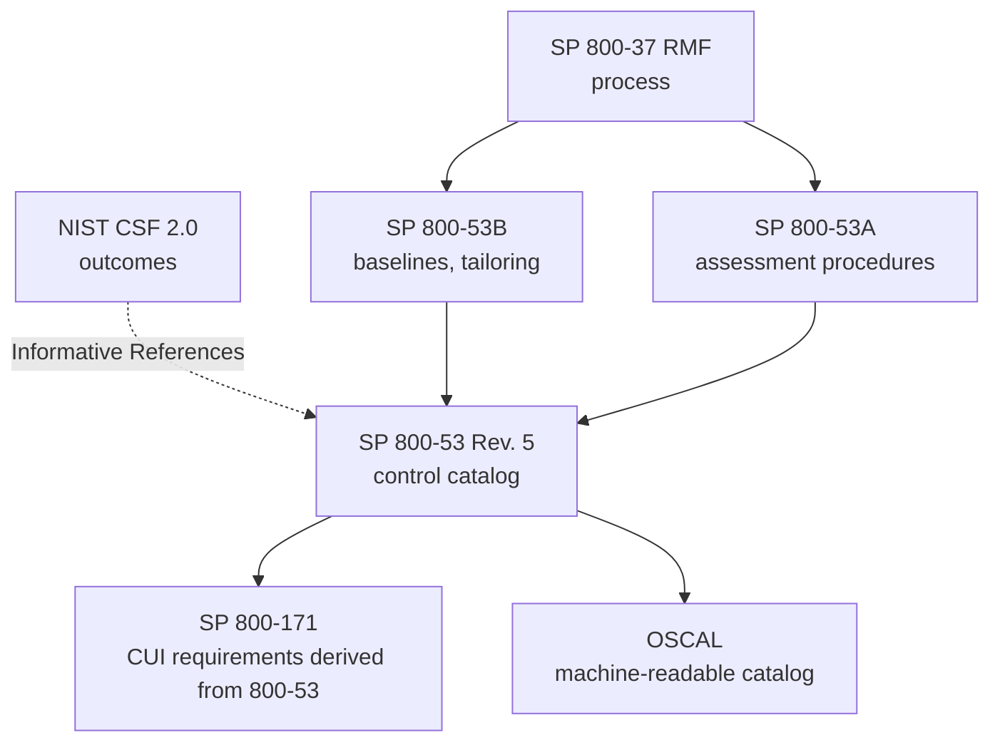

# NIST SP 800-53 security and privacy controls

## Summary

NIST SP 800-53 is the most widely used catalog of security and privacy controls: a numbered list of safeguards, from account management to supply chain risk, written so that they can be selected, implemented and assessed. A companion document, SP 800-53B, groups the controls into low, moderate and high baselines, and SP 800-53A defines how to test them. The catalog is the "what exactly do we implement" layer under the [NIST Risk Management Framework](../../risk-management/risk-management-framework.md) and the usual source of the detail behind CSF outcomes, FedRAMP, SP 800-171 and many commercial control sets.

Checked against SP 800-53 Rev. 5 (September 2020, with the 2020-12-10 updates), SP 800-53B, SP 800-53A Rev. 5 (January 2022), the NIST OSCAL catalog at version 5.2.0 and the NIST publication page (Release 5.2.0 of 2025-08-27), 2026-10. Counts in this note were computed from the OSCAL data with the scripts in this directory.

## Prerequisites

- [NIST Risk Management Framework](../../risk-management/risk-management-framework.md): the process that selects and assesses controls.
- [Security controls](../security-controls.md): the general idea of preventive, detective and corrective controls.
- [CIA triad](../../../foundations/cia-triad/README.md): control selection starts from impact on confidentiality, integrity and availability.

## Core concepts

### Definition

SP 800-53 Revision 5 is titled *Security and Privacy Controls for Information Systems and Organizations*. NIST describes it as a catalog of controls to protect organizational operations and assets, individuals, other organizations and the Nation from threats including hostile attacks, human errors, natural disasters, structural failures, foreign intelligence entities and privacy risks. It was developed under NIST's statutory responsibilities under the Federal Information Security Modernization Act (FISMA, Public Law 113-283) and is consistent with OMB Circular A-130. It is not subject to copyright in the United States, and NIST states that non-governmental organizations may use it voluntarily.

A **control**, in NIST's wording, describes a safeguard or protection capability. Controls can be administrative, technical or physical. A **requirement** is an obligation or stakeholder need, from laws, policy, mission or risk assessment. Controls are selected and implemented to satisfy requirements. This distinction matters when you write a policy: "encrypt data at rest" is a requirement, SC-28 is the control family entry used to meet it.

### Analogy

Think of a very large, well-indexed hardware store catalog. Each item (control) has a number, a description, and a list of related items. A builder (system owner) does not buy everything. A packing list (baseline) says what a house of a given size normally needs, and the builder adds or removes items for the actual site (tailoring). An inspector (assessor) uses the checklist from a second book (SP 800-53A) to check each installed item.

The analogy breaks in one place. In a store, items are independent. In SP 800-53, controls depend on each other. AC-6 least privilege is weak without IA-2 authentication and AU-2 audit events, and each control lists related controls for that reason.

### Why Revision 5 is different

NIST lists the most significant changes of Revision 5:

- Controls are more **outcome-based**: the entity responsible (the system or the organization) was removed from the control statement.
- Security and privacy controls are **integrated** in one consolidated catalog.
- A new **supply chain risk management** family (SR) was added.
- Control **selection processes were separated from the controls**. Baselines and tailoring guidance moved to SP 800-53B, so that engineers, architects, developers and mission owners can use the catalog without the federal selection process.
- The relationship between requirements and controls, and between security and privacy controls, was clarified.
- New state-of-the-practice controls were added, such as cyber resiliency, secure systems design, and governance and accountability.

Revision 5 was published in September 2020. NIST's publication page records a minor release, **Release 5.2.0, on 2025-08-27**, that added SA-15(13), SA-24 (Design for Cyber Resiliency) and SI-02(07) (Root Cause Analysis), revised SI-07(12) (Integrity Verification) and updated discussion text and related-controls lists in several controls. The catalog is maintained in a machine-readable form (OSCAL), and the NIST OSCAL repository I used carries version 5.2.0.

### Structure of a control

Each control has a base control, a discussion, related controls, control enhancements and references. Enhancements either add functionality or specificity to a base control or increase its strength, and selecting an enhancement always requires selecting the base control. Control numbers are not reused when a control is withdrawn.

A real example, AU-4 (Audit Log Storage Capacity), as it appears in the catalog:

```text
AU-4  AUDIT LOG STORAGE CAPACITY
Control: Allocate audit log storage capacity to accommodate [Assignment: organization-defined
         audit log retention requirements].
Discussion: Organizations consider the types of auditing to be performed ... Allocating sufficient
         audit log storage capacity reduces the likelihood of such capacity being exceeded ...
Related Controls: AU-2, AU-5, AU-6, AU-7, AU-9, AU-11, AU-12, AU-14, SI-4.
Control Enhancements:
  (1) AUDIT LOG STORAGE CAPACITY | TRANSFER TO ALTERNATE STORAGE
      Off-load audit logs [Assignment: organization-defined frequency] onto a different system ...
```

In the text above, the Rev. 5 PDF uses the older wording "audit record" and the current OSCAL catalog uses "audit log", which shows that wording is refined between releases. The bracketed text is an **organization-defined parameter (ODP)**: the organization fills in the value ("90 days", "daily") through an *assignment* or chooses from listed options through a *selection*. A control without ODP values is not yet a requirement you can test.

### The 20 families

Counts below are active (not withdrawn) base controls and control enhancements in the version 5.2.0 OSCAL catalog. NIST states that 17 of the 20 families align with the minimum security requirements of FIPS 200, and that PM, PT and SR address program management, privacy and supply chain concerns that emerged after FIPS 200.

| ID | Family | Base controls | Enhancements |
| --- | --- | --- | --- |
| AC | Access Control | 23 | 108 |
| AT | Awareness and Training | 5 | 10 |
| AU | Audit and Accountability | 15 | 41 |
| CA | Assessment, Authorization, and Monitoring | 8 | 17 |
| CM | Configuration Management | 14 | 42 |
| CP | Contingency Planning | 12 | 37 |
| IA | Identification and Authentication | 13 | 46 |
| IR | Incident Response | 9 | 31 |
| MA | Maintenance | 7 | 21 |
| MP | Media Protection | 8 | 12 |
| PE | Physical and Environmental Protection | 22 | 29 |
| PL | Planning | 8 | 3 |
| PM | Program Management | 32 | 5 |
| PS | Personnel Security | 9 | 8 |
| PT | PII Processing and Transparency | 8 | 13 |
| RA | Risk Assessment | 9 | 13 |
| SA | System and Services Acquisition | 17 | 91 |
| SC | System and Communications Protection | 47 | 92 |
| SI | System and Information Integrity | 22 | 80 |
| SR | Supply Chain Risk Management | 12 | 15 |
| | **Total** | **300** | **714** |

So the active catalog holds 1,014 controls and enhancements. The same file marks another 24 base controls and 158 enhancements as withdrawn. The order of families is alphabetical and carries no priority. The first control of every family (for example AC-1) is "Policy and Procedures", and PM-1 is the program plan.

Orientation, using verified names:

| Need | Look at |
| --- | --- |
| Who can do what | AC (AC-2 account management, AC-3 access enforcement, AC-5 separation of duties, AC-6 least privilege) |
| Who are you | IA (authentication and authenticators) |
| What happened | AU (audit), SI-4 (monitoring) |
| Safe configuration | CM (CM-2 baseline, CM-7 least functionality) |
| Network and crypto boundaries | SC (SC-7 boundary protection, SC-24 fail in known state) |
| Recovery | CP (contingency planning, CP-9 backup), IR (incident response) |
| Vendors and components | SA (acquisition), SR (supply chain) |
| Privacy | PT and the privacy baseline |
| Governance of the whole program | PM (organization-level, not tied to one system) |

### Baselines (SP 800-53B)

SP 800-53B provides three security control baselines, one per system impact level (low, moderate, high), and a **privacy baseline** that applies to systems processing personally identifiable information. Impact levels come from FIPS 199 categorization: a low-impact system has all three security objectives low, a moderate-impact system has at least one moderate and none high, and a high-impact system has at least one high.

Counts from the NIST OSCAL baseline profiles, version 5.2.0 (reproduced by the script in the worked example):

| Baseline | Controls | Base | Enhancements |
| --- | --- | --- | --- |
| Low | 149 | 131 | 18 |
| Moderate | 287 | 177 | 110 |
| High | 370 | 188 | 182 |
| Privacy | 96 | 81 | 15 |

The baselines are nested: every control in Low is in Moderate, and every control in Moderate is in High (checked by the script). Some controls are not in any baseline, and organizations can still add them through tailoring. Controls assigned only to the privacy baseline manage privacy program responsibilities and generally do not manage confidentiality, integrity and availability risk. Controls in both baselines serve both purposes.

Baselines are starting points. The standard tailoring actions are: identify and designate common controls, apply scoping considerations, select compensating controls, assign values to organization-defined parameters, supplement the baseline, and add overlays. SP 800-53B also contains guidance on overlays, which are reusable sets of tailoring decisions for a community, technology or mission.

### Control implementation approaches

Each control is **system-specific**, **common** (inherited from a provider such as a data center) or **hybrid** (split). Documenting which part the customer implements is a precondition of any cloud shared responsibility model.

### Assessment (SP 800-53A)

SP 800-53A Rev. 5 turns each control into **assessment objectives** with determination statements. Assessments use three methods, **examine** (documents, mechanisms, activities), **interview** and **test**. Two attributes, **depth** and **coverage**, take the values basic, focused or comprehensive and set the rigor and scope, and effort is primarily set by the categorization. Bracketed numbering such as `AC-17a.[01]` identifies a granular objective.

### Reading a control closely: AC-2 and AC-6

Two controls from the same family show how the structure behaves in practice. The text below is from the Rev. 5.2.0 catalog, and the listing comes from the [render-control script](scripts/render-control.py).

**AC-2 Account Management** (in the low, moderate and high baselines) has twelve lettered parts. A few of them, with the parameters shown in brackets:

```text
c. Require [ac-02_odp.01] for group and role membership;
e. Require approvals by [ac-02_odp.03] for requests to create accounts;
h. Notify account managers and [ac-02_odp.05] within:
   1. [ac-02_odp.06] when accounts are no longer required;
   2. [ac-02_odp.07] when users are terminated or transferred; and
j. Review accounts for compliance with account management requirements [ac-02_odp.10];
l. Align account management processes with personnel termination and transfer processes.
```

The base control has 10 organization-defined parameters (ODPs). Each one is a decision that the organization, or the program that sets baselines (for example a federal agency or a cloud authorization program), has to make. A typical set of values for a system, as an example and not a recommendation: approvals by the system owner, notification within 24 hours for accounts no longer required and within 8 hours for terminations, and review every 90 days. The enhancement AC-2(3) *Disable Accounts* shows the same mechanism with two time parameters: "Disable accounts within [time period] when the accounts have expired, are no longer associated with a user, violate policy, or have been inactive for [time period]".

AC-2 also has 12 enhancements. Their baseline membership shows how the catalog scales protection with impact:

| Enhancement | Title | Low | Moderate | High |
| --- | --- | --- | --- | --- |
| AC-2(1) | Automated System Account Management | no | yes | yes |
| AC-2(2) | Automated Temporary and Emergency Account Management | no | yes | yes |
| AC-2(3) | Disable Accounts | no | yes | yes |
| AC-2(4) | Automated Audit Actions | no | yes | yes |
| AC-2(5) | Inactivity Logout | no | yes | yes |
| AC-2(6) to AC-2(9) | Dynamic Privilege Management, Privileged User Accounts, Dynamic Account Management, Restrictions on Use of Shared and Group Accounts | no | no | no |
| AC-2(11) | Usage Conditions | no | no | yes |
| AC-2(12) | Account Monitoring for Atypical Usage | no | no | yes |
| AC-2(13) | Disable Accounts for High-risk Individuals | no | yes | yes |

(AC-2(10) was withdrawn, and control numbers are not reused.) Read the pattern: the low baseline has the base control only, moderate adds automation and cleanup, high adds monitoring for atypical use. Four enhancements are in no baseline, and an organization may add them by tailoring.

**AC-6 Least Privilege** has a one-sentence statement ("employ the principle of least privilege, allowing only authorized accesses for users, or processes acting on behalf of users, that are necessary to accomplish assigned organizational tasks") and no parameters of its own, but 10 enhancements. The base control is not in the low baseline: the moderate and high baselines include it with AC-6(1), (2), (5), (7), (9) and (10), and AC-6(3), network access to privileged commands, is in the high baseline only. Note what this means: a low-impact system under the standard baselines has no AC-6 control, only account management (AC-2) and access enforcement (AC-3), even though least privilege is among the oldest security principles (see [OWASP security principles](../../../application-security/owasp/owasp-security-principles.md)). Tailoring up is often the right decision.

### The numbers (Rev. 5.2.0)

The [control index](../../../_assets/governance-and-compliance/nist-sp-800-53-rev5-control-index.csv) lists all 300 active base controls with their baseline membership, the number of enhancements per baseline, and the number of parameters. Computed from it:

- 165 of the 300 base controls have at least one enhancement, and 135 have none. The controls with the most enhancements are SA-8 Security and Privacy Engineering Principles (33), AC-4 Information Flow Enforcement (30), SC-7 Boundary Protection (26), SI-4 System Monitoring (23), IA-5 Authenticator Management (15), IR-4 Incident Handling (15), AC-3 Access Enforcement (13), SI-7 Software, Firmware, and Information Integrity (13), AC-2 Account Management (12) and SA-4 Acquisition Process (11).
- 228 base controls carry parameters at the base level. AC-16 (security and privacy attributes) has the most (17), then PE-3 (11), AC-2 and CP-2 (10 each).
- 78 base controls are in no baseline at all (for example AC-9, AC-16, PM-1, PM-2 and PM-5, and 27 from the SC family). These are available for tailoring and for the program-level work of the PM family.
- The security baselines are nested, with 131, 177 and 188 base controls in low, moderate and high, and 75 in the privacy baseline.

The count of enhancements per control is a measure of how much optional depth exists, not of importance: SA-8, for example, lists design principles as enhancements.

### A guide to the families

This table is this note's own summary, to orient reading. It says what each family is for, what evidence typically shows it works, and a common way it fails in practice. The family names and IDs are NIST's.

| Family | Purpose | Typical evidence | Common failure |
| --- | --- | --- | --- |
| AC Access Control | Who may do what | Role matrix, access review records, IAM policy exports | Accounts and privileges never reviewed or removed after role changes |
| AT Awareness and Training | People can do their security tasks | Training records by role | Generic training only, no role-based content |
| AU Audit and Accountability | Record and review security-relevant events | Audit configuration, log retention settings, review records | Logs on but never reviewed, or too short a retention |
| CA Assessment, Authorization, and Monitoring | Verify controls and manage risk acceptance | Assessment reports, POA&M, monitoring reports | Assessments of documents only, with no tests |
| CM Configuration Management | Known, controlled configuration | Baselines, change records, inventory | Baselines that no longer match reality (drift) |
| CP Contingency Planning | Restore after disruption | Plans, tests, backup and restore logs | Backups never restored, plans never exercised |
| IA Identification and Authentication | Prove who is acting | Authenticator policy, MFA coverage reports | MFA gaps for service and privileged accounts |
| IR Incident Response | Detect, handle, learn | Plan, exercises, incident records | Plan exists but roles and tools are unclear, see [NIST incident response](../../../defensive-operations/operations/nist-incident-response/README.md) |
| MA Maintenance | Controlled maintenance | Maintenance logs, vendor access records | Unmonitored remote vendor access |
| MP Media Protection | Protect and sanitize media | Sanitization records | Disposal without verification |
| PE Physical and Environmental Protection | Facilities | Access logs, visitor records, inherited attestations | Treating provider-inherited controls as someone else's problem without documenting it |
| PL Planning | Security and privacy plans | System security plan, rules of behavior | Plan copied from a template and not maintained |
| PM Program Management | Organization-wide program | Program plan, risk strategy, metrics | No link between program-level decisions and system plans |
| PS Personnel Security | Screening and transfer or termination | Screening and offboarding records | Access not removed on termination |
| PT PII Processing and Transparency | Lawful, transparent processing | Notices, consent and purpose records | Collection with no purpose limitation |
| RA Risk Assessment | Know the risks | Risk assessments, vulnerability scan reports | Scanning without remediation tracking |
| SA System and Services Acquisition | Secure acquisition and development | Secure development records, supplier requirements | Security requirements missing from contracts |
| SC System and Communications Protection | Network, cryptography, boundary | Network diagrams, crypto configuration, key management | Strong algorithms with weak key handling |
| SI System and Information Integrity | Flaws, malware, monitoring, integrity | Patch metrics, monitoring tool coverage | Patch SLAs missed, tool coverage unknown |
| SR Supply Chain Risk Management | Manage supplier and component risk | Supplier assessments, SBOMs, provenance | No inventory of suppliers by criticality |

### Selecting and tailoring in practice

Tailoring is the step where a baseline becomes a system's requirement set. SP 800-53B names the actions, and each should leave a written decision:

1. **Scope the baseline** to the system boundary and remove or adjust what does not apply (for example controls for technology the system does not use). Record why.
2. **Designate** each control as system-specific, common (inherited) or hybrid. For a cloud system, the physical and environmental protection family is typically inherited from the provider's authorization, and account management is typically hybrid.
3. **Set parameter values.** An unset ODP makes a control untestable.
4. **Select compensating controls** where a baseline control cannot be met, with an analysis of why the alternative gives equivalent protection.
5. **Supplement** with controls or enhancements from the catalog that the baseline lacks, based on the threat model.
6. **Apply overlays** where a community or technology has published one.

The [tailor-baseline script](scripts/tailor-baseline.py) models steps 2, 3 and 5 on the moderate baseline for a synthetic SaaS payroll portal:

```python
designation = {}
for cid in sorted(baseline):
    family = cid.split("-")[0]
    if family == "pe":                                   # physical protection of the data centers
        designation[cid] = "inherited (cloud provider authorization)"
    elif cid.split(".")[0] in ("ac-2", "ia-2"):          # accounts: we approve, the identity service provisions
        designation[cid] = "hybrid"
    else:
        designation[cid] = "system-specific"
# then: add sc-24, sc-7.18 and si-2.7 with a reason each, and record parameter values for ac-2.3
```

Output:

```text
moderate baseline: 287 controls and enhancements
added by tailoring: sc-24, sc-7.18, si-2.7

result:
  system-specific                             257
  inherited (cloud provider authorization)     18
  hybrid                                       12
  system-specific (added)                       3
  total in the system security plan scope     290

parameter values recorded: {"ac-2.3": {"ac-02.03_odp.01": "24 hours", "ac-02.03_odp.02": "45 days"}}
check: every added control is outside the moderate baseline -> True
```

What to take from it: only 18 of 290 controls are inherited, which is a small share, and the 12 hybrid ones are where audits find gaps (the customer's half of the control). The three added controls come with reasons, which is what makes tailoring defensible. In a real security plan each row also carries an implementation statement, an owner and an evidence reference.

### Assessing a control in detail (SP 800-53A)

SP 800-53A turns each control statement into assessment objectives. For AC-2 the Rev. 5 procedure has 26 determination statements that follow the structure of the control, plus 10 that check that each organization-defined parameter has been defined. The numbering shows the traceability: `AC-02a.[01]` ("account types allowed for use within the system are defined and documented") and `AC-02a.[02]` ("account types specifically prohibited ... are defined and documented") are the two halves of part a, and `AC-02f.[01]` to `AC-02f.[05]` check that accounts are created, enabled, modified, disabled and removed in accordance with the defined policy and procedures. A parameter objective such as `AC-02_ODP[10]` reads "the frequency of account review is defined".

Each objective is tested with methods and objects: examine (policy and procedure documents, account lists), interview (account managers) and test (attempt to create an account without approval, check that a terminated user's account was disabled within the defined period). Depth and coverage values decide how many accounts, systems and people are sampled. A good assessor's question for AC-2j is not "is there a review" but "show me last quarter's review with the accounts that were removed".

### Controls in a cloud context

Cloud systems turn the control designation into a shared responsibility matrix. The following mapping from cloud posture checks to controls is this note's suggestion, to connect the catalog to [CSPM](../../../cloud-and-infrastructure-security/cloud-security-posture-management.md) practice:

| Cloud posture check | Controls it supports as evidence |
| --- | --- |
| No public object storage, no open management ports | AC-3 Access Enforcement, AC-4 Information Flow Enforcement, SC-7 Boundary Protection |
| Encryption at rest on for storage and databases | SC-28 Protection of Information at Rest |
| TLS enforced for data in transit | SC-8 Transmission Confidentiality and Integrity |
| Least-privilege roles, no wildcard permissions, MFA | AC-2, AC-6, IA-2 |
| Audit logging on in every account and Region | AU-2 Event Logging, AU-12 Audit Record Generation |
| Resource inventory and configuration baselines, drift detection | CM-2 Baseline Configuration, CM-6 Configuration Settings, CM-8 System Component Inventory |
| Backups enabled and tested | CP-9 System Backup, CP-4 Contingency Plan Testing |
| Continuous assessment and reporting of misconfigurations | CA-7 Continuous Monitoring, RA-5 Vulnerability Monitoring and Scanning |

For the shared responsibility split, the cloud provider's authorization package documents which controls it implements (typically physical and environmental protection and the platform layers), and the customer documents the rest, including the customer's half of hybrid controls. The service model changes the split: more of the configuration is yours in infrastructure services, and less in managed or software services.

### Relationship to SP 800-171, FedRAMP and other catalogs

- **SP 800-171 Rev. 3** is derived from 800-53 (its discussion sections come from the 800-53 control discussions) and applies to controlled unclassified information in nonfederal systems. See the [NIST overview](../nist-frameworks-overview.md).
- **FedRAMP** applies 800-53 baselines and an authorization model to cloud services for U.S. agencies (the use of third-party assessment organizations for FedRAMP is mentioned in 800-53A). Its current baselines and processes are set by the program and not covered here.
- **Other catalogs** (ISO/IEC 27001 Annex A, the [CIS Controls](../cis-controls.md), the [CSA CCM](../csa-cloud-controls-matrix.md)) publish mappings to 800-53. Mappings are approximate and many-to-many, so check at the requirement level.

### Where SP 800-53 sits



- **CSF 2.0:** the CSF Informative References and the Cybersecurity and Privacy Reference Tool map CSF outcomes to 800-53 controls. For example, PR.AA-05 (access permissions incorporate least privilege and separation of duties) relates to AC-6 and AC-5.
- **RMF:** Select picks a baseline from 800-53B, Assess uses 800-53A.
- **SP 800-171:** its Revision 3 states that its discussion sections are derived from 800-53 control discussions, and that it protects the confidentiality of controlled unclassified information in nonfederal systems. See [NIST frameworks overview](../nist-frameworks-overview.md).
- **Other control sets:** ISO/IEC 27001 Annex A, the [CIS Controls](../cis-controls.md) and cloud matrices such as the [CSA CCM](../csa-cloud-controls-matrix.md) publish mappings to 800-53, which allows one implementation to feed several programs.

## Worked example

The scenario: you want to know how much extra work moving a system from the moderate to the high baseline means, and which controls are only in the high baseline for system and communications protection. This is a lab on public data. Tested with Python 3.10.12, standard library only, with network access to raw.githubusercontent.com. The complete script is [count-baselines.py](scripts/count-baselines.py).

```python
def ids(catalog):
    out = set()

    def walk(node):
        for c in node.get("controls", []):
            out.add(c["id"])
            walk(c)

    for g in catalog["groups"]:
        walk(g)
    return out


baselines = {n: ids(load(n)) for n in ("LOW", "MODERATE", "HIGH", "PRIVACY")}
# ... then counts per family, a nesting check, and the high-only controls (full script: scripts/count-baselines.py)
```

Output:

```text
LOW       total= 149
MODERATE  total= 287
HIGH      total= 370
PRIVACY   total=  96

family  low  mod  high  priv
AC       11   39    46     2
AT        5    6     6     5
AU       10   16    25     4
CA        8   10    14     6
CM        9   24    32     2
CP        6   23    35     0
IA       16   24    26     0
IR        7   13    18    10
MA        4    9    12     0
MP        4    7    10     2
PE       10   18    25     1
PL        6    7     7     6
PM        0    0     0    24
PS        9    9    10     1
PT        0    0     0    13
RA        8   10    11     4
SA        9   17    21     7
SC       10   25    30     1
SI        6   18    28     8
SR       11   12    14     0

nested check, low in moderate: True | moderate in high: True
high-only controls in SC family: ['sc-12.1', 'sc-24', 'sc-3', 'sc-7.18', 'sc-7.21']
```

How to read the output:

1. The jump from low to moderate is 138 controls (287 minus 149), and from moderate to high another 83 (370 minus 287). The largest step comes from the family counts: for example CP (contingency planning) goes from 6 to 23 to 35, and SI (system and information integrity) from 6 to 18 to 28.
2. The program management (PM) and PII processing (PT) families have no controls in the security baselines. PM is organization-level, PT is privacy-specific. Their controls appear in the privacy baseline (24 and 13).
3. In the SC family, the high-only controls printed are SC-12(1) Availability, SC-24 Fail in Known State, SC-3 Security Function Isolation, SC-7(18) Fail Secure and SC-7(21) Isolation of System Components (titles from the OSCAL catalog). Two of them, SC-24 and SC-7(18), are the control-level form of the fail safe principle, so a moderate system that needs that behavior has to add them through tailoring. See [OWASP security principles](../../../application-security/owasp/owasp-security-principles.md).
4. Identifiers use the OSCAL form `sc-7.18`, which corresponds to SC-7(18).

Next step for a real project: read a control's ODPs from the catalog (they are `{{ insert: param, ... }}` placeholders in the JSON), decide the values, and record them in the security plan. Overlays and the NIST CPRT show how community decisions are published.

## Trade offs and when to use it

### Benefits

- Broad coverage of technical, operational, physical, privacy and supply chain safeguards in one numbering system.
- A common language that regulators, assessors, cloud providers and standards bodies map to.
- Baselines give a starting point, parameters give the flexibility, and 800-53A gives test procedures.
- Free, with machine-readable (OSCAL) distribution that suits automation and "compliance as code".

### Costs and limits

- **Size.** 1,014 active items, many with parameters. Using the whole catalog without baselines and tailoring is not practical.
- **Control-centric.** A control describes a safeguard and not an attack path. Threat-informed work (see [MITRE ATT&CK](../../../threat-intelligence/mitre/mitre-attack.md)) must decide which controls matter against which adversaries.
- **Federal framing.** Language such as organization-defined, authorizing official and agency does not map cleanly to every company.
- **Change over time.** Controls and enhancements are added and withdrawn, so mappings and tooling need version tracking (5.2.0 in 2025).
- **Assessments need judgment.** 800-53A reduces variance, but depth and coverage choices drive cost and assurance.

### Alternatives and companions

| Need | Use |
| --- | --- |
| Executive-level outcomes | [NIST CSF](../nist-cybersecurity-framework.md) |
| Prioritized safeguards for a small team | [CIS Controls](../cis-controls.md) |
| Certifiable management system | [ISO/IEC 27001](../../standards/iso-iec-27001.md) |
| Protect CUI in a contractor system | SP 800-171, see the overview |
| Cloud-specific control matrix | [CSA CCM](../csa-cloud-controls-matrix.md) |

## Common mistakes

| Mistake | Why it is wrong | Fix |
| --- | --- | --- |
| Treating a baseline as the finish line | Baselines are starting points and tailoring is part of the process | Tailor with documented rationale |
| Leaving organization-defined parameters blank | The control becomes untestable | Assign and record values in the plan |
| Copying control text into the plan as the implementation statement | It does not say who does what and how | Write specific, evidence-backed statements |
| Mixing revisions (Rev. 4 IDs with Rev. 5 text) | Controls were renumbered, withdrawn and added | Pin the revision and release (for example Rev. 5, Release 5.2.0) |
| Selecting an enhancement without its base control | Enhancements always require the base control | Select both |
| Ignoring the privacy baseline for systems with PII | The security baselines do not cover PT and parts of PM | Apply the privacy baseline where PII is processed |
| Assuming "has the control" means "is secure" | Controls need correct implementation and operation | Assess with examine, interview and test |
| Taking mappings from other frameworks as exact | Mappings are many-to-many and approximate | Check the mapping at the requirement level |
| Treating inherited controls as someone else's problem | The provider's authorization has scope and conditions, and the customer owns the hybrid half | Read the provider's package, document inheritance and the customer responsibilities |
| Reading the number of enhancements as importance | SA-8 has 33 enhancements because it lists design principles, not because it outranks AC-3 | Choose controls from risk, not from counts |
| Using a CSPM compliance percentage as proof that a control is satisfied | A benchmark checks some settings of some resources | Map checks to control objectives and add tests for the rest (see 800-53A methods) |
| Writing the same implementation text for every control | An implementation statement must say who does what, where and with which evidence | Write per-control statements with an owner and an evidence reference |

## Practice

1. Name five of the 20 control families and give a control ID from each.
2. What does the ODP in `AU-4` allow an organization to do, and what happens if it is left blank?
3. A system is categorized as {C: LOW, I: MODERATE, A: LOW}. Which baseline applies and why?
4. Why does SC-24 not appear in the moderate baseline, and when would you add it?
5. What are the three SP 800-53A assessment methods, and what do depth and coverage control?
6. Explain the difference between a system-specific, common and hybrid control with an example for a SaaS application on a public cloud.
7. Modify the worked example script to list the controls that are in the moderate baseline but not in the low baseline for the IA family.
8. Run `python3 scripts/render-control.py ia-5` and list which enhancements are in the moderate baseline but not in the low baseline.
9. For the tailoring example, which controls would you also mark as hybrid in a SaaS application running on a public cloud, and what evidence would you ask the provider for?
10. Write the three determination statements you would test for AC-2(3) in a system where inactive accounts are disabled after 45 days.
11. Compute from the control index which family has the largest number of base controls that are in no baseline, and explain what that says about the family.

Hints and answers:

1. For example AC (AC-6), AU (AU-4), CM (CM-7), IR (IR-4), SR (SR-3).
2. It lets the organization set the audit log retention requirement, for example a number of days. If blank, the control cannot be assessed because no target is defined.
3. Moderate, because the highest impact among the three objectives is moderate (high-water mark), and a moderate-impact system has at least one moderate and none high.
4. The baseline tables put SC-24 only in the high baseline (SC-7(18) Fail Secure is also high-only). Add it when a risk analysis shows that an error in a critical component would otherwise leave the system in an insecure or unsafe state.
5. Examine, interview and test. Depth sets rigor and detail, coverage sets breadth (how many objects, people, activities), each basic, focused or comprehensive.
6. System-specific: the application's own authorization logic (AC-3). Common: physical security (PE family) from the cloud provider's data center. Hybrid: account management (AC-2) where the customer approves accounts and the provider's identity service provisions them.
7. `sorted(c for c in baselines["MODERATE"] - baselines["LOW"] if c.startswith("ia-"))`.
8. Use the output of the script and compare the `L` and `M` marks in the brackets. The answer depends on the catalog release, so read it from the output.
9. For example controls for incident response and contingency planning (the provider's part is the platform, yours is the application and data), audit logging (provider supplies the log source, you enable, retain and review it), and encryption (provider supplies the capability, you configure and manage keys). Ask for the provider's authorization package and customer responsibility matrix.
10. For example: accounts are disabled within the defined time period when they have expired, when they are no longer associated with a user, when they violate policy, and after the defined inactivity period (45 days); the time period parameter is defined; a sample of accounts inactive longer than 45 days shows none enabled.
11. The SC family has 27 base controls in no baseline, the largest number. It says that system and communications protection is broad, with many specialized controls (for example for specific technologies) that are selected through tailoring and not by impact level.

## Further reading

- NIST, SP 800-53 Rev. 5, Security and Privacy Controls for Information Systems and Organizations (2020). The primary source for the catalog, families, structure and Rev. 5 changes: https://csrc.nist.gov/pubs/sp/800/53/r5/upd1/final
- NIST, SP 800-53B, Control Baselines for Information Systems and Organizations (2020). Baselines, tailoring and overlays: https://doi.org/10.6028/NIST.SP.800-53B
- NIST, SP 800-53A Rev. 5, Assessing Security and Privacy Controls in Information Systems and Organizations (2022): https://doi.org/10.6028/NIST.SP.800-53Ar5
- NIST OSCAL content repository, SP 800-53 Rev. 5 catalog and baseline profiles in JSON, XML and YAML. The data source for the counts, the index and the scripts: https://github.com/usnistgov/oscal-content
- The [control index](../../../_assets/governance-and-compliance/nist-sp-800-53-rev5-control-index.csv) generated from the OSCAL catalog (300 base controls, baseline membership, enhancement and parameter counts).
- NIST, FIPS 199 (2004) and FIPS 200, Minimum Security Requirements for Federal Information and Information Systems (2006). The impact levels and the 17 minimum security requirement areas behind the families: https://nvlpubs.nist.gov/nistpubs/FIPS/NIST.FIPS.199.pdf and https://nvlpubs.nist.gov/nistpubs/FIPS/NIST.FIPS.200.pdf
