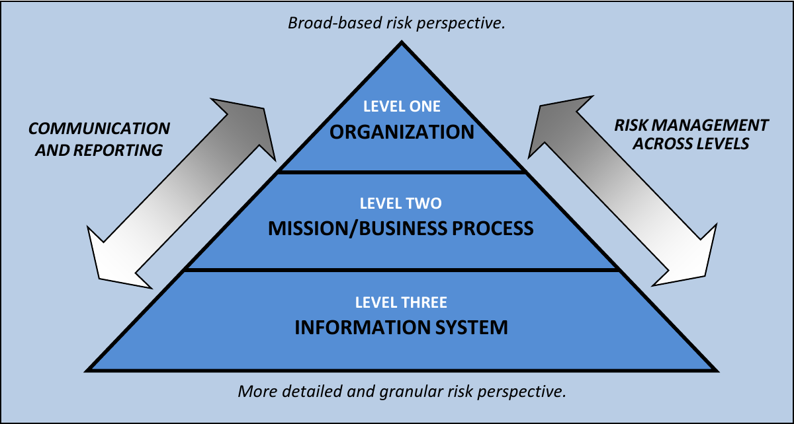
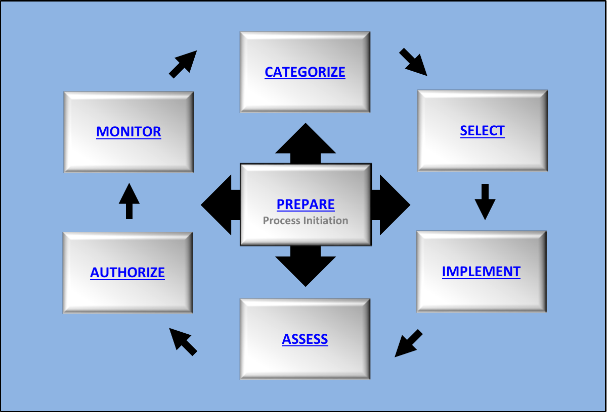
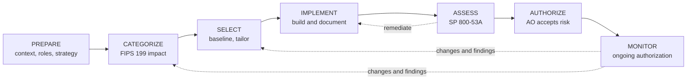
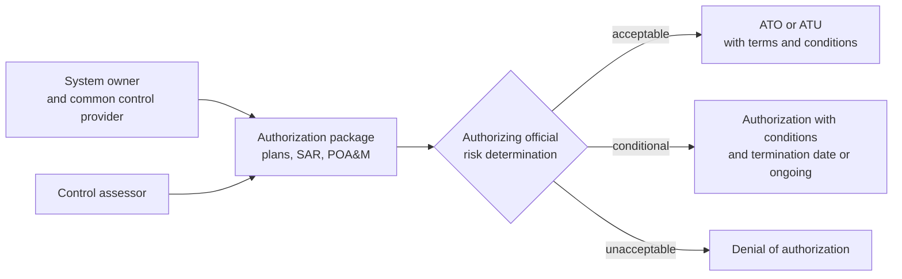

# NIST Risk Management Framework (RMF)

## Summary

The NIST Risk Management Framework (RMF) is a seven-step process for deciding whether a specific information system is secure enough to run, and for keeping that decision current. A named senior official, the authorizing official, accepts the remaining risk in writing after seeing evidence that the chosen controls were implemented and tested. The RMF does not list what good security looks like (that is the [NIST CSF](../frameworks/nist-cybersecurity-framework.md) and the [SP 800-53 catalog](../frameworks/nist-sp-800-53/README.md)). It defines who decides what, in which order, based on which evidence, which is why it is the working core of U.S. federal system authorization and is widely reused in other regulated programs.

Checked against NIST SP 800-37 Rev. 2 (December 2018), SP 800-53 Rev. 5 and SP 800-53B, SP 800-53A Rev. 5 (January 2022), FIPS 199, 2026-10. Statements about FedRAMP and DoD programs are from memory and marked as such.

## Prerequisites

- [CIA triad](../../foundations/cia-triad/README.md): impact levels in the RMF are rated per property.
- [Information risk management](information-risk-management.md): risk, likelihood, impact, risk tolerance.
- [NIST CSF](../frameworks/nist-cybersecurity-framework.md): the organization-level outcome framework that the RMF complements.
- [NIST SP 800-53](../frameworks/nist-sp-800-53/README.md): the control catalog the RMF selects from.

## Core concepts

### Definition

The **Risk Management Framework** is described in NIST SP 800-37 Revision 2, *Risk Management Framework for Information Systems and Organizations: A System Life Cycle Approach for Security and Privacy* (December 2018, 183 pages). It is a structured process for managing security and privacy risk across the system life cycle. According to the cover of Revision 2, the update added alignment with the constructs of the NIST Cybersecurity Framework, integration of privacy risk management, alignment with system life cycle security engineering and supply chain risk management processes, and a set of organization-wide tasks (the Prepare step) that make system-level work cheaper and more consistent.

Terms you need before the steps make sense:

| Term | Meaning in the RMF |
| --- | --- |
| Authorization boundary | What counts as "the system" for the decision (task P-11). Everything outside is an external dependency |
| Authorizing official (AO) | The senior official who accepts risk and decides to authorize or deny |
| System owner | Responsible for the system through its life cycle, usually assembles the authorization package |
| Common control provider | A party that provides controls that many systems inherit, such as a data center or an identity service |
| Control baseline | A starting set of controls for an impact level, from SP 800-53B |
| Tailoring | Adding, removing or adjusting controls in a baseline for the specific system |
| Overlay | A reusable set of tailoring decisions for a community or technology |
| Control designation | Each control is system-specific, hybrid or common (task S-3) |
| Security and privacy plans | Document how each selected control is implemented. Often called the system security plan (SSP) for the security part |
| Security assessment report (SAR) | The assessor's findings and recommendations |
| Plan of action and milestones (POA&M) | Remediation plan for weaknesses that are not yet fixed |
| Authorization package | The plans, assessment reports, POA&M and supporting evidence submitted to the AO |
| ATO and ATU | Authorization to operate, and authorization to use (reusing another party's authorization) |
| Ongoing authorization | Authorization maintained through continuous monitoring instead of a fixed three-year cycle |

### Analogy

Think of a building permit and occupancy certificate. The owner submits drawings (plans), the inspector checks the finished building against the code (assessment), and an official signs the certificate of occupancy accepting the building in its current state, with conditions (authorization). After that, periodic inspections and any renovation trigger a review (monitoring and re-authorization).

The analogy breaks in one place. A building inspector applies a fixed code, so the same building passes or fails the same way. In the RMF, the AO sees the same assessment results and can reach different decisions depending on the mission, the threat environment and the organization's risk tolerance. The framework produces an informed risk decision, not a pass or fail.

### Where the RMF sits: three levels of risk management



SP 800-37 describes a multi-level approach, taken from SP 800-39: Level 1 organization, Level 2 mission and business process, Level 3 information system. Communication and reporting flow in both directions. The RMF operates at all levels. The Prepare step has organization-level tasks (P-1 to P-7) and system-level tasks (P-8 to P-18) for this reason.

| Level | Typical concern | Typical artifacts |
| --- | --- | --- |
| 1 Organization | Risk strategy, risk tolerance, common controls, monitoring strategy | Risk management strategy, organization-wide risk assessment, common control catalog |
| 2 Mission and business process | Which processes depend on which systems and information | Mission and business impact analysis, enterprise architecture |
| 3 Information system | Categorization, control selection, implementation, assessment, authorization | Security and privacy plans, SAR, POA&M |

### The seven steps





NIST notes that after Prepare, the steps can be carried out in a non-sequential order, and that organizations running the RMF for the first time for a system usually carry out the remaining steps in sequence.

The steps contain 47 tasks in total: Prepare 18 (7 organization level, 11 system level), Categorize 3, Select 6, Implement 2, Assess 6, Authorize 5, Monitor 7. The counts were derived from Tables 1 to 8 of SP 800-37 Rev. 2.

#### Prepare

Purpose: carry out essential activities at the organization, mission and business process, and system levels to prepare to manage security and privacy risk with the RMF.

| Task | Name | Outcome (short) |
| --- | --- | --- |
| P-1 | Risk management roles | Individuals are identified and assigned key RMF roles |
| P-2 | Risk management strategy | Organizational risk strategy, including risk tolerance, is established |
| P-3 | Risk assessment, organization | Organization-wide risk assessment is completed or updated |
| P-4 | Organizationally tailored control baselines and CSF Profiles (optional) | Tailored baselines or Profiles are established and available |
| P-5 | Common control identification | Controls available for inheritance are identified, documented and published |
| P-6 | Impact-level prioritization (optional) | Systems with the same impact level are prioritized |
| P-7 | Continuous monitoring strategy, organization | Organization-wide strategy for monitoring control effectiveness |
| P-8 | Mission or business focus | Missions and processes the system supports are identified |
| P-9 | System stakeholders | Stakeholders are identified |
| P-10 | Asset identification | Stakeholder assets are identified and prioritized |
| P-11 | Authorization boundary | The authorization boundary is determined |
| P-12 | Information types | Information processed, stored and transmitted is identified |
| P-13 | Information life cycle | All life cycle stages of each information type are understood |
| P-14 | Risk assessment, system | System-level risk assessment is completed or updated |
| P-15 | Requirements definition | Security and privacy requirements are defined and prioritized |
| P-16 | Enterprise architecture | Placement of the system in the enterprise architecture is determined |
| P-17 | Requirements allocation | Requirements are allocated to the system and its environment |
| P-18 | System registration | The system is registered for management, accountability and oversight |

The Prepare step was introduced as a separate step in Revision 2. A frequent failure is to start at Categorize and discover later that no one owns the system boundary or the risk tolerance.

#### Categorize

| Task | Name | Outcome (short) |
| --- | --- | --- |
| C-1 | System description | Characteristics of the system are described and documented |
| C-2 | Security categorization | Impact of the system and its information types is categorized |
| C-3 | Categorization review and approval | Senior leaders review and approve the categorization |

Categorization follows FIPS 199. Each information type gets a potential impact (low, moderate or high) for confidentiality, integrity and availability, and the system takes the highest value per property (the high-water mark). SP 800-53B then maps the result to a baseline: a low-impact system has all three security objectives low, a moderate-impact system has at least one moderate and none high, and a high-impact system has at least one high. SP 800-60 (information types) is a cited input. See [CIA triad](../../foundations/cia-triad/README.md).

#### Select

| Task | Name | Outcome (short) |
| --- | --- | --- |
| S-1 | Control selection | Baselines commensurate with risk are selected |
| S-2 | Control tailoring | Controls are tailored, producing tailored baselines |
| S-3 | Control allocation | Controls are designated system-specific, hybrid or common, and allocated to system elements |
| S-4 | Documentation of planned control implementations | Selection and tailoring are documented in the security and privacy plans |
| S-5 | Continuous monitoring strategy, system | System-level monitoring strategy reflects the organization's |
| S-6 | Plan review and approval | The AO reviews and approves the plans |

Tailoring is the step where risk replaces defaults. Typical tailoring actions are scoping out controls that do not apply to the technology, designating common or inherited controls, setting organization-defined parameters (for example password lifetime or log retention), and adding controls or overlays for specific threats or missions. SP 800-53B provides the baselines, tailoring guidance and overlay guidance. The AO's approval in S-6 happens before implementation, so that disagreement about scope surfaces early.

#### Implement

| Task | Name | Outcome (short) |
| --- | --- | --- |
| I-1 | Control implementation | Controls in the plans are implemented using systems security and privacy engineering methods |
| I-2 | Update control implementation information | Changes to the planned implementation are documented and the plans updated |

The word "using systems security and privacy engineering methodologies" in task I-1 connects the RMF to SP 800-160 Volume 1. The plans must say how, where and by whom each control is implemented. Plans that only restate the control text are a typical assessor complaint.

#### Assess

| Task | Name | Outcome (short) |
| --- | --- | --- |
| A-1 | Assessor selection | An assessor or team with the right independence is selected |
| A-2 | Assessment plan | Assessment plans are developed, reviewed and approved |
| A-3 | Control assessments | Assessments are performed, prior results reused where possible, automation maximized |
| A-4 | Assessment reports | Findings and recommendations are documented |
| A-5 | Remediation actions | Deficiencies are remediated and plans updated |
| A-6 | Plan of action and milestones | A POA&M is developed for unacceptable risks |

Assessments follow SP 800-53A Rev. 5. An assessment procedure has objectives with determination statements, and each uses three methods: examine (review documents, mechanisms, activities), interview (talk to people) and test (exercise mechanisms or activities and compare actual with expected behavior). Depth and coverage each take basic, focused or comprehensive values, which rise with assurance needs. The level of effort is primarily determined by the system's categorization. For some programs, independent third-party assessment organizations perform the assessment, for example in FedRAMP, as 800-53A itself mentions.

#### Authorize

| Task | Name | Outcome (short) |
| --- | --- | --- |
| R-1 | Authorization package | Plans, assessment reports, POA&M and supporting evidence are assembled |
| R-2 | Risk analysis and determination | The AO determines risk in light of the risk tolerance |
| R-3 | Risk response | Responses to determined risks are provided |
| R-4 | Authorization decision | Authorization is approved or denied |
| R-5 | Authorization reporting | Decisions, significant vulnerabilities and risks are reported to organizational officials |



The expected outputs of R-4 are an authorization to operate, an authorization to use, or a common control authorization, or the corresponding denials. The decision carries terms and conditions, and either a termination date or a time-driven authorization frequency, or it continues as an ongoing authorization. An **authorization to use** lets one organization reuse another organization's authorization, for example for a shared service, and relies on the assessment results already produced.

The AO decides about **risk to organizational operations and assets, individuals, other organizations and the Nation**. This is a business and mission decision, not a technical approval, which is why a senior official with authority over the mission signs it.

#### Monitor

| Task | Name | Outcome (short) |
| --- | --- | --- |
| M-1 | System and environment changes | Changes are monitored per the monitoring strategy |
| M-2 | Ongoing assessments | Control effectiveness is assessed on an ongoing basis |
| M-3 | Ongoing risk response | Monitoring output is analyzed and acted on |
| M-4 | Authorization package updates | Plans, SAR and POA&M are kept current |
| M-5 | Security and privacy reporting | Posture is reported to the AO and senior leaders |
| M-6 | Ongoing authorization | AOs conduct ongoing authorization from monitoring results |
| M-7 | System disposal | A disposal strategy is developed and implemented |

Revision 2 states a preference to move to ongoing authorization and to use continuous monitoring approaches, supported by SP 800-137 (continuous monitoring). Disposal is part of the process because the RMF is a life cycle approach.

### Roles and responsibilities

SP 800-37 assigns each task a primary responsibility and supporting roles. The main roles as they appear in the task descriptions:

| Role | Typical responsibility |
| --- | --- |
| Authorizing official | Risk determination and authorization decision, approves plans |
| Senior accountable official for risk management or risk executive (function) | Organization-wide risk perspective |
| Senior agency information security officer | Program oversight, supports most tasks |
| Senior agency official for privacy | Privacy plan and risk, active for systems processing PII |
| System owner | Assembles the package, owns implementation and updates |
| Common control provider | Implements and documents inheritable controls |
| Information owner or steward | Information protection needs and categorization input |
| System security officer and system privacy officer | Day-to-day control operation and documentation |
| Control assessor | Independent assessment and reports |

The separation matters. The assessor must have an appropriate level of independence (task A-1), and the person who accepts the risk is not the person who built the system.

### RMF and the NIST Cybersecurity Framework

| Aspect | CSF 2.0 | RMF |
| --- | --- | --- |
| Question | What outcomes should our program achieve? | Is this system acceptable to run, and who decided? |
| Scope | Organization, or any scoped part | One system or a set of common controls |
| Output | Profile, gap analysis | Authorization decision with evidence |
| Controls | Points to them through Informative References | Selects and tailors them from SP 800-53 |
| Audience | Executives to practitioners | Authorizing officials, system owners, assessors |

CSF 2.0 says it can complement the RMF's approach to selecting and prioritizing SP 800-53 controls, and SP 800-37 Rev. 2 contains CSF mappings per task, plus optional Prepare task P-4 for CSF Profiles. A practical point: those SP 800-37 mappings use CSF 1.1 identifiers such as `ID.GV-2` and `ID.BE`, which do not exist in CSF 2.0 (the Govern Function replaced several of them). Use NIST's current CSF 2.0 mappings (the Cybersecurity and Privacy Reference Tool) for task-to-outcome lookups. In 2.0 terms, Prepare tasks P-1 and P-2 correspond to outcomes in GV.RR and GV.RM, P-3 and P-14 to ID.RA, P-5 and P-10 to ID.AM, and P-7 and S-5 to DE.CM. That mapping is this note's reading, not NIST's published crosswalk.

### RMF in other programs

- **Federal agencies** use the RMF to authorize systems under FISMA. SP 800-53 says it was developed under NIST's FISMA responsibilities and is consistent with OMB Circular A-130. The requirement for a particular agency comes from OMB and agency policy, not from NIST itself.
- **FedRAMP** applies SP 800-53 baselines and an authorization model to cloud services, and the 53A text confirms that third-party assessment organizations assess cloud services for it. The details of current FedRAMP baselines and process changes are not covered in this note and should be checked at the program's own site.
- **U.S. Department of Defense** uses its own RMF implementation (my recollection is DoD Instruction 8510.01, not checked). It follows the NIST structure with DoD-specific procedures.
- **Outside the U.S. public sector**, organizations borrow the structure (categorize, select, assess, sign-off, monitor) without the formal roles, often under another name. This is an opinion about practice, not a NIST statement.

## Worked example

The scenario is fictional and uses synthetic data. A federal-style agency, "Example Agency" (`example.com`), runs a payroll portal as a cloud-hosted web application. The task is to walk the first three steps and show how control selection follows from categorization. No real system is described.

**Prepare (system level).** P-11: the boundary includes the web tier, application tier, database and the identity integration. The cloud platform's data centers are outside it and treated as a provider with an existing authorization. P-12 and P-13: information types are payroll data and employee personal information, with a life cycle from HR input to archival.

**Categorize.** Using FIPS 199 notation, for each information type:

```text
SC payroll data   = {(confidentiality, MODERATE), (integrity, MODERATE), (availability, LOW)}
SC personal info  = {(confidentiality, MODERATE), (integrity, MODERATE), (availability, LOW)}
SC portal         = {(confidentiality, MODERATE), (integrity, MODERATE), (availability, LOW)}
```

The overall system is **moderate-impact** because at least one security objective is moderate and none is high. The ratings are an illustration. They are decisions that the system owner proposes and senior leaders approve in C-3. Availability is low here because a payroll portal can be down for a day without harming the mission, and that assumption has to be recorded.

**Select.** Start from the moderate baseline in SP 800-53B. The table shows a few controls and enhancements with their baseline membership, read from the baseline tables of 800-53B (columns checked per table header):

| Control | Name | Low | Moderate | High |
| --- | --- | --- | --- | --- |
| AC-2 | Account Management | yes | yes | yes |
| AC-2(1) | Automated System Account Management | no | yes | yes |
| AC-6 | Least Privilege | no | yes | yes |
| AC-6(1) | Authorize Access to Security Functions | no | yes | yes |
| IA-2(1) | Multi-Factor Authentication to Privileged Accounts | yes | yes | yes |
| SC-7 | Boundary Protection | yes | yes | yes |
| SC-7(3) | Access Points | no | yes | yes |
| SI-4(2) | Automated Tools and Mechanisms for Real-Time Analysis | no | yes | yes |
| CP-9(1) | Testing for Reliability and Integrity | no | yes | yes |
| SC-24 | Fail in Known State | no | no | yes |

Notice SC-24: the baseline for a moderate-impact system does not include it, so the "fail safe" principle from [OWASP security principles](../../application-security/owasp/owasp-security-principles.md) is not mandated by the baseline at this level. The agency could still add it through tailoring if a threat assessment says an error in the payroll approval flow could otherwise fail open. That is exactly the kind of risk-based decision S-2 exists for.

**Tailor and allocate (S-2, S-3).**

- Physical and environmental controls (the PE family) are **common or inherited** from the cloud provider's authorization, so the system documents the inheritance and does not re-implement them.
- AC-2 is **hybrid**: the agency owns account approval, the identity provider supplies automated provisioning.
- Parameters are set, for example audit retention and the inactivity period for sessions, and recorded in the plan.
- The CSF Profile for the organization (task P-4) may add outcomes beyond the baseline.

**Implement and document (I-1).** An implementation statement for AC-6 in the security plan should say who, where and how, for example: "Application roles are limited to employee, payroll clerk and payroll approver. Database access for the application uses a role limited to the portal schema. Privileged cloud console access requires MFA and is granted just in time for 4 hours. The identity team reviews role membership every quarter." The text above is an invented example of the required level of detail.

**Assess (A-3).** For AC-6 the assessor chooses methods and depth. Examine: the role matrix and the cloud IAM policy. Interview: the identity team about the quarterly review. Test: attempt to read another employee's payroll record as a clerk, attempt a write outside the schema with the application's database role. Findings go to the SAR, and an unresolved finding enters the POA&M with an owner and a date.

**Authorize (R-1 to R-4).** The AO reads the executive summary and the POA&M. Suppose two moderate findings are open with remediation dates in 60 days. The AO may issue an ATO with conditions, for example "no new external integrations until finding F-3 is closed", plus a requirement that continuous monitoring reports are delivered monthly. A denial is possible if the open risk exceeds the tolerance set in P-2.

**Monitor (M-1 to M-6).** A change that moves the system towards high impact, such as adding a feature that processes data with confidentiality impact rated high, triggers re-categorization and a new control selection. Otherwise, monitoring results feed ongoing authorization.

## Trade offs and when to use it

### Benefits

- **Defensible decisions.** The AO decision is tied to evidence, controls and a named person. That is valuable in audits and after incidents.
- **Clear division of labor.** Roles, tasks, inputs and outputs are specified, so teams do not argue about who owns what.
- **Reuse.** Common controls, inheritance and authorization to use reduce repeated work.
- **Alignment with engineering and privacy.** Revision 2 builds in privacy plans, supply chain and security engineering.

### Costs and limits

- **Documentation weight.** Plans, packages and POA&Ms are heavy for small systems. Task P-6 and tailoring exist to scale the effort, but the culture often does not scale with them.
- **Point-in-time bias.** If authorization is a three-year paperwork exercise, it describes a system that no longer exists. Ongoing authorization with real monitoring is the intended fix, and it requires investment in automation.
- **Controls are not outcomes.** A system can satisfy every control as written and still be breached, because a control catalog cannot cover every attack path. Threat-informed testing (red teaming, see [red, blue, purple teams](../../defensive-operations/operations/red-blue-purple-teams.md)) complements assessment.
- **Federal vocabulary.** Terms like authorizing official or common control provider need translation outside government.

### Alternatives

| Need | Better fit |
| --- | --- |
| Organization-wide program view and communication | [NIST CSF](../frameworks/nist-cybersecurity-framework.md) |
| Certificate for customers | [ISO/IEC 27001](../standards/iso-iec-27001.md) |
| A formal quantitative risk analysis | Methods such as FAIR, outside NIST's scope here |
| Cloud service sold to U.S. agencies | FedRAMP, which applies RMF concepts and 800-53 baselines |
| Product-level cybersecurity evaluation | Common Criteria or FIPS 140-3 testing, as 800-53A notes for products and modules |

The RMF is the wrong tool for a quick team-level security improvement plan, and the right tool when someone must sign that a system is acceptable to operate.

## Common mistakes

| Mistake | Why it is wrong | Fix |
| --- | --- | --- |
| Treating the RMF as a documentation exercise | The goal is a risk decision, and the paperwork is evidence for it | Write plans that say how controls work, and test them |
| Skipping Prepare | Boundary, roles and risk tolerance are undefined, so later steps are disputed | Complete the P-tasks before Categorize |
| Copying the baseline without tailoring | Wastes effort on irrelevant controls and misses system-specific risks | Record tailoring and rationale (S-2, S-4) |
| Categorizing from habit (everything moderate) | The impact level drives control volume and cost | Rate per information type, with evidence from the mission |
| Letting the system builder assess the system | Lacks independence (A-1) | Choose an assessor with the required independence |
| Authorizing as approval of "no findings" | The AO accepts residual risk, which is never zero | Make risk tolerance explicit (P-2) and record conditions |
| Stale authorization | Changes accumulate and invalidate the evidence | Use the monitoring strategy, re-categorize on major change |
| Using CSF 1.1 identifiers from SP 800-37 in a 2.0 assessment | They no longer exist | Use current CSF 2.0 mappings |
| Ignoring inherited controls' own assessments | The provider's authorization has scope and conditions | Read the provider's package and document customer responsibilities |
| Never planning disposal | Data and credentials outlive systems | Use task M-7 and cover media and data sanitization |

## Practice

1. Name the seven RMF steps and say which one was added in Revision 2.
2. A system has information types rated {C: HIGH, I: LOW, A: LOW} and {C: LOW, I: MODERATE, A: LOW}. What is the system's impact level, and which baseline applies?
3. Who accepts risk in the RMF, and who assesses the controls? Why must they be different from the system builder?
4. What is the difference between ATO and ATU?
5. A system inherits physical security controls from a cloud provider. Which task designates this, and what must still be documented?
6. Explain what changes when an organization moves from a three-year reauthorization cycle to ongoing authorization.
7. Map the following to CSF 2.0 Functions: P-2 (risk management strategy), A-3 (control assessments), M-3 (ongoing risk response).

Hints and answers:

1. Prepare, Categorize, Select, Implement, Assess, Authorize, Monitor. Prepare was added as a step in Revision 2.
2. High-impact, because at least one security objective is high (confidentiality). The high baseline applies.
3. The authorizing official accepts the risk. The control assessor assesses the controls, with independence (task A-1). The builder has a conflict of interest, which is the same logic as separation of duties.
4. An ATO authorizes a system to operate. An ATU lets an organization use a system or service already authorized by another party, relying on the existing assessment results.
5. S-3 (control allocation) designates controls as system-specific, hybrid or common. The system must still document how the inheritance is used and what the customer's own responsibilities are.
6. Authorization continues from continuous monitoring results (task M-6) instead of a periodic full re-assessment, so evidence, assessments and risk determinations are updated as changes occur, and the AO sees posture reports (M-5) regularly.
7. P-2 aligns with Govern (risk management strategy). A-3 has no exact CSF Function because assessment is a verification activity across Identify and Govern oversight, and NIST's own mapping for A-3 is not given in the task table. M-3 aligns with Respond and Detect (analysis and response). These are interpretations, check NIST's mapping before using them in an assessment.

## Further reading

- NIST, SP 800-37 Rev. 2, Risk Management Framework for Information Systems and Organizations (2018). The primary source for the steps, tasks, roles and the Prepare step: https://doi.org/10.6028/NIST.SP.800-37r2
- NIST, SP 800-53 Rev. 5 (2020) and SP 800-53B, Control Baselines for Information Systems and Organizations. The catalog and the baselines used in Select: https://csrc.nist.gov/pubs/sp/800/53/r5/upd1/final and https://doi.org/10.6028/NIST.SP.800-53B
- NIST, SP 800-53A Rev. 5, Assessing Security and Privacy Controls in Information Systems and Organizations (2022). Assessment objectives, methods, depth and coverage: https://doi.org/10.6028/NIST.SP.800-53Ar5
- NIST, FIPS 199, Standards for Security Categorization of Federal Information and Information Systems (2004): https://nvlpubs.nist.gov/nistpubs/FIPS/NIST.FIPS.199.pdf
- NIST, SP 800-39, Managing Information Security Risk: Organization, Mission, and Information System View (2011). Source of the three-level model and the frame, assess, respond, monitor cycle. Skimmed only for this note: https://nvlpubs.nist.gov/nistpubs/Legacy/SP/nistspecialpublication800-39.pdf
- NIST, SP 800-30 Rev. 1, Guide for Conducting Risk Assessments (2012). Prepare, conduct, communicate and maintain steps of a risk assessment. Skimmed only for this note: https://nvlpubs.nist.gov/nistpubs/Legacy/SP/nistspecialpublication800-30r1.pdf
- NIST, SP 800-160 Volume 1 Revision 1, Engineering Trustworthy Secure Systems (2022), referenced by task I-1: https://doi.org/10.6028/NIST.SP.800-160v1r1
