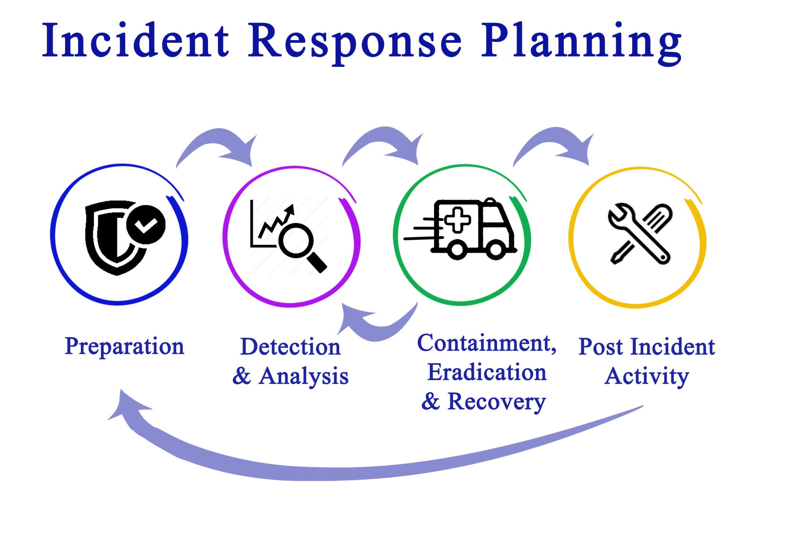

# National Institute of Standards and Technology (NIST)

## Summary

TODO: write two to four plain language sentences that say what this is and why it matters.

## Prerequisites

TODO: link the notes a reader should know first and state the assumed knowledge.

## What it is?

NIST stands for the National Institute of Standards and Technology. It is a non-regulatory agency of the United States Department of Commerce.

While NIST develops standards for everything from atomic clocks to the composition of concrete, its impact on SecOps is monumental. It provides the "universal language" and the "rulebook" that cybersecurity professionals worldwide use to build, measure, and manage their security programs.

NIST does not sell products; it provides vetted, peer-reviewed research. Because it is a government entity, its publications are public domain (free) and are developed in collaboration with thousands of industry experts.

For a SecOps team, NIST provides the theoretical scaffolding that supports their technical tools (like SIEM and SOAR).

## Phases

The NIST framework, specifically SP 800-61, is often preferred by government agencies and large enterprises because it views incident response as a continuous cycle rather than a linear start-to-finish process.

1. Preparation: Establishing the tools, skills, and resources needed to respond. This includes training, creating SOPs, and deploying SIEM/SOAR tools.
2. Detection & Analysis: Identifying that an incident is occurring. This involves monitoring logs, analyzing alerts, and determining the "scope" and "severity" of the attack.
3. Containment, Eradication, & Recovery: NIST groups these three into one iterative loop. You contain the threat (stop it from spreading), eradicate it (delete the malware), and recover (restore systems), but you may have to go back to "Analysis" if you discover the attacker is still in the network.
4. Post-Incident Activity: The "Lessons Learned" phase. What happened? Why? How can we prevent it? This phase feeds directly back into Preparation.

### Phase 1: Preparation (The Foundation)

Preparation is the most critical phase but often the most ignored. You aren't just preparing for an attack; you are making the organization a "hard target."

- Tooling: Deploying and tuning the SIEM, SOAR, EDR, and NDR (Network Detection and Response).
- Documentation: Developing the SOPs and Playbooks we discussed earlier.
- The IR Team: Establishing the CSIRT (Computer Security Incident Response Team) and defining who has the authority to "pull the plug" on a production server.
- Hardening: Patching systems, implementing Multi-Factor Authentication (MFA), and conducting user awareness training.
- Baseline Creation: Defining what "normal" looks like so that detection tools can identify "abnormal."

### Phase 2: Detection & Analysis (The Watchtower)

This is where the SecOps team spends most of its daily life. NIST breaks this down into two distinct categories of signals:

1. Precursors: Signs that an incident might happen in the future (e.g., a web server log showing a vulnerability scanner looking for weaknesses).
2. Indicators: Signs that an incident is happening or has already occurred (e.g., the SIEM alerts that a user is suddenly accessing 1,000 files in a minute).

#### Key Activities in this Phase:

- Validation: Distinguishing a "True Positive" from a "False Positive."
- Prioritization: Assigning a score based on Functional Impact (is the business stopped?), Information Impact (was data stolen?), and Recoverability (how hard is it to fix?).
- Documentation: Starting the "Incident Log" - a minute-by-minute account of everything the analyst finds.

---

### Phase 3: Containment, Eradication, & Recovery

NIST groups these into one big tactical loop. Unlike SANS, NIST recognizes that you often have to go back and forth between these steps.

#### A. Containment (Stop the Bleeding)

- Short-term: Isolating a network segment or a specific host (e.g., via SOAR automation).
- Long-term: Applying temporary "clean" patches or moving the workload to a failover environment while the original is analyzed.

#### B. Eradication (Clean the Wound)

- Finding the Root Cause. If you delete the malware but don't close the hole it came through, the attacker will return in 10 minutes.
- Identifying all affected hosts, deleting malicious files, and resetting compromised passwords/tokens.

#### C. Recovery (Back to Business)

- Restoring systems from "Gold Image" backups.
- Phased Approach: You don't turn everything back on at once. You monitor the restored systems with "High Sensitivity" for several days to ensure the attacker is truly gone.

---

### Phase 4: Post-Incident Activity (The Evolution)

This is what separates a "Good" SOC from a "Great" SOC. NIST places heavy emphasis on the Lessons Learned meeting.

- The Post-Mortem: A formal meeting held within days of the incident.
  - *What exactly happened?*
  - *Did the SOP work, or was it outdated?*
  - *Were there enough tools/staff?*
- Evidence Retention: Storing logs and disk images for legal or insurance purposes (often for years).
- Metric Reporting: Calculating the MTTD (Mean Time to Detect) and MTTR (Mean Time to Respond) to prove the value of the SecOps team to the board.

---

### Why NIST is "Comprehensive"

The reason NIST is preferred for large-scale SecOps is that it accounts for the external environment:

- It provides guidelines on how to talk to Law Enforcement (FBI/Europol).
- It dictates how to share threat data with ISACs (Information Sharing and Analysis Centers).
- It ensures that "incident response" isn't just a technical task, but a business survival strategy.

## Worked example

TODO: add a concrete, reproducible example that walks through the idea end to end.

## Trade offs and when to use it

TODO: cover benefits, costs, alternatives and the situations where this is the wrong choice.

## Common mistakes

TODO: list frequent misunderstandings and failure modes, each with its fix.

## Practice

TODO: add questions or small exercises, with answers or hints at the bottom.

## Further reading

TODO: add annotated links to primary sources.
